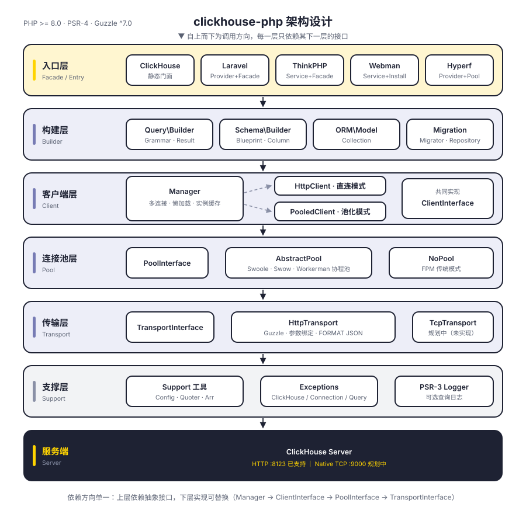
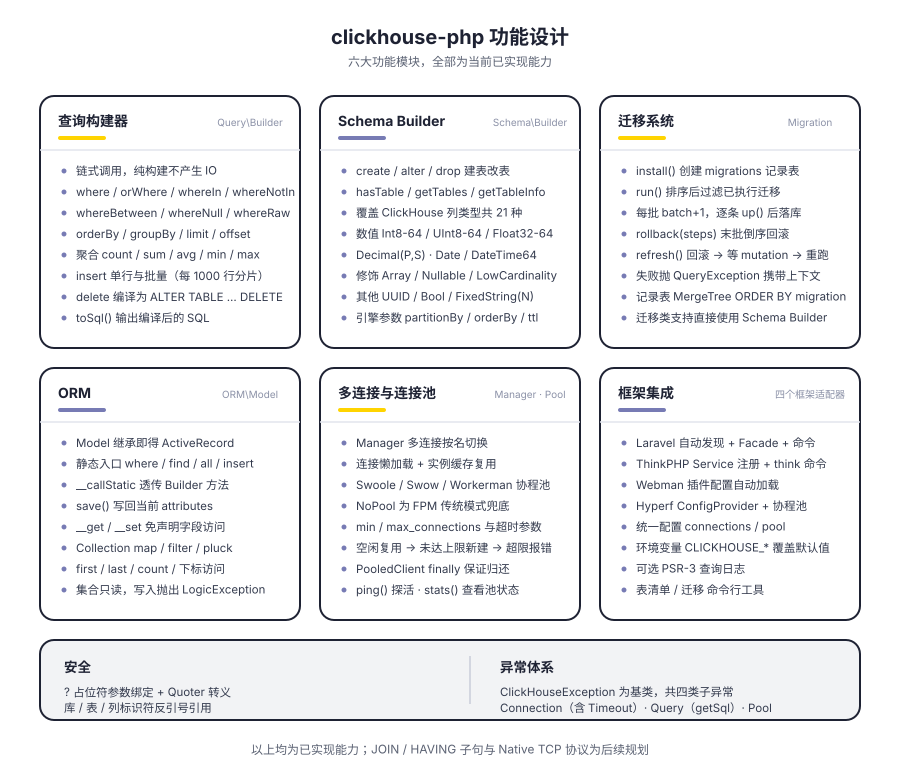
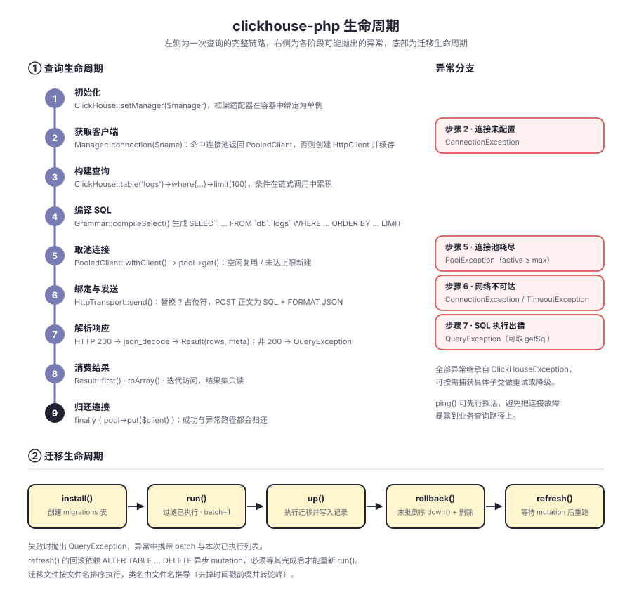

# clickhouse-php

PHP ClickHouse 客户端。默认通过 ClickHouse HTTP 接口（8123 端口）通信，内置查询构建器、Schema Builder、迁移系统与 ORM，并适配 Laravel、ThinkPHP、Webman、Hyperf。

分层解耦：`Manager → ClientInterface → PoolInterface → TransportInterface`，客户端形态、连接池、传输协议各自面向接口，均可替换。Native TCP 协议已在传输层预留位置，尚未实现。

**简体中文** | [English](README_EN.md) | [한국어](docs/i18n/ko/README.md) | [Русский](docs/i18n/ru/README.md) | [Deutsch](docs/i18n/de/README.md) | [Français](docs/i18n/fr/README.md) | [Español](docs/i18n/es/README.md) | [Português](docs/i18n/pt/README.md) | [हिन्दी](docs/i18n/hi/README.md) | [العربية](docs/i18n/ar/README.md) | [বাংলা](docs/i18n/bn/README.md) | [Bahasa Indonesia](docs/i18n/id/README.md) | [日本語](docs/i18n/ja/README.md)

<p align="center">
  
</p>

## 项目结构

```
clickhouse-php/
├── src/
│   ├── ClickHouse.php                  # 静态门面入口
│   ├── Client/                         # 客户端层：多连接、直连 / 池化两种形态
│   │   ├── ClientInterface.php         # query / select / insert / ping
│   │   ├── Manager.php                 # 多连接管理，懒加载 + 实例缓存
│   │   ├── HttpClient.php              # 直连客户端，负责 SQL 拼装与响应解析
│   │   └── PooledClient.php            # 池化客户端，自动取还连接
│   ├── Query/                          # 查询构建器
│   │   ├── Builder.php                 # 链式 API 与聚合入口
│   │   ├── Grammar.php                 # SELECT / DELETE 语法编译
│   │   ├── Expression.php              # 原生表达式
│   │   └── Result.php                  # 只读结果集
│   ├── Schema/                         # Schema Builder
│   │   ├── Builder.php                 # create / alter / drop / 元信息查询
│   │   ├── Blueprint.php               # 列与引擎参数收集
│   │   ├── Column.php                  # 列定义
│   │   └── Grammar.php                 # DDL 语法编译
│   ├── Migration/                      # 迁移系统
│   │   ├── Migration.php               # 迁移基类
│   │   ├── Migrator.php                # run / rollback / refresh
│   │   └── Repository.php              # 迁移记录表读写与 mutation 等待
│   ├── ORM/                            # ORM
│   │   ├── Model.php                   # ActiveRecord 基类
│   │   └── Collection.php              # 只读模型集合
│   ├── Pool/                           # 连接池
│   │   ├── PoolInterface.php           # get / put / stats / close
│   │   ├── AbstractPool.php            # 公共池化逻辑（计数、超时、补水）
│   │   ├── SwoolePool.php              # Swoole 协程通道
│   │   ├── SwowPool.php                # Swow 协程通道
│   │   ├── WorkermanPool.php           # Workerman 协程通道
│   │   └── NoPool.php                  # FPM 传统模式
│   ├── Transport/                      # 传输层
│   │   ├── TransportInterface.php      # send / close
│   │   ├── HttpTransport.php           # Guzzle HTTP，参数绑定与 FORMAT JSON
│   │   └── TcpTransport.php            # Native TCP（规划中）
│   ├── Support/                        # Config / Quoter / Arr
│   ├── Exceptions/                     # 异常体系（1 个基类 + 4 个子类）
│   ├── Laravel/                        # ServiceProvider · Facade · Artisan 命令
│   ├── ThinkPHP/                       # Service · Facade · 命令
│   ├── Webman/                         # Service · 安装脚本
│   └── Hyperf/                         # ConfigProvider · 协程连接池 · 命令
├── tests/                              # PHPUnit 测试，目录与 src 同构
├── docs/                               # 设计图与文档
└── composer.json
```

## 架构设计

<p align="center">
  
</p>

自上而下分为六层，每层只依赖下一层的抽象接口：

| 层 | 职责 | 关键类型 |
|----|------|----------|
| 入口层 | 门面与框架适配 | `ClickHouse`、四套框架适配器 |
| 构建层 | 拼装查询与 DDL，不产生 IO | `Query\Builder`、`Schema\Builder`、`ORM\Model`、`Migration\Migrator` |
| 客户端层 | 多连接管理与执行入口 | `Manager`、`HttpClient`、`PooledClient` |
| 连接池层 | 连接复用与并发上限 | `PoolInterface`、`AbstractPool`、`NoPool` |
| 传输层 | 协议编解码与错误映射 | `HttpTransport`、`TcpTransport`（规划中） |
| 支撑层 | 配置、转义、异常、日志 | `Support\*`、`Exceptions\*`、PSR-3 `LoggerInterface` |

## 功能设计

<p align="center">
  
</p>

## 生命周期

<p align="center">
  
</p>

## 安装

```bash
composer require erikwang2013/clickhouse-php
```

## 快速开始

### 独立使用（原生 PHP）

不依赖任何框架。用 `CLICKHOUSE_*` 环境变量初始化，一行即可：

```php
use Erikwang2013\ClickHouse\ClickHouse;

ClickHouse::bootstrap();   // 等价于 ClickHouse::setManager(Manager::fromEnv())

$rows = ClickHouse::table('logs')
    ->where('date', '>=', '2024-01-01')
    ->whereIn('level', ['error', 'warn'])
    ->orderBy('timestamp', 'desc')
    ->limit(100)
    ->get();

foreach ($rows as $row) {
    echo $row['message'];
}
```

环境变量覆盖不到的配置（多连接、连接池调参）用 `Manager` 显式传入：

```php
use Erikwang2013\ClickHouse\ClickHouse;
use Erikwang2013\ClickHouse\Client\Manager;

// 配置
$config = [
    'default' => 'clickhouse',
    'connections' => [
        'clickhouse' => [
            'driver'   => 'http',        // http（推荐）或 native（开发中）
            'host'     => 'localhost',
            'port'     => 8123,          // HTTP 端口, Native 用 9000
            'database' => 'default',
            'username' => 'default',
            'password' => '',
            'timeout'  => 30,
            'https'    => false,         // true 走 HTTPS
        ],
    ],
    'pool' => [
        'min_connections'    => 2,
        'max_connections'    => 16,
        'connection_timeout' => 5.0,
    ],
];

// 初始化
$manager = new Manager($config);
ClickHouse::setManager($manager);

// 查询
$rows = ClickHouse::table('logs')
    ->where('date', '>=', '2024-01-01')
    ->whereIn('level', ['error', 'warn'])
    ->orderBy('timestamp', 'desc')
    ->limit(100)
    ->get();

foreach ($rows as $row) {
    echo $row['message'];
}

// 原生 SQL
$result = ClickHouse::query('SELECT count(*) AS cnt FROM logs WHERE date = ?', ['2024-01-01']);
echo $result->first()['cnt'];

// 聚合
$count = ClickHouse::table('logs')->where('level', 'error')->count();
$avgDuration = ClickHouse::table('logs')->avg('duration');
```

### 插入数据

```php
// 单行
ClickHouse::table('logs')->insert([
    'date'      => '2024-01-01',
    'level'     => 'info',
    'message'   => 'hello',
    'duration'  => 12.5,
]);

// 批量
ClickHouse::table('logs')->insert([
    ['date' => '2024-01-01', 'level' => 'info',  'message' => 'a', 'duration' => 1.2],
    ['date' => '2024-01-02', 'level' => 'error', 'message' => 'b', 'duration' => 3.4],
]);
```

### 建表 (Schema Builder)

```php
ClickHouse::schema()->create('logs', function ($table) {
    $table->date('date');
    $table->dateTime('timestamp');
    $table->string('level');
    $table->string('message');
    $table->float64('duration');
    $table->engine('MergeTree')
          ->partitionBy('toYYYYMM(date)')
          ->orderBy(['date', 'timestamp', 'level']);
});

// 删除表
ClickHouse::schema()->drop('logs');

// 修改表
ClickHouse::schema()->alter('logs', function ($table) {
    $table->nullable('source', 'String');
});
```

### 数据迁移

创建迁移文件（如 `2026_05_27_000000_create_logs_table.php`）：

```php
use Erikwang2013\ClickHouse\Migration\Migration;

class CreateLogsTable extends Migration
{
    public function up(): void
    {
        $this->schema->create('logs', function ($table) {
            $table->date('date');
            $table->string('level');
            $table->engine('MergeTree')
                  ->partitionBy('toYYYYMM(date)')
                  ->orderBy(['date', 'level']);
        });
    }

    public function down(): void
    {
        $this->schema->drop('logs');
    }
}
```

运行迁移：

```php
use Erikwang2013\ClickHouse\Migration\Migrator;
use Erikwang2013\ClickHouse\Migration\Repository;

$client = ClickHouse::getManager()->connection();
$repository = new Repository($client);
$migrator = new Migrator($client, $repository, '/path/to/migrations');

$migrator->install();   // 创建迁移记录表
$migrator->run();       // 执行待迁移
$migrator->rollback();  // 回滚上一批
$migrator->refresh();   // 回滚后重新执行
```

### ORM

```php
use Erikwang2013\ClickHouse\ORM\Model;

class Log extends Model
{
    protected string $table = 'logs';
    protected string $connection = 'default';
}

// 查询
$logs = Log::where('level', 'error')
    ->orderBy('timestamp', 'desc')
    ->limit(50)
    ->get();

// 查找单条
$log = Log::find(123);

// 聚合
$total = Log::where('date', '>=', '2024-01-01')->count();

// 批量插入
Log::insert([
    ['date' => '2024-01-01', 'level' => 'info'],
    ['date' => '2024-01-02', 'level' => 'error'],
]);
```

### 多连接

```php
$config = [
    'default' => 'default',
    'connections' => [
        'default' => ['driver' => 'http', 'host' => 'ch1.example.com', 'port' => 8123],
        'analytics' => ['driver' => 'http', 'host' => 'ch2.example.com', 'port' => 8123],
    ],
];

$manager = new Manager($config);

// 使用指定连接
ClickHouse::connection('analytics')->table('events')->get();
ClickHouse::table('events', 'analytics')->get();
```

## 框架集成

### Laravel

配置文件自动发布，Composer 自动发现 ServiceProvider。

```bash
php artisan vendor:publish --tag=clickhouse-config
```

```php
use Erikwang2013\ClickHouse\Laravel\Facades\ClickHouse;

ClickHouse::table('logs')->where('level', 'error')->get();
ClickHouse::connection('native')->select('SELECT * FROM logs LIMIT 10');
```

Artisan 命令：

```bash
php artisan clickhouse:table-list
php artisan clickhouse:migration:install
php artisan clickhouse:migration:run
```

### ThinkPHP

在 `app/service.php` 中注册服务：

```php
return [
    \Erikwang2013\ClickHouse\ThinkPHP\ClickHouseService::class,
];
```

```php
use think\facade\ClickHouse;

ClickHouse::table('logs')->get();
```

```bash
php think clickhouse:table-list
```

### Webman

Webman 自动加载插件配置，无需手动配置。

```php
use Erikwang2013\ClickHouse\Webman\ClickHouse;

ClickHouse::table('logs')->where('level', 'error')->get();
```

### Hyperf

通过 `ConfigProvider` 自动发现，支持依赖注入和协程连接池。

```bash
php bin/hyperf.php vendor:publish erikwang2013/clickhouse-php
```

```php
use Erikwang2013\ClickHouse\Hyperf\ClickHouseConnection;

class LogController
{
    public function __construct(
        private ClickHouseConnection $clickhouse
    ) {}

    public function index()
    {
        return $this->clickhouse->table('logs')->get();
    }
}
```

## 查询构建器参考

| 方法 | 说明 |
|------|------|
| `table($name)` / `from($name)` | 指定表名 |
| `select([...])` / `selectRaw($expr)` | SELECT 列。`select()` 的列名会被反引号引用（`` `order` `` 这类保留字可用），别名 `id as uid` 两侧分别引用；要写函数或子查询请用 `selectRaw()` 或 `Expression` |
| `where($col, $op, $val)` | 条件 (2 参数时 `$op` 默认 `=`)。值为 `null` 时自动转 `IS NULL` / `IS NOT NULL` |
| `orWhere($col, $op, $val)` | OR 条件 |
| `whereIn($col, $arr)` / `whereNotIn($col, $arr)` | IN / NOT IN |
| `whereBetween($col, [$min, $max])` | BETWEEN |
| `whereNull($col)` / `whereNotNull($col)` | IS NULL / IS NOT NULL |
| `whereRaw($sql)` | 原生 WHERE（勿传用户输入） |
| `prewhere($col, $op, $val)` | PREWHERE，位置在 WHERE 之前（ClickHouse 最有效的扫描裁剪） |
| `orderBy($col, $dir)` | 排序 (默认 ASC) |
| `groupBy(...$cols)` | 分组 |
| `having($col, $op, $val)` / `havingRaw($sql)` | HAVING，位置在 GROUP BY 之后。`having()` 会把列名当标识符引用，聚合条件（如 `count() > 100`）请用 `havingRaw()` 或 `new Expression('count()')` |
| `limit($n)` / `offset($n)` | 分页 |
| `final()` | 读取时去重合并（ReplacingMergeTree 等） |
| `sample($ratio)` | SAMPLE 抽样，如 `sample(0.1)` |
| `settings([...])` | 查询级 SETTINGS，如 `settings(['max_execution_time' => 30])` |
| `count()` / `sum($col)` / `avg($col)` / `min($col)` / `max($col)` | 聚合 |
| `insert($data)` | 插入 (单行或批量)。同一批各行必须列一致，缺列或多列会直接报错（避免值按位置错位写入） |
| `delete()` | 删除（编译为 `ALTER TABLE ... DELETE`，**必须带 WHERE**，否则抛异常） |
| `get()` | 执行查询，返回 Result |
| `first()` | 返回第一条 |
| `toSql()` | 获取生成的 SQL |

### 大结果集与流式读取

`get()` 会把整个结果集解析成 PHP 数组，内存约是响应体积的 7 倍（实测 5 列窄表：载荷 93 B/行 → 解码后 677 B/行，10 万行约 73 MB）。数据量大时用 `stream()` 逐行消费，内存与结果集大小无关：

```php
use Erikwang2013\ClickHouse\Client\StreamingClientInterface;

$client = ClickHouse::client();           // 需要底层客户端时用它（connection() 返回的是构造器）
if ($client instanceof StreamingClientInterface) {
    foreach ($client->stream('SELECT * FROM logs') as $row) {   // FORMAT JSONEachRow
        echo $row['message'], PHP_EOL;
    }
}

// 自带 FORMAT 的查询（CSV/TSV 等）用 raw()，原样拿响应体
$csv = $client->raw('SELECT * FROM logs FORMAT CSV');
```

池化模式下 `stream()` 同样可用：连接在生成器消费完（或提前 break 被销毁）时归还。

### 原生 SQL 入口

以下入口是**原样拼接**的原生 SQL 通道，传入用户输入等于交出数据库：`selectRaw()`、`whereRaw()`、`havingRaw()`、`new Expression($sql)`、`Blueprint::settings()` 的值、以及 `$table->string('col')` 这类列类型字符串（`array($name, $type)`）。标识符与值本身已做转义（列名反引号、值按类型转义），但原生 SQL 片段不做任何处理。

`Expression` 可以传进 `select()`（放进数组里）、`where()`、`prewhere()`、`having()`、`orderBy()`、`groupBy()`，用于 `rand()`、`toStartOfHour(ts)` 这类表达式。

## Schema 列类型

| 方法 | ClickHouse 类型 |
|------|----------------|
| `string($name)` | String |
| `fixedString($name, $len)` | FixedString(N) |
| `int8/16/32/64($name)` | Int8/16/32/64 |
| `uint8/16/32/64($name)` | UInt8/16/32/64 |
| `float32($name)` / `float64($name)` | Float32 / Float64 |
| `decimal($name, $p, $s)` | Decimal(P, S) |
| `date($name)` | Date |
| `dateTime($name)` | DateTime |
| `dateTime64($name, $p)` | DateTime64(P) |
| `uuid($name)` | UUID |
| `bool($name)` | Bool |
| `array($name, $type)` | Array(T) |
| `nullable($name, $type)` | Nullable(T) |
| `lowCardinality($name, $type)` | LowCardinality(T) |

## 配置参考

```php
[
    'default' => 'clickhouse',
    'connections' => [
        'clickhouse' => [
            'driver'   => 'http',     // http（推荐）| native（开发中）
            'host'     => 'localhost',
            'port'     => 8123,       // HTTP 8123, Native 9000
            'database' => 'default',
            'username' => 'default',
            'password' => '',
            'timeout'  => 30,
            'https'    => false,
        ],
    ],
    'pool' => [
        'min_connections'    => 2,
        'max_connections'    => 16,
        'connection_timeout' => 5.0,
    ],
    'query_log' => false,
];
```

关于连接池：`pool` 配置只在**存在可用协程通道**时生效（Swoole / Swow / Workerman），FPM 等同步环境下会忽略它并直连，不会给你加并发上限。另外 HTTP 驱动走同步 Guzzle，池化的实际收益是「限制并发连接数 + 复用连接对象」，**不会自动变成非阻塞** —— 要真正非阻塞需自行开启 Swoole 的 curl 钩子（`Swoole\Runtime::enableCoroutine(SWOOLE_HOOK_NATIVE_CURL)`，它不在 `SWOOLE_HOOK_ALL` 里）或接入 hyperf/guzzle 的 CoroutineHandler。可用 `pool.driver` 显式指定 `swoole|swow|workerman|none`。

## 环境变量

| 变量 | 默认值 | 说明 |
|------|--------|------|
| `CLICKHOUSE_CONNECTION` | default | 默认连接名 |
| `CLICKHOUSE_HOST` | localhost | 主机地址 |
| `CLICKHOUSE_PORT` | 8123 | HTTP 端口 |
| `CLICKHOUSE_DB` | default | 数据库名 |
| `CLICKHOUSE_USER` | default | 用户名 |
| `CLICKHOUSE_PASS` | — | 密码 |
| `CLICKHOUSE_TIMEOUT` | 30 | 连接超时(秒) |
| `CLICKHOUSE_HTTPS` | false | 是否走 HTTPS |
| `CLICKHOUSE_DRIVER` | http | 驱动类型 |
| `CLICKHOUSE_POOL_MIN` | 2 | 最小连接数 |
| `CLICKHOUSE_POOL_MAX` | 16 | 最大连接数 |
| `CLICKHOUSE_POOL_TIMEOUT` | 5.0 | 取连接超时(秒) |

以上变量在原生 PHP 下由 `ClickHouse::bootstrap()` / `Manager::fromEnv()` 读取，四个框架的配置文件读的是同一套变量名（含 `CLICKHOUSE_HTTPS`）。

## 异常处理

```php
use Erikwang2013\ClickHouse\Exceptions\{
    ClickHouseException,
    ConnectionException,
    QueryException,
    TimeoutException,
    PoolException,
};

try {
    ClickHouse::table('logs')->get();
} catch (ConnectionException | TimeoutException $e) {
    // 连接或超时问题
} catch (QueryException $e) {
    echo $e->getMessage();
    echo $e->getSql();      // 原始 SQL
} catch (ClickHouseException $e) {
    // 其他异常
}
```

## 欢迎支持

| 微信 | 支付宝 |
|------|--------|
|  |  |

感谢您的支持！

## 许可证

MIT License.  Copyright (c) 2026 erik <erik@erik.xyz> — https://erik.xyz
