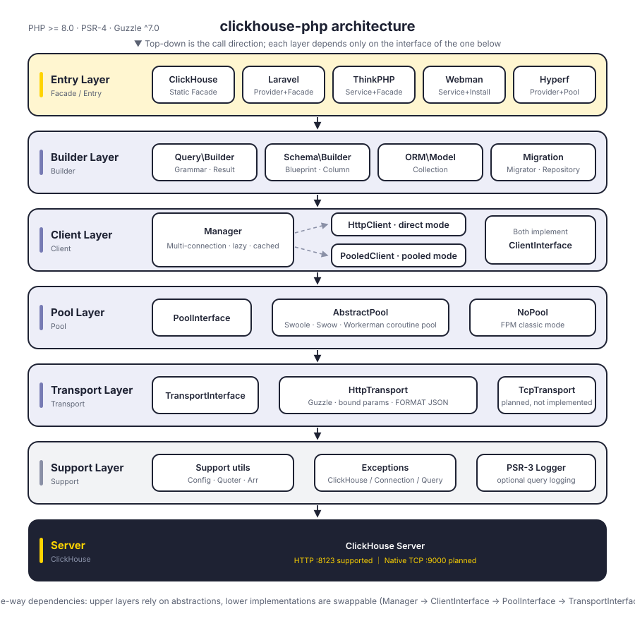
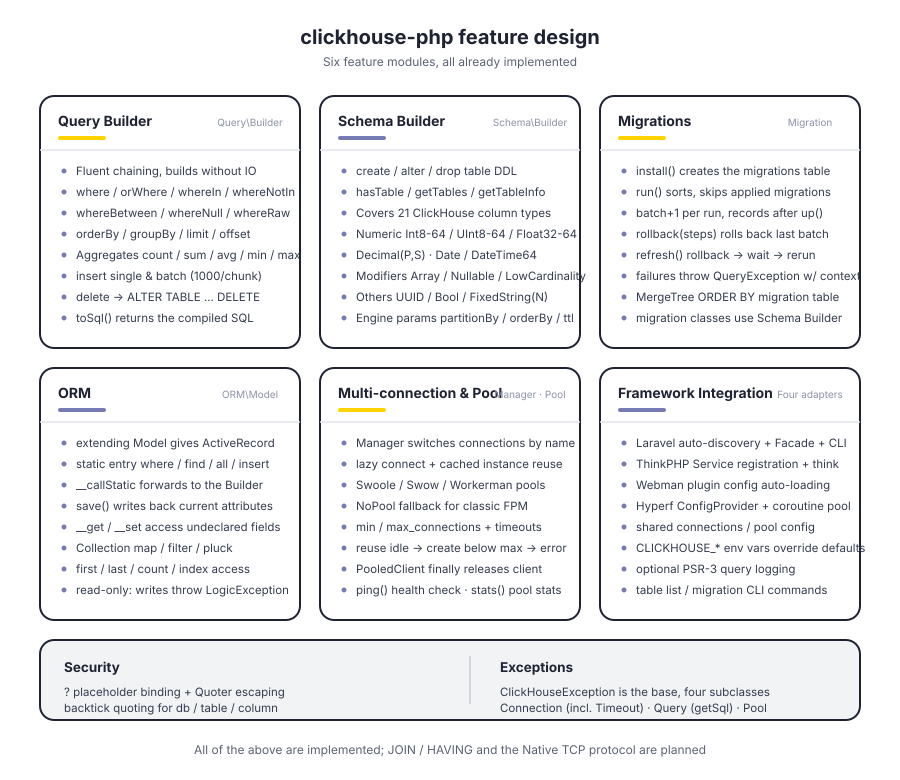
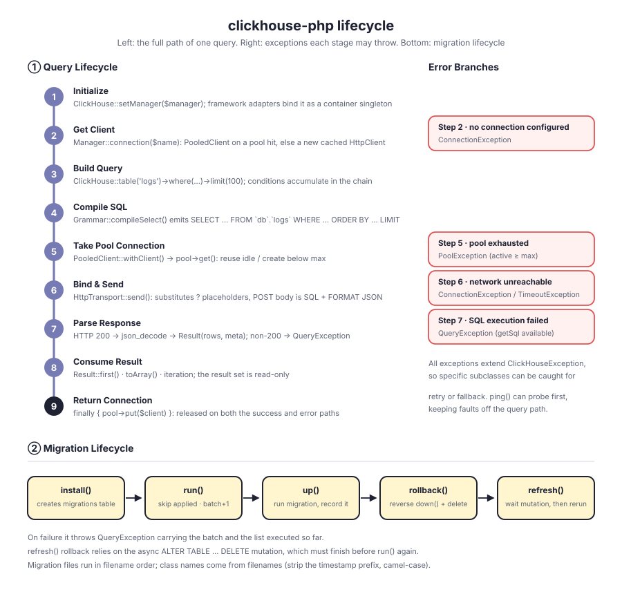

# clickhouse-php

A PHP ClickHouse client. It talks to the ClickHouse HTTP interface (port 8123) by default and ships with a query builder, schema builder, migration system, and ORM, plus adapters for Laravel, ThinkPHP, Webman, and Hyperf.

Clean layering: `Manager → ClientInterface → PoolInterface → TransportInterface`. Client flavour, connection pool, and transport protocol each sit behind an interface and can be swapped. The Native TCP protocol has its slot reserved in the transport layer but is not implemented yet.

[简体中文](README.md) | **English** | [한국어](docs/i18n/ko/README.md) | [Русский](docs/i18n/ru/README.md) | [Deutsch](docs/i18n/de/README.md) | [Français](docs/i18n/fr/README.md) | [Español](docs/i18n/es/README.md) | [Português](docs/i18n/pt/README.md) | [हिन्दी](docs/i18n/hi/README.md) | [العربية](docs/i18n/ar/README.md) | [বাংলা](docs/i18n/bn/README.md) | [Bahasa Indonesia](docs/i18n/id/README.md) | [日本語](docs/i18n/ja/README.md)

<p align="center">
  
</p>

## Project Structure

```
clickhouse-php/
├── src/
│   ├── ClickHouse.php                  # static facade entry point
│   ├── Client/                         # client layer: multi-connection, direct or pooled
│   │   ├── ClientInterface.php         # query / select / insert / ping
│   │   ├── Manager.php                 # multi-connection, lazy + cached instances
│   │   ├── HttpClient.php              # direct client: SQL assembly and response parsing
│   │   └── PooledClient.php            # pooled client: acquires and returns connections
│   ├── Query/                          # query builder
│   │   ├── Builder.php                 # fluent API and aggregate entry points
│   │   ├── Grammar.php                 # SELECT / DELETE compilation
│   │   ├── Expression.php              # raw expressions
│   │   └── Result.php                  # read-only result set
│   ├── Schema/                         # schema builder
│   │   ├── Builder.php                 # create / alter / drop / introspection
│   │   ├── Blueprint.php               # column and engine-parameter collection
│   │   ├── Column.php                  # column definition
│   │   └── Grammar.php                 # DDL compilation
│   ├── Migration/                      # migration system
│   │   ├── Migration.php               # base migration class
│   │   ├── Migrator.php                # run / rollback / refresh
│   │   └── Repository.php              # migration table IO and mutation waiting
│   ├── ORM/                            # ORM
│   │   ├── Model.php                   # ActiveRecord base class
│   │   └── Collection.php              # read-only model collection
│   ├── Pool/                           # connection pool
│   │   ├── PoolInterface.php           # get / put / stats / close
│   │   ├── AbstractPool.php            # shared pooling logic (counts, timeout, warmup)
│   │   ├── SwoolePool.php              # Swoole coroutine channel
│   │   ├── SwowPool.php                # Swow coroutine channel
│   │   ├── WorkermanPool.php           # Workerman coroutine channel
│   │   └── NoPool.php                  # classic FPM mode
│   ├── Transport/                      # transport layer
│   │   ├── TransportInterface.php      # send / close
│   │   ├── HttpTransport.php           # Guzzle HTTP, parameter binding, FORMAT JSON
│   │   └── TcpTransport.php            # Native TCP (planned)
│   ├── Support/                        # Config / Quoter / Arr
│   ├── Exceptions/                     # exception hierarchy (1 base + 4 subclasses)
│   ├── Laravel/                        # ServiceProvider · Facade · Artisan commands
│   ├── ThinkPHP/                       # Service · Facade · command
│   ├── Webman/                         # Service · installer
│   └── Hyperf/                         # ConfigProvider · coroutine pool · command
├── tests/                              # PHPUnit tests, mirrors src layout
├── docs/                               # design diagrams and docs
└── composer.json
```

## Architecture

<p align="center">
  
</p>

Six layers, each depending only on the abstract interface of the layer below:

| Layer | Responsibility | Key types |
|-------|----------------|-----------|
| Entry | Facade and framework adapters | `ClickHouse`, four framework adapters |
| Builder | Assembles queries and DDL without IO | `Query\Builder`, `Schema\Builder`, `ORM\Model`, `Migration\Migrator` |
| Client | Multi-connection management and execution entry | `Manager`, `HttpClient`, `PooledClient` |
| Pool | Connection reuse and concurrency ceiling | `PoolInterface`, `AbstractPool`, `NoPool` |
| Transport | Protocol encoding and error mapping | `HttpTransport`, `TcpTransport` (planned) |
| Support | Config, quoting, exceptions, logging | `Support\*`, `Exceptions\*`, PSR-3 `LoggerInterface` |

## Features

<p align="center">
  
</p>

## Lifecycle

<p align="center">
  
</p>

## Installation

```bash
composer require erikwang2013/clickhouse-php
```

## Quick Start

### Standalone Usage (plain PHP)

No framework required. Initialise from `CLICKHOUSE_*` environment variables in one line:

```php
use Erikwang2013\ClickHouse\ClickHouse;

ClickHouse::bootstrap();   // same as ClickHouse::setManager(Manager::fromEnv())

$rows = ClickHouse::table('logs')
    ->where('date', '>=', '2024-01-01')
    ->whereIn('level', ['error', 'warn'])
    ->orderBy('timestamp', 'desc')
    ->limit(100)
    ->get();

foreach ($rows as $row) {
    echo $row['message'];
}
```

For what environment variables cannot express (multiple connections, pool tuning), pass a config array explicitly:

```php
use Erikwang2013\ClickHouse\ClickHouse;
use Erikwang2013\ClickHouse\Client\Manager;

$config = [
    'default' => 'clickhouse',
    'connections' => [
        'clickhouse' => [
            'driver'   => 'http',        // 'http' (recommended) or 'native' (WIP)
            'host'     => 'localhost',
            'port'     => 8123,          // HTTP port, 9000 for Native
            'database' => 'default',
            'username' => 'default',
            'password' => '',
            'timeout'  => 30,
            'https'    => false,         // true to use HTTPS
        ],
    ],
    'pool' => [
        'min_connections'    => 2,
        'max_connections'    => 16,
        'connection_timeout' => 5.0,
    ],
];

$manager = new Manager($config);
ClickHouse::setManager($manager);

// Query with builder
$rows = ClickHouse::table('logs')
    ->where('date', '>=', '2024-01-01')
    ->whereIn('level', ['error', 'warn'])
    ->orderBy('timestamp', 'desc')
    ->limit(100)
    ->get();

foreach ($rows as $row) {
    echo $row['message'];
}

// Raw SQL
$result = ClickHouse::query('SELECT count(*) AS cnt FROM logs WHERE date = ?', ['2024-01-01']);
echo $result->first()['cnt'];

// Aggregation
$count = ClickHouse::table('logs')->where('level', 'error')->count();
$avgDuration = ClickHouse::table('logs')->avg('duration');
```

### Insert Data

```php
// Single row
ClickHouse::table('logs')->insert([
    'date'     => '2024-01-01',
    'level'    => 'info',
    'message'  => 'hello',
    'duration' => 12.5,
]);

// Batch insert
ClickHouse::table('logs')->insert([
    ['date' => '2024-01-01', 'level' => 'info',  'message' => 'a', 'duration' => 1.2],
    ['date' => '2024-01-02', 'level' => 'error', 'message' => 'b', 'duration' => 3.4],
]);
```

### Schema Builder

```php
ClickHouse::schema()->create('logs', function ($table) {
    $table->date('date');
    $table->dateTime('timestamp');
    $table->string('level');
    $table->string('message');
    $table->float64('duration');
    $table->engine('MergeTree')
          ->partitionBy('toYYYYMM(date)')
          ->orderBy(['date', 'timestamp', 'level']);
});

// Drop
ClickHouse::schema()->drop('logs');

// Alter
ClickHouse::schema()->alter('logs', function ($table) {
    $table->nullable('source', 'String');
});
```

### Migrations

Create a migration file (e.g. `2026_05_27_000000_create_logs_table.php`):

```php
use Erikwang2013\ClickHouse\Migration\Migration;

class CreateLogsTable extends Migration
{
    public function up(): void
    {
        $this->schema->create('logs', function ($table) {
            $table->date('date');
            $table->string('level');
            $table->engine('MergeTree')
                  ->partitionBy('toYYYYMM(date)')
                  ->orderBy(['date', 'level']);
        });
    }

    public function down(): void
    {
        $this->schema->drop('logs');
    }
}
```

Run:

```php
use Erikwang2013\ClickHouse\Migration\Migrator;
use Erikwang2013\ClickHouse\Migration\Repository;

$client = ClickHouse::getManager()->connection();
$repository = new Repository($client);
$migrator = new Migrator($client, $repository, '/path/to/migrations');

$migrator->install();   // Create migrations table
$migrator->run();       // Run pending
$migrator->rollback();  // Rollback last batch
$migrator->refresh();   // Rollback + re-run
```

### ORM

```php
use Erikwang2013\ClickHouse\ORM\Model;

class Log extends Model
{
    protected string $table = 'logs';
    protected string $connection = 'default';
}

// Queries
$logs = Log::where('level', 'error')
    ->orderBy('timestamp', 'desc')
    ->limit(50)
    ->get();

$log = Log::find(123);
$total = Log::where('date', '>=', '2024-01-01')->count();

// Batch insert
Log::insert([
    ['date' => '2024-01-01', 'level' => 'info'],
    ['date' => '2024-01-02', 'level' => 'error'],
]);
```

### Multiple Connections

```php
$config = [
    'default' => 'default',
    'connections' => [
        'default'   => ['driver' => 'http', 'host' => 'ch1.example.com', 'port' => 8123],
        'analytics' => ['driver' => 'http', 'host' => 'ch2.example.com', 'port' => 8123],
    ],
];

$manager = new Manager($config);
ClickHouse::setManager($manager);

ClickHouse::connection('analytics')->table('events')->get();
ClickHouse::table('events', 'analytics')->get();
```

## Framework Integration

### Laravel

Auto-discovered via Composer. Publish config:

```bash
php artisan vendor:publish --tag=clickhouse-config
```

```php
use Erikwang2013\ClickHouse\Laravel\Facades\ClickHouse;

ClickHouse::table('logs')->where('level', 'error')->get();
ClickHouse::connection('native')->select('SELECT * FROM logs LIMIT 10');
```

Artisan commands:

```bash
php artisan clickhouse:table-list
php artisan clickhouse:migration:install
php artisan clickhouse:migration:run
```

### ThinkPHP

Register in `app/service.php`:

```php
return [
    \Erikwang2013\ClickHouse\ThinkPHP\ClickHouseService::class,
];
```

```php
use think\facade\ClickHouse;

ClickHouse::table('logs')->get();
```

```bash
php think clickhouse:table-list
```

### Webman

Auto-loaded from `config/plugin/erikwang2013/clickhouse-php/app.php`.

```php
use Erikwang2013\ClickHouse\Webman\ClickHouse;

ClickHouse::table('logs')->where('level', 'error')->get();
```

### Hyperf

Auto-discovered via `ConfigProvider`. Supports coroutine connection pooling with Swoole.

```bash
php bin/hyperf.php vendor:publish erikwang2013/clickhouse-php
```

```php
use Erikwang2013\ClickHouse\Hyperf\ClickHouseConnection;

class LogController
{
    public function __construct(
        private ClickHouseConnection $clickhouse
    ) {}

    public function index()
    {
        return $this->clickhouse->table('logs')->get();
    }
}
```

## Query Builder Reference

| Method | Description |
|--------|-------------|
| `table($name)` / `from($name)` | Set table name |
| `select([...])` / `selectRaw($expr)` | SELECT columns |
| `where($col, $op, $val)` | WHERE clause (2-arg defaults to `=`) |
| `orWhere($col, $op, $val)` | OR WHERE clause |
| `whereIn($col, $arr)` / `whereNotIn($col, $arr)` | WHERE IN / NOT IN |
| `whereBetween($col, [$min, $max])` | WHERE BETWEEN |
| `whereNull($col)` / `whereNotNull($col)` | IS NULL / IS NOT NULL |
| `whereRaw($sql)` | Raw WHERE expression |
| `orderBy($col, $dir)` | ORDER BY (default ASC) |
| `groupBy(...$cols)` | GROUP BY |
| `limit($n)` / `offset($n)` | Pagination |
| `count()` / `sum($col)` / `avg($col)` / `min($col)` / `max($col)` | Aggregates |
| `insert($data)` | Insert (single or batch) |
| `delete()` | Delete (ALTER TABLE ... DELETE) |
| `get()` | Execute query, returns Result |
| `first()` | Return first row |
| `toSql()` | Get generated SQL |

## Schema Column Types

| Method | ClickHouse Type |
|--------|----------------|
| `string($name)` | String |
| `fixedString($name, $len)` | FixedString(N) |
| `int8/16/32/64($name)` | Int8/16/32/64 |
| `uint8/16/32/64($name)` | UInt8/16/32/64 |
| `float32($name)` / `float64($name)` | Float32 / Float64 |
| `decimal($name, $p, $s)` | Decimal(P, S) |
| `date($name)` | Date |
| `dateTime($name)` | DateTime |
| `dateTime64($name, $p)` | DateTime64(P) |
| `uuid($name)` | UUID |
| `bool($name)` | Bool |
| `array($name, $type)` | Array(T) |
| `nullable($name, $type)` | Nullable(T) |
| `lowCardinality($name, $type)` | LowCardinality(T) |

## Configuration Reference

```php
[
    'default' => 'clickhouse',
    'connections' => [
        'clickhouse' => [
            'driver'   => 'http',     // http (recommended) | native (WIP)
            'host'     => 'localhost',
            'port'     => 8123,       // HTTP 8123, Native 9000
            'database' => 'default',
            'username' => 'default',
            'password' => '',
            'timeout'  => 30,
            'https'    => false,
        ],
    ],
    'pool' => [
        'min_connections'    => 2,
        'max_connections'    => 16,
        'connection_timeout' => 5.0,
    ],
    'query_log' => false,
];
```

## Error Handling

All exceptions extend `ClickHouseException`:

```php
use Erikwang2013\ClickHouse\Exceptions\{
    ClickHouseException,
    ConnectionException,
    QueryException,
    TimeoutException,
    PoolException,
};

try {
    ClickHouse::table('logs')->get();
} catch (ConnectionException | TimeoutException $e) {
    // Connection or timeout issues
} catch (QueryException $e) {
    echo $e->getMessage();
    echo $e->getSql();      // Original SQL
} catch (ClickHouseException $e) {
    // Other exceptions
}
```

## Environment Variables

| Variable | Default | Description |
|----------|---------|-------------|
| `CLICKHOUSE_CONNECTION` | default | Default connection name |
| `CLICKHOUSE_HOST` | localhost | Server host |
| `CLICKHOUSE_PORT` | 8123 | HTTP port |
| `CLICKHOUSE_DB` | default | Database name |
| `CLICKHOUSE_USER` | default | Username |
| `CLICKHOUSE_PASS` | — | Password |
| `CLICKHOUSE_TIMEOUT` | 30 | Timeout (seconds) |
| `CLICKHOUSE_HTTPS` | false | Use HTTPS |
| `CLICKHOUSE_DRIVER` | http | Driver type |
| `CLICKHOUSE_POOL_MIN` | 2 | Min connections |
| `CLICKHOUSE_POOL_MAX` | 16 | Max connections |
| `CLICKHOUSE_POOL_TIMEOUT` | 5.0 | Pool acquire timeout (seconds) |

In plain PHP these are read by `ClickHouse::bootstrap()` / `Manager::fromEnv()`. The four framework config files use the same variable names but cover different subsets (Laravel covers all, Hyperf lacks `CLICKHOUSE_CONNECTION`/`CLICKHOUSE_DRIVER`/`CLICKHOUSE_HTTPS`, Webman only reads the five connection variables, ThinkPHP reads none) — check each config file.

## Support

| WeChat | Alipay |
|--------|--------|
|  |  |

Thank you for your support!

## License

MIT License. Copyright (c) 2026 erik <erik@erik.xyz> — https://erik.xyz
