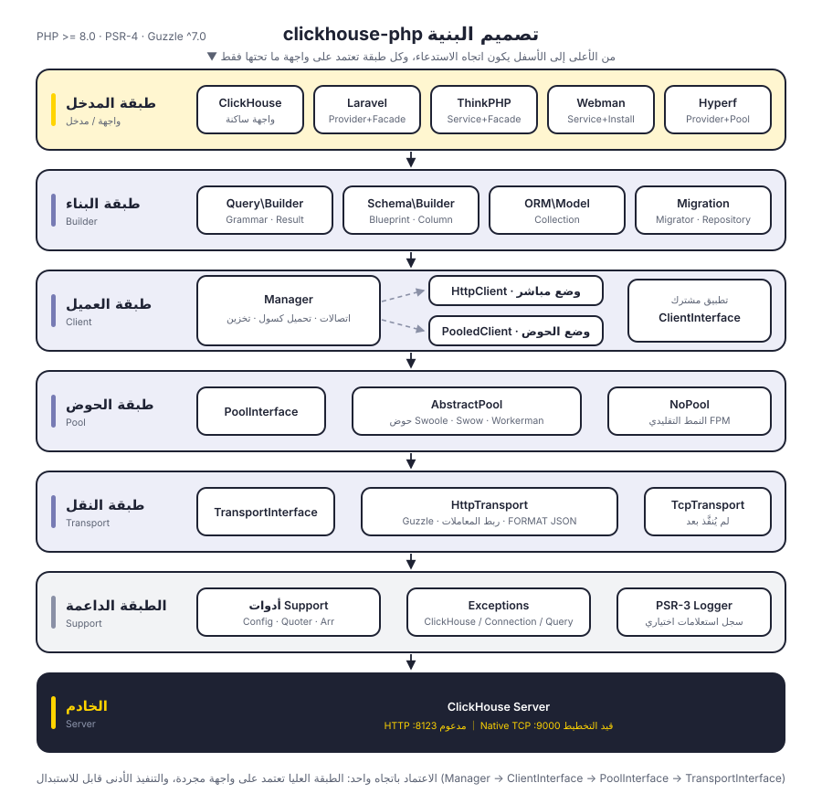
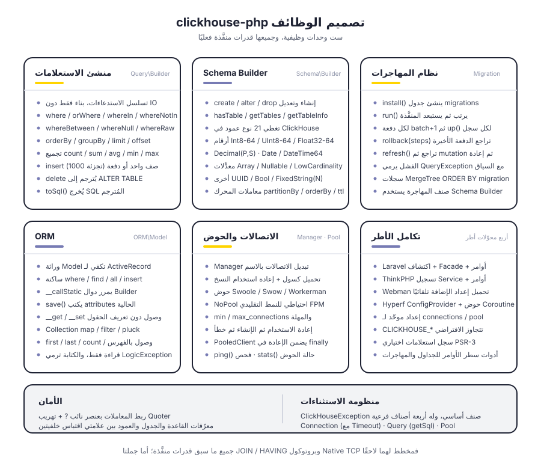
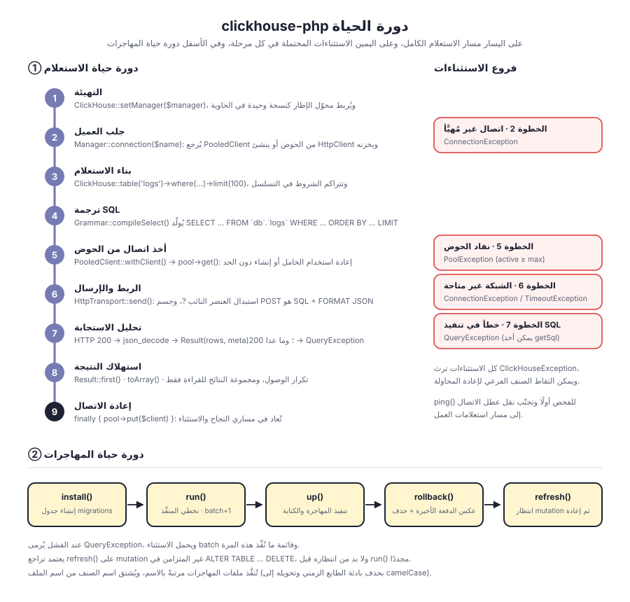

# clickhouse-php

عميل ClickHouse لـ PHP. يتواصل افتراضيًا عبر واجهة ClickHouse HTTP (المنفذ 8123)، ويتضمن منشئ استعلامات وSchema Builder ونظام مهاجرات وORM، مع دعم Laravel وThinkPHP وWebman وHyperf.

فصل طَبَقي: `Manager → ClientInterface → PoolInterface → TransportInterface`، إذ يستند شكل العميل وحوض الاتصالات وبروتوكول النقل كلٌّ إلى واجهته الخاصة، ويمكن استبدالها جميعًا. بروتوكول Native TCP له موضع محجوز في طبقة النقل، لكنه لم يُنفَّذ بعد.

[简体中文](../../../README.md) | [English](../../../README_EN.md) | [한국어](../ko/README.md) | [Русский](../ru/README.md) | [Deutsch](../de/README.md) | [Français](../fr/README.md) | [Español](../es/README.md) | [Português](../pt/README.md) | [हिन्दी](../hi/README.md) | **العربية** | [বাংলা](../bn/README.md) | [Bahasa Indonesia](../id/README.md) | [日本語](../ja/README.md)

<p align="center">
  
</p>

## هيكل المشروع

```
clickhouse-php/
├── src/
│   ├── ClickHouse.php                  # مدخل الواجهة الساكنة
│   ├── Client/                         # طبقة العميل: اتصالات متعددة، مباشر / من الحوض
│   │   ├── ClientInterface.php         # query / select / insert / ping
│   │   ├── Manager.php                 # إدارة اتصالات متعددة، تحميل كسول + تخزين النسخ
│   │   ├── HttpClient.php              # عميل مباشر، مسؤول عن تجميع SQL وتحليل الاستجابة
│   │   └── PooledClient.php            # عميل من الحوض، يأخذ الاتصال ويعيده تلقائيًا
│   ├── Query/                          # منشئ الاستعلامات
│   │   ├── Builder.php                 # واجهة تسلسلية ومدخل التجميع
│   │   ├── Grammar.php                 # ترجمة صيغة SELECT / DELETE
│   │   ├── Expression.php              # تعبير خام
│   │   └── Result.php                  # مجموعة نتائج للقراءة فقط
│   ├── Schema/                         # Schema Builder
│   │   ├── Builder.php                 # create / alter / drop / استعلام البيانات الوصفية
│   │   ├── Blueprint.php               # تجميع الأعمدة ومعاملات المحرك
│   │   ├── Column.php                  # تعريف العمود
│   │   └── Grammar.php                 # ترجمة صيغة DDL
│   ├── Migration/                      # نظام المهاجرات
│   │   ├── Migration.php               # الصنف الأساسي للمهاجرة
│   │   ├── Migrator.php                # run / rollback / refresh
│   │   └── Repository.php              # قراءة جدول سجلات المهاجرات وكتابته وانتظار mutation
│   ├── ORM/                            # ORM
│   │   ├── Model.php                   # الصنف الأساسي لـ ActiveRecord
│   │   └── Collection.php              # مجموعة نماذج للقراءة فقط
│   ├── Pool/                           # حوض الاتصالات
│   │   ├── PoolInterface.php           # get / put / stats / close
│   │   ├── AbstractPool.php            # منطق الحوض المشترك (العدّ، المهلة، التعويض)
│   │   ├── SwoolePool.php              # قناة Coroutine في Swoole
│   │   ├── SwowPool.php                # قناة Coroutine في Swow
│   │   ├── WorkermanPool.php           # قناة Coroutine في Workerman
│   │   └── NoPool.php                  # النمط التقليدي FPM
│   ├── Transport/                      # طبقة النقل
│   │   ├── TransportInterface.php      # send / close
│   │   ├── HttpTransport.php           # Guzzle HTTP، ربط المعاملات وFORMAT JSON
│   │   └── TcpTransport.php            # Native TCP (قيد التخطيط)
│   ├── Support/                        # Config / Quoter / Arr
│   ├── Exceptions/                     # منظومة الاستثناءات (صنف أساسي واحد + 4 أصناف فرعية)
│   ├── Laravel/                        # ServiceProvider · Facade · أوامر Artisan
│   ├── ThinkPHP/                       # Service · Facade · أوامر
│   ├── Webman/                         # Service · نص التثبيت
│   └── Hyperf/                         # ConfigProvider · حوض اتصالات Coroutine · أوامر
├── tests/                              # اختبارات PHPUnit، الدلائل مطابقة لـ src
├── docs/                               # مخططات ووثائق
└── composer.json
```

## تصميم البنية

<p align="center">
  
</p>

تنقسم من الأعلى إلى الأسفل إلى ست طبقات، وكل طبقة تعتمد فقط على الواجهة المجردة للطبقة التي تحتها:

| الطبقة | المسؤولية | الأنواع الأساسية |
|----|------|----------|
| طبقة المدخل | الواجهة وتكييف الأطر | `ClickHouse`، أربع محوّلات أطر |
| طبقة البناء | تجميع الاستعلامات وDDL، دون إنتاج IO | `Query\Builder`، `Schema\Builder`، `ORM\Model`، `Migration\Migrator` |
| طبقة العميل | إدارة اتصالات متعددة ومدخل التنفيذ | `Manager`، `HttpClient`، `PooledClient` |
| طبقة حوض الاتصالات | إعادة استخدام الاتصالات وحد التزامن | `PoolInterface`، `AbstractPool`، `NoPool` |
| طبقة النقل | ترميز البروتوكول وفك ترميزه وتعيين الأخطاء | `HttpTransport`، `TcpTransport` (قيد التخطيط) |
| الطبقة الداعمة | الإعداد والتهريب والاستثناءات والسجلات | `Support\*`، `Exceptions\*`، PSR-3 `LoggerInterface` |

## تصميم الوظائف

<p align="center">
  
</p>

## دورة الحياة

<p align="center">
  
</p>

## التثبيت

```bash
composer require erikwang2013/clickhouse-php
```

## البدء السريع

### الاستخدام المستقل

```php
use Erikwang2013\ClickHouse\ClickHouse;
use Erikwang2013\ClickHouse\Client\Manager;

// الإعداد
$config = [
    'default' => 'clickhouse',
    'connections' => [
        'clickhouse' => [
            'driver'   => 'http',        // http (موصى به) أو native (قيد التطوير)
            'host'     => 'localhost',
            'port'     => 8123,          // منفذ HTTP، ولـ Native يُستخدم 9000
            'database' => 'default',
            'username' => 'default',
            'password' => '',
            'timeout'  => 30,
        ],
    ],
];

// التهيئة
$manager = new Manager($config);
ClickHouse::setManager($manager);

// استعلام
$rows = ClickHouse::table('logs')
    ->where('date', '>=', '2024-01-01')
    ->whereIn('level', ['error', 'warn'])
    ->orderBy('timestamp', 'desc')
    ->limit(100)
    ->get();

foreach ($rows as $row) {
    echo $row['message'];
}

// SQL خام
$result = ClickHouse::query('SELECT count(*) AS cnt FROM logs WHERE date = ?', ['2024-01-01']);
echo $result->first()['cnt'];

// التجميع
$count = ClickHouse::table('logs')->where('level', 'error')->count();
$avgDuration = ClickHouse::table('logs')->avg('duration');
```

### إدراج البيانات

```php
// صف واحد
ClickHouse::table('logs')->insert([
    'date'      => '2024-01-01',
    'level'     => 'info',
    'message'   => 'hello',
    'duration'  => 12.5,
]);

// دفعة
ClickHouse::table('logs')->insert([
    ['date' => '2024-01-01', 'level' => 'info',  'message' => 'a', 'duration' => 1.2],
    ['date' => '2024-01-02', 'level' => 'error', 'message' => 'b', 'duration' => 3.4],
]);
```

### إنشاء الجداول (Schema Builder)

```php
ClickHouse::schema()->create('logs', function ($table) {
    $table->date('date');
    $table->dateTime('timestamp');
    $table->string('level');
    $table->string('message');
    $table->float64('duration');
    $table->engine('MergeTree')
          ->partitionBy('toYYYYMM(date)')
          ->orderBy(['date', 'timestamp', 'level']);
});

// حذف الجدول
ClickHouse::schema()->drop('logs');

// تعديل الجدول
ClickHouse::schema()->alter('logs', function ($table) {
    $table->nullable('source', 'String');
});
```

### المهاجرات

أنشئ ملف مهاجرة (مثل `2026_05_27_000000_create_logs_table.php`):

```php
use Erikwang2013\ClickHouse\Migration\Migration;

class CreateLogsTable extends Migration
{
    public function up(): void
    {
        $this->schema->create('logs', function ($table) {
            $table->date('date');
            $table->string('level');
            $table->engine('MergeTree')
                  ->partitionBy('toYYYYMM(date)')
                  ->orderBy(['date', 'level']);
        });
    }

    public function down(): void
    {
        $this->schema->drop('logs');
    }
}
```

تشغيل المهاجرات:

```php
use Erikwang2013\ClickHouse\Migration\Migrator;
use Erikwang2013\ClickHouse\Migration\Repository;

$client = ClickHouse::getManager()->connection();
$repository = new Repository($client);
$migrator = new Migrator($client, $repository, '/path/to/migrations');

$migrator->install();   // إنشاء جدول سجلات المهاجرات
$migrator->run();       // تنفيذ المهاجرات المعلّقة
$migrator->rollback();  // التراجع عن الدفعة الأخيرة
$migrator->refresh();   // التراجع ثم إعادة التنفيذ
```

### ORM

```php
use Erikwang2013\ClickHouse\ORM\Model;

class Log extends Model
{
    protected string $table = 'logs';
    protected string $connection = 'default';
}

// استعلام
$logs = Log::where('level', 'error')
    ->orderBy('timestamp', 'desc')
    ->limit(50)
    ->get();

// جلب سجل واحد
$log = Log::find(123);

// التجميع
$total = Log::where('date', '>=', '2024-01-01')->count();

// إدراج دفعة
Log::insert([
    ['date' => '2024-01-01', 'level' => 'info'],
    ['date' => '2024-01-02', 'level' => 'error'],
]);
```

### اتصالات متعددة

```php
$config = [
    'default' => 'default',
    'connections' => [
        'default' => ['driver' => 'http', 'host' => 'ch1.example.com', 'port' => 8123],
        'analytics' => ['driver' => 'http', 'host' => 'ch2.example.com', 'port' => 8123],
    ],
];

$manager = new Manager($config);

// استخدام اتصال محدد
ClickHouse::connection('analytics')->table('events')->get();
ClickHouse::table('events', 'analytics')->get();
```

## تكامل الأطر

### Laravel

يُنشر ملف الإعداد تلقائيًا، ويكتشف Composer الـ ServiceProvider تلقائيًا.

```bash
php artisan vendor:publish --tag=clickhouse-config
```

```php
use Erikwang2013\ClickHouse\Laravel\Facades\ClickHouse;

ClickHouse::table('logs')->where('level', 'error')->get();
ClickHouse::connection('native')->select('SELECT * FROM logs LIMIT 10');
```

أوامر Artisan:

```bash
php artisan clickhouse:table-list
php artisan clickhouse:migration:install
php artisan clickhouse:migration:run
```

### ThinkPHP

سجّل الخدمة في `app/service.php`:

```php
return [
    \Erikwang2013\ClickHouse\ThinkPHP\ClickHouseService::class,
];
```

```php
use think\facade\ClickHouse;

ClickHouse::table('logs')->get();
```

```bash
php think clickhouse:table-list
```

### Webman

يحمّل Webman إعداد الإضافة تلقائيًا، دون حاجة إلى إعداد يدوي.

```php
use Erikwang2013\ClickHouse\Webman\ClickHouse;

ClickHouse::table('logs')->where('level', 'error')->get();
```

### Hyperf

يُكتشف تلقائيًا عبر `ConfigProvider`، ويدعم حقن التبعيات وحوض اتصالات Coroutine.

```bash
php bin/hyperf.php vendor:publish erikwang2013/clickhouse-php
```

```php
use Erikwang2013\ClickHouse\Hyperf\ClickHouseConnection;

class LogController
{
    public function __construct(
        private ClickHouseConnection $clickhouse
    ) {}

    public function index()
    {
        return $this->clickhouse->table('logs')->get();
    }
}
```

## مرجع منشئ الاستعلامات

| الطريقة | الوصف |
|------|------|
| `table($name)` / `from($name)` | تحديد اسم الجدول |
| `select([...])` / `selectRaw($expr)` | أعمدة SELECT |
| `where($col, $op, $val)` | شرط (عند تمرير معاملين تكون `$op` افتراضيًا `=`) |
| `orWhere($col, $op, $val)` | شرط OR |
| `whereIn($col, $arr)` / `whereNotIn($col, $arr)` | IN / NOT IN |
| `whereBetween($col, [$min, $max])` | BETWEEN |
| `whereNull($col)` / `whereNotNull($col)` | IS NULL / IS NOT NULL |
| `whereRaw($sql)` | WHERE خام |
| `orderBy($col, $dir)` | الترتيب (ASC افتراضيًا) |
| `groupBy(...$cols)` | التجميع |
| `limit($n)` / `offset($n)` | ترقيم الصفحات |
| `count()` / `sum($col)` / `avg($col)` / `min($col)` / `max($col)` | التجميع |
| `insert($data)` | إدراج (صف واحد أو دفعة) |
| `delete()` | حذف |
| `get()` | تنفيذ الاستعلام وإرجاع Result |
| `first()` | إرجاع أول سجل |
| `toSql()` | الحصول على SQL المُولَّد |

## أنواع أعمدة Schema

| الطريقة | نوع ClickHouse |
|------|----------------|
| `string($name)` | String |
| `fixedString($name, $len)` | FixedString(N) |
| `int8/16/32/64($name)` | Int8/16/32/64 |
| `uint8/16/32/64($name)` | UInt8/16/32/64 |
| `float32($name)` / `float64($name)` | Float32 / Float64 |
| `decimal($name, $p, $s)` | Decimal(P, S) |
| `date($name)` | Date |
| `dateTime($name)` | DateTime |
| `dateTime64($name, $p)` | DateTime64(P) |
| `uuid($name)` | UUID |
| `bool($name)` | Bool |
| `array($name, $type)` | Array(T) |
| `nullable($name, $type)` | Nullable(T) |
| `lowCardinality($name, $type)` | LowCardinality(T) |

## مرجع الإعداد

```php
[
    'default' => 'clickhouse',
    'connections' => [
        'clickhouse' => [
            'driver'   => 'http',     // http (موصى به) | native (قيد التطوير)
            'host'     => 'localhost',
            'port'     => 8123,       // HTTP 8123، وNative 9000
            'database' => 'default',
            'username' => 'default',
            'password' => '',
            'timeout'  => 30,
        ],
    ],
    'pool' => [
        'min_connections'    => 2,
        'max_connections'    => 16,
        'connection_timeout' => 5.0,
    ],
    'query_log' => false,
];
```

## متغيرات البيئة

| المتغير | القيمة الافتراضية | الوصف |
|------|--------|------|
| `CLICKHOUSE_HOST` | localhost | عنوان المضيف |
| `CLICKHOUSE_PORT` | 8123 | منفذ HTTP |
| `CLICKHOUSE_DB` | default | اسم قاعدة البيانات |
| `CLICKHOUSE_USER` | default | اسم المستخدم |
| `CLICKHOUSE_PASS` | — | كلمة المرور |
| `CLICKHOUSE_TIMEOUT` | 30 | مهلة الاتصال (ثانية) |
| `CLICKHOUSE_DRIVER` | http | نوع المشغّل |
| `CLICKHOUSE_POOL_MIN` | 2 | الحد الأدنى للاتصالات |
| `CLICKHOUSE_POOL_MAX` | 16 | الحد الأقصى للاتصالات |

## معالجة الاستثناءات

```php
use Erikwang2013\ClickHouse\Exceptions\{
    ClickHouseException,
    ConnectionException,
    QueryException,
    TimeoutException,
    PoolException,
};

try {
    ClickHouse::table('logs')->get();
} catch (ConnectionException | TimeoutException $e) {
    // مشكلة اتصال أو مهلة
} catch (QueryException $e) {
    echo $e->getMessage();
    echo $e->getSql();      // SQL الأصلي
} catch (ClickHouseException $e) {
    // استثناءات أخرى
}
```

## دعم المشروع

| WeChat | Alipay |
|------|--------|
|  |  |

شكرًا لدعمكم!

## الترخيص

MIT License.  Copyright (c) 2026 erik <erik@erik.xyz> — https://erik.xyz
