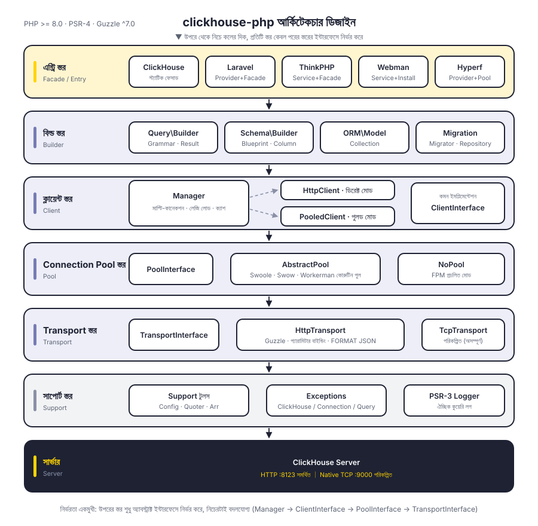
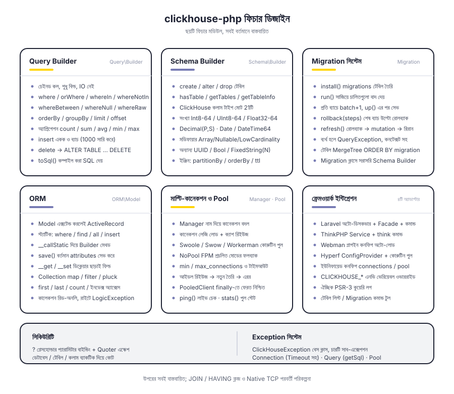
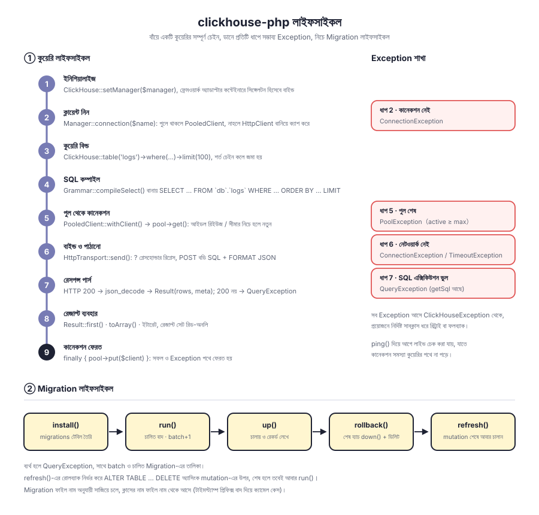

# clickhouse-php

PHP ClickHouse ক্লায়েন্ট। ডিফল্টভাবে ClickHouse HTTP ইন্টারফেস (পোর্ট 8123) দিয়ে যোগাযোগ করে, এতে আছে Query Builder, Schema Builder, Migration সিস্টেম ও ORM, এবং Laravel, ThinkPHP, Webman, Hyperf-এর অ্যাডাপ্টার।

স্তরভিত্তিক ডিকাপলিং: `Manager → ClientInterface → PoolInterface → TransportInterface`, ক্লায়েন্ট ফর্ম, Connection Pool ও Transport প্রোটোকল প্রত্যেকটি ইন্টারফেস-ভিত্তিক, সবই প্রতিস্থাপনযোগ্য। Native TCP প্রোটোকল Transport স্তরে জায়গা রাখা আছে, এখনো বাস্তবায়িত হয়নি।

[简体中文](../../../README.md) | [English](../../../README_EN.md) | [한국어](../ko/README.md) | [Русский](../ru/README.md) | [Deutsch](../de/README.md) | [Français](../fr/README.md) | [Español](../es/README.md) | [Português](../pt/README.md) | [हिन्दी](../hi/README.md) | [العربية](../ar/README.md) | **বাংলা** | [Bahasa Indonesia](../id/README.md) | [日本語](../ja/README.md)

<p align="center">
  
</p>

## প্রকল্প কাঠামো

```
clickhouse-php/
├── src/
│   ├── ClickHouse.php                  # স্ট্যাটিক ফেসাড এন্ট্রি
│   ├── Client/                         # ক্লায়েন্ট স্তর: মাল্টি-কানেকশন, ডিরেক্ট / পুলড দুই রূপ
│   │   ├── ClientInterface.php         # query / select / insert / ping
│   │   ├── Manager.php                 # মাল্টি-কানেকশন ব্যবস্থাপনা, লেজি লোড + ইনস্ট্যান্স ক্যাশ
│   │   ├── HttpClient.php              # ডিরেক্ট ক্লায়েন্ট, SQL তৈরি ও রেসপন্স পার্স করে
│   │   └── PooledClient.php            # পুলড ক্লায়েন্ট, স্বয়ংক্রিয়ভাবে কানেকশন নেয় ও ফেরত দেয়
│   ├── Query/                          # Query Builder
│   │   ├── Builder.php                 # চেইনড API ও অ্যাগ্রিগেশন এন্ট্রি
│   │   ├── Grammar.php                 # SELECT / DELETE সিনট্যাক্স কম্পাইল
│   │   ├── Expression.php              # র' এক্সপ্রেশন
│   │   └── Result.php                  # রিড-অনলি রেজাল্ট সেট
│   ├── Schema/                         # Schema Builder
│   │   ├── Builder.php                 # create / alter / drop / মেটাডেটা কুয়েরি
│   │   ├── Blueprint.php               # কলাম ও ইঞ্জিন প্যারামিটার সংগ্রহ
│   │   ├── Column.php                  # কলাম ডেফিনিশন
│   │   └── Grammar.php                 # DDL সিনট্যাক্স কম্পাইল
│   ├── Migration/                      # Migration সিস্টেম
│   │   ├── Migration.php               # Migration বেস ক্লাস
│   │   ├── Migrator.php                # run / rollback / refresh
│   │   └── Repository.php              # Migration রেকর্ড টেবিল পড়া/লেখা ও mutation অপেক্ষা
│   ├── ORM/                            # ORM
│   │   ├── Model.php                   # ActiveRecord বেস ক্লাস
│   │   └── Collection.php              # রিড-অনলি মডেল কালেকশন
│   ├── Pool/                           # Connection Pool
│   │   ├── PoolInterface.php           # get / put / stats / close
│   │   ├── AbstractPool.php            # সাধারণ পুলিং লজিক (গণনা, টাইমআউট, রিফিল)
│   │   ├── SwoolePool.php              # Swoole কোরুটিন চ্যানেল
│   │   ├── SwowPool.php                # Swow কোরুটিন চ্যানেল
│   │   ├── WorkermanPool.php           # Workerman কোরুটিন চ্যানেল
│   │   └── NoPool.php                  # FPM প্রচলিত মোড
│   ├── Transport/                      # Transport স্তর
│   │   ├── TransportInterface.php      # send / close
│   │   ├── HttpTransport.php           # Guzzle HTTP, প্যারামিটার বাইন্ডিং ও FORMAT JSON
│   │   └── TcpTransport.php            # Native TCP (পরিকল্পিত)
│   ├── Support/                        # Config / Quoter / Arr
│   ├── Exceptions/                     # Exception সিস্টেম (১টি বেস ক্লাস + ৪টি সাবক্লাস)
│   ├── Laravel/                        # ServiceProvider · Facade · Artisan কমান্ড
│   ├── ThinkPHP/                       # Service · Facade · কমান্ড
│   ├── Webman/                         # Service · ইনস্টল স্ক্রিপ্ট
│   └── Hyperf/                         # ConfigProvider · কোরুটিন Connection Pool · কমান্ড
├── tests/                              # PHPUnit টেস্ট, ডিরেক্টরি 구조 src-এর সমান
├── docs/                               # ডিজাইন ডায়াগ্রাম ও ডকুমেন্টেশন
└── composer.json
```

## আর্কিটেকচার ডিজাইন

<p align="center">
  
</p>

উপর থেকে নিচে ছয়টি স্তরে বিভক্ত, প্রতিটি স্তর কেবল তার পরের স্তরের অ্যাবস্ট্রাক্ট ইন্টারফেসের উপর নির্ভর করে:

| স্তর | দায়িত্ব | মূল টাইপ |
|----|------|----------|
| এন্ট্রি স্তর | ফেসাড ও ফ্রেমওয়ার্ক অ্যাডাপ্টার | `ClickHouse`, চারটি ফ্রেমওয়ার্ক অ্যাডাপ্টার |
| বিল্ড স্তর | কুয়েরি ও DDL তৈরি করে, কোনো IO নেই | `Query\Builder`, `Schema\Builder`, `ORM\Model`, `Migration\Migrator` |
| ক্লায়েন্ট স্তর | মাল্টি-কানেকশন ব্যবস্থাপনা ও এক্সিকিউশন এন্ট্রি | `Manager`, `HttpClient`, `PooledClient` |
| Connection Pool স্তর | কানেকশন পুনর্ব্যবহার ও কনকারেন্সি সীমা | `PoolInterface`, `AbstractPool`, `NoPool` |
| Transport স্তর | প্রোটোকল এনকোড/ডিকোড ও এরর ম্যাপিং | `HttpTransport`, `TcpTransport` (পরিকল্পিত) |
| সাপোর্ট স্তর | কনফিগারেশন, এস্কেপিং, Exception, লগ | `Support\*`, `Exceptions\*`, PSR-3 `LoggerInterface` |

## ফিচার ডিজাইন

<p align="center">
  
</p>

## লাইফসাইকল

<p align="center">
  
</p>

## ইনস্টলেশন

```bash
composer require erikwang2013/clickhouse-php
```

## দ্রুত শুরু

### স্বতন্ত্র ব্যবহার (নেটিভ PHP)

কোনো ফ্রেমওয়ার্কের উপর নির্ভরতা নেই। `CLICKHOUSE_*` এনভায়রনমেন্ট ভেরিয়েবল দিয়ে ইনিশিয়ালাইজ করুন, এক লাইনেই:

```php
use Erikwang2013\ClickHouse\ClickHouse;

ClickHouse::bootstrap();   // সমতুল্য ClickHouse::setManager(Manager::fromEnv())

$rows = ClickHouse::table('logs')
    ->where('date', '>=', '2024-01-01')
    ->whereIn('level', ['error', 'warn'])
    ->orderBy('timestamp', 'desc')
    ->limit(100)
    ->get();

foreach ($rows as $row) {
    echo $row['message'];
}
```

এনভায়রনমেন্ট ভেরিয়েবলে যেসব কনফিগ কভার হয় না (মাল্টি-কানেকশন, Connection Pool টিউনিং), সেগুলো `Manager` দিয়ে সরাসরি পাস করুন:

```php
use Erikwang2013\ClickHouse\ClickHouse;
use Erikwang2013\ClickHouse\Client\Manager;

// কনফিগারেশন
$config = [
    'default' => 'clickhouse',
    'connections' => [
        'clickhouse' => [
            'driver'   => 'http',        // http (প্রস্তাবিত) অথবা native (উন্নয়নাধীন)
            'host'     => 'localhost',
            'port'     => 8123,          // HTTP পোর্ট, Native-এর জন্য 9000
            'database' => 'default',
            'username' => 'default',
            'password' => '',
            'timeout'  => 30,
            'https'    => false,         // true হলে HTTPS
        ],
    ],
    'pool' => [
        'min_connections'    => 2,
        'max_connections'    => 16,
        'connection_timeout' => 5.0,
    ],
];

// ইনিশিয়ালাইজ
$manager = new Manager($config);
ClickHouse::setManager($manager);

// কুয়েরি
$rows = ClickHouse::table('logs')
    ->where('date', '>=', '2024-01-01')
    ->whereIn('level', ['error', 'warn'])
    ->orderBy('timestamp', 'desc')
    ->limit(100)
    ->get();

foreach ($rows as $row) {
    echo $row['message'];
}

// র' SQL
$result = ClickHouse::query('SELECT count(*) AS cnt FROM logs WHERE date = ?', ['2024-01-01']);
echo $result->first()['cnt'];

// অ্যাগ্রিগেশন
$count = ClickHouse::table('logs')->where('level', 'error')->count();
$avgDuration = ClickHouse::table('logs')->avg('duration');
```

### ডেটা ইনসার্ট

```php
// একক সারি
ClickHouse::table('logs')->insert([
    'date'      => '2024-01-01',
    'level'     => 'info',
    'message'   => 'hello',
    'duration'  => 12.5,
]);

// ব্যাচ
ClickHouse::table('logs')->insert([
    ['date' => '2024-01-01', 'level' => 'info',  'message' => 'a', 'duration' => 1.2],
    ['date' => '2024-01-02', 'level' => 'error', 'message' => 'b', 'duration' => 3.4],
]);
```

### টেবিল তৈরি (Schema Builder)

```php
ClickHouse::schema()->create('logs', function ($table) {
    $table->date('date');
    $table->dateTime('timestamp');
    $table->string('level');
    $table->string('message');
    $table->float64('duration');
    $table->engine('MergeTree')
          ->partitionBy('toYYYYMM(date)')
          ->orderBy(['date', 'timestamp', 'level']);
});

// টেবিল ড্রপ
ClickHouse::schema()->drop('logs');

// টেবিল পরিবর্তন
ClickHouse::schema()->alter('logs', function ($table) {
    $table->nullable('source', 'String');
});
```

### ডেটা মাইগ্রেশন

Migration ফাইল তৈরি করুন (যেমন `2026_05_27_000000_create_logs_table.php`):

```php
use Erikwang2013\ClickHouse\Migration\Migration;

class CreateLogsTable extends Migration
{
    public function up(): void
    {
        $this->schema->create('logs', function ($table) {
            $table->date('date');
            $table->string('level');
            $table->engine('MergeTree')
                  ->partitionBy('toYYYYMM(date)')
                  ->orderBy(['date', 'level']);
        });
    }

    public function down(): void
    {
        $this->schema->drop('logs');
    }
}
```

Migration চালান:

```php
use Erikwang2013\ClickHouse\Migration\Migrator;
use Erikwang2013\ClickHouse\Migration\Repository;

$client = ClickHouse::getManager()->connection();
$repository = new Repository($client);
$migrator = new Migrator($client, $repository, '/path/to/migrations');

$migrator->install();   // Migration রেকর্ড টেবিল তৈরি
$migrator->run();       // অপেক্ষমাণ Migration চালান
$migrator->rollback();  // শেষ ব্যাচ রোলব্যাক
$migrator->refresh();   // রোলব্যাকের পর আবার চালান
```

### ORM

```php
use Erikwang2013\ClickHouse\ORM\Model;

class Log extends Model
{
    protected string $table = 'logs';
    protected string $connection = 'default';
}

// কুয়েরি
$logs = Log::where('level', 'error')
    ->orderBy('timestamp', 'desc')
    ->limit(50)
    ->get();

// একটি রেকর্ড খুঁজুন
$log = Log::find(123);

// অ্যাগ্রিগেশন
$total = Log::where('date', '>=', '2024-01-01')->count();

// ব্যাচ ইনসার্ট
Log::insert([
    ['date' => '2024-01-01', 'level' => 'info'],
    ['date' => '2024-01-02', 'level' => 'error'],
]);
```

### মাল্টি-কানেকশন

```php
$config = [
    'default' => 'default',
    'connections' => [
        'default' => ['driver' => 'http', 'host' => 'ch1.example.com', 'port' => 8123],
        'analytics' => ['driver' => 'http', 'host' => 'ch2.example.com', 'port' => 8123],
    ],
];

$manager = new Manager($config);

// নির্দিষ্ট কানেকশন ব্যবহার
ClickHouse::connection('analytics')->table('events')->get();
ClickHouse::table('events', 'analytics')->get();
```

## ফ্রেমওয়ার্ক ইন্টিগ্রেশন

### Laravel

কনফিগ ফাইল স্বয়ংক্রিয়ভাবে পাবলিশ হয়, Composer স্বয়ংক্রিয়ভাবে ServiceProvider ডিসকভার করে।

```bash
php artisan vendor:publish --tag=clickhouse-config
```

```php
use Erikwang2013\ClickHouse\Laravel\Facades\ClickHouse;

ClickHouse::table('logs')->where('level', 'error')->get();
ClickHouse::connection('native')->select('SELECT * FROM logs LIMIT 10');
```

Artisan কমান্ড:

```bash
php artisan clickhouse:table-list
php artisan clickhouse:migration:install
php artisan clickhouse:migration:run
```

### ThinkPHP

`app/service.php`-এ সার্ভিস রেজিস্টার করুন:

```php
return [
    \Erikwang2013\ClickHouse\ThinkPHP\ClickHouseService::class,
];
```

```php
use think\facade\ClickHouse;

ClickHouse::table('logs')->get();
```

```bash
php think clickhouse:table-list
```

### Webman

Webman স্বয়ংক্রিয়ভাবে প্লাগইন কনফিগ লোড করে, ম্যানুয়াল কনফিগের দরকার নেই।

```php
use Erikwang2013\ClickHouse\Webman\ClickHouse;

ClickHouse::table('logs')->where('level', 'error')->get();
```

### Hyperf

`ConfigProvider`-এর মাধ্যমে স্বয়ংক্রিয় ডিসকভারি, ডিপেন্ডেন্সি ইনজেকশন ও কোরুটিন Connection Pool সমর্থিত।

```bash
php bin/hyperf.php vendor:publish erikwang2013/clickhouse-php
```

```php
use Erikwang2013\ClickHouse\Hyperf\ClickHouseConnection;

class LogController
{
    public function __construct(
        private ClickHouseConnection $clickhouse
    ) {}

    public function index()
    {
        return $this->clickhouse->table('logs')->get();
    }
}
```

## Query Builder রেফারেন্স

| মেথড | বিবরণ |
|------|------|
| `table($name)` / `from($name)` | টেবিলের নাম নির্দিষ্ট করুন |
| `select([...])` / `selectRaw($expr)` | SELECT কলাম। `select()`-এর কলাম নাম ব্যাকটিক-এ কোট হয় (`` `order` ``-এর মতো রিজার্ভড ওয়ার্ড চলে), অ্যালিয়াস `id as uid`-এর দুই পাশ আলাদা আলাদা কোট হয়; ফাংশন বা সাবকুয়েরি লিখতে `selectRaw()` বা `Expression` ব্যবহার করুন |
| `where($col, $op, $val)` | শর্ত (২টি আর্গুমেন্ট হলে `$op` ডিফল্ট `=`)। মান `null` হলে স্বয়ংক্রিয়ভাবে `IS NULL` / `IS NOT NULL` হয় |
| `orWhere($col, $op, $val)` | OR শর্ত |
| `whereIn($col, $arr)` / `whereNotIn($col, $arr)` | IN / NOT IN |
| `whereBetween($col, [$min, $max])` | BETWEEN |
| `whereNull($col)` / `whereNotNull($col)` | IS NULL / IS NOT NULL |
| `whereRaw($sql)` | র' WHERE (ইউজার ইনপুট দেবেন না) |
| `prewhere($col, $op, $val)` | PREWHERE, WHERE-এর আগে বসে (ClickHouse-এ সবচেয়ে কার্যকর স্ক্যান কাটছাঁট) |
| `orderBy($col, $dir)` | সাজানো (ডিফল্ট ASC) |
| `groupBy(...$cols)` | গ্রুপিং |
| `having($col, $op, $val)` / `havingRaw($sql)` | HAVING, GROUP BY-এর পরে বসে। `having()` কলাম নামকে আইডেন্টিফায়ার হিসেবে কোট করে, অ্যাগ্রিগেট শর্ত (যেমন `count() > 100`) হলে `havingRaw()` বা `new Expression('count()')` ব্যবহার করুন |
| `limit($n)` / `offset($n)` | পেজিনেশন |
| `final()` | পড়ার সময় ডিডুপ-মার্জ (ReplacingMergeTree ইত্যাদি) |
| `sample($ratio)` | SAMPLE স্যাম্পলিং, যেমন `sample(0.1)` |
| `settings([...])` | কুয়েরি-লেভেল SETTINGS, যেমন `settings(['max_execution_time' => 30])` |
| `count()` / `sum($col)` / `avg($col)` / `min($col)` / `max($col)` | অ্যাগ্রিগেশন |
| `insert($data)` | ইনসার্ট (একক সারি বা ব্যাচ)। একই ব্যাচের সব সারিতে কলাম একই থাকতে হবে, কলাম কম বা বেশি হলে সরাসরি এরর (পজিশন ধরে ভুল মান লেখা এড়াতে) |
| `delete()` | ডিলিট (`ALTER TABLE ... DELETE`-এ কম্পাইল হয়, **WHERE অবশ্যই লাগবে**, নাহলে Exception) |
| `get()` | কুয়েরি চালান, Result রিটার্ন করে |
| `first()` | প্রথমটি রিটার্ন করে |
| `toSql()` | জেনারেট করা SQL পান |

### বড় রেজাল্ট সেট ও স্ট্রিমিং পড়া

`get()` পুরো রেজাল্ট সেটকে PHP অ্যারে-তে পার্স করে, মেমরি রেসপন্স সাইজের প্রায় ৭ গুণ (৫ কলামের সরু টেবিলে মাপা: পেলোড 93 B/সারি → ডিকোডের পর 677 B/সারি, ১ লাখ সারিতে প্রায় 73 MB)। ডেটার পরিমাণ বড় হলে `stream()` দিয়ে সারি ধরে ধরে নিন, মেমরি রেজাল্ট সেটের আকারের সাথে বাড়ে না:

```php
use Erikwang2013\ClickHouse\Client\StreamingClientInterface;

$client = ClickHouse::client();           // নিচের স্তরের ক্লায়েন্ট দরকার হলে এটি (connection() রিটার্ন করে বিল্ডার)
if ($client instanceof StreamingClientInterface) {
    foreach ($client->stream('SELECT * FROM logs') as $row) {   // FORMAT JSONEachRow
        echo $row['message'], PHP_EOL;
    }
}

// নিজস্ব FORMAT থাকা কুয়েরিতে (CSV/TSV ইত্যাদি) raw() ব্যবহার করুন, রেসপন্স বডি হুবহু পাওয়া যায়
$csv = $client->raw('SELECT * FROM logs FORMAT CSV');
```

পুলড মোডেও `stream()` কাজ করে: জেনারেটর শেষ হলে (বা আগেই break করে ধ্বংস হলে) কানেকশন ফেরত যায়।

### র' SQL এন্ট্রি

নিচের এন্ট্রিগুলো **হুবহু জোড়া লাগানো** র' SQL চ্যানেল, এখানে ইউজার ইনপুট দিলে ডেটাবেসই তুলে দিলেন: `selectRaw()`, `whereRaw()`, `havingRaw()`, `new Expression($sql)`, `Blueprint::settings()`-এর মান, আর `$table->string('col')`-এর মতো কলাম টাইপ স্ট্রিং (`array($name, $type)`)। আইডেন্টিফায়ার ও মান নিজে থেকেই এস্কেপ হয় (কলাম নাম ব্যাকটিক, মান টাইপ অনুযায়ী এস্কেপ), কিন্তু র' SQL ফ্র্যাগমেন্টে কোনো প্রসেসিং হয় না।

`Expression` কে `select()`-এ (অ্যারের ভেতরে), `where()`, `prewhere()`, `having()`, `orderBy()`, `groupBy()`-তে পাস করা যায়, `rand()`, `toStartOfHour(ts)`-এর মতো এক্সপ্রেশনের জন্য।

## Schema কলাম টাইপ

| মেথড | ClickHouse টাইপ |
|------|----------------|
| `string($name)` | String |
| `fixedString($name, $len)` | FixedString(N) |
| `int8/16/32/64($name)` | Int8/16/32/64 |
| `uint8/16/32/64($name)` | UInt8/16/32/64 |
| `float32($name)` / `float64($name)` | Float32 / Float64 |
| `decimal($name, $p, $s)` | Decimal(P, S) |
| `date($name)` | Date |
| `dateTime($name)` | DateTime |
| `dateTime64($name, $p)` | DateTime64(P) |
| `uuid($name)` | UUID |
| `bool($name)` | Bool |
| `array($name, $type)` | Array(T) |
| `nullable($name, $type)` | Nullable(T) |
| `lowCardinality($name, $type)` | LowCardinality(T) |

## কনফিগারেশন রেফারেন্স

```php
[
    'default' => 'clickhouse',
    'connections' => [
        'clickhouse' => [
            'driver'   => 'http',     // http (প্রস্তাবিত) | native (উন্নয়নাধীন)
            'host'     => 'localhost',
            'port'     => 8123,       // HTTP 8123, Native 9000
            'database' => 'default',
            'username' => 'default',
            'password' => '',
            'timeout'  => 30,
            'https'    => false,
        ],
    ],
    'pool' => [
        'min_connections'    => 2,
        'max_connections'    => 16,
        'connection_timeout' => 5.0,
    ],
    'query_log' => false,
];
```

Connection Pool প্রসঙ্গে: `pool` কনফিগ কেবল **কোরুটিন চ্যানেল থাকলেই** কাজ করে (Swoole / Swow / Workerman), FPM-এর মতো সিঙ্ক্রোনাস পরিবেশে এটি উপেক্ষা করে সরাসরি কানেক্ট করে, কোনো কনকারেন্সি সীমা বসায় না। এছাড়া HTTP ড্রাইভার সিঙ্ক্রোনাস Guzzle ব্যবহার করে, পুলিংয়ের আসল লাভ "কনকারেন্সি কানেকশন সংখ্যা সীমিত করা + কানেকশন অবজেক্ট পুনর্ব্যবহার", **এটি নিজে থেকে নন-ব্লকিং হয়ে যায় না** —— সত্যিকারের নন-ব্লকিং চাইলে নিজে Swoole-এর curl হুক চালু করুন (`Swoole\Runtime::enableCoroutine(SWOOLE_HOOK_NATIVE_CURL)`, এটি `SWOOLE_HOOK_ALL`-এর মধ্যে নেই) বা hyperf/guzzle-এর CoroutineHandler যুক্ত করুন। `pool.driver` দিয়ে স্পষ্টভাবে `swoole|swow|workerman|none` নির্দিষ্ট করা যায়।

## এনভায়রনমেন্ট ভেরিয়েবল

| ভেরিয়েবল | ডিফল্ট মান | বিবরণ |
|------|--------|------|
| `CLICKHOUSE_CONNECTION` | default | ডিফল্ট কানেকশনের নাম |
| `CLICKHOUSE_HOST` | localhost | হোস্ট |
| `CLICKHOUSE_PORT` | 8123 | HTTP পোর্ট |
| `CLICKHOUSE_DB` | default | ডেটাবেসের নাম |
| `CLICKHOUSE_USER` | default | ইউজারনেম |
| `CLICKHOUSE_PASS` | — | পাসওয়ার্ড |
| `CLICKHOUSE_TIMEOUT` | 30 | কানেকশন টাইমআউট (সেকেন্ড) |
| `CLICKHOUSE_HTTPS` | false | HTTPS ব্যবহার হবে কি না |
| `CLICKHOUSE_DRIVER` | http | ড্রাইভার টাইপ |
| `CLICKHOUSE_POOL_MIN` | 2 | সর্বনিম্ন কানেকশন |
| `CLICKHOUSE_POOL_MAX` | 16 | সর্বোচ্চ কানেকশন |
| `CLICKHOUSE_POOL_TIMEOUT` | 5.0 | কানেকশন নেওয়ার টাইমআউট (সেকেন্ড) |

উপরের ভেরিয়েবলগুলো নেটিভ PHP-তে `ClickHouse::bootstrap()` / `Manager::fromEnv()` পড়ে, চারটি ফ্রেমওয়ার্কের কনফিগ ফাইল একই ভেরিয়েবল নাম সেট পড়ে (`CLICKHOUSE_HTTPS` সহ)।

## Exception হ্যান্ডলিং

```php
use Erikwang2013\ClickHouse\Exceptions\{
    ClickHouseException,
    ConnectionException,
    QueryException,
    TimeoutException,
    PoolException,
};

try {
    ClickHouse::table('logs')->get();
} catch (ConnectionException | TimeoutException $e) {
    // কানেকশন বা টাইমআউট সমস্যা
} catch (QueryException $e) {
    echo $e->getMessage();
    echo $e->getSql();      // মূল SQL
} catch (ClickHouseException $e) {
    // অন্যান্য Exception
}
```

## সমর্থন করুন

| WeChat | Alipay |
|------|--------|
|  |  |

আপনার সমর্থনের জন্য ধন্যবাদ!

## লাইসেন্স

MIT License.  Copyright (c) 2026 erik <erik@erik.xyz> — https://erik.xyz
