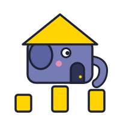
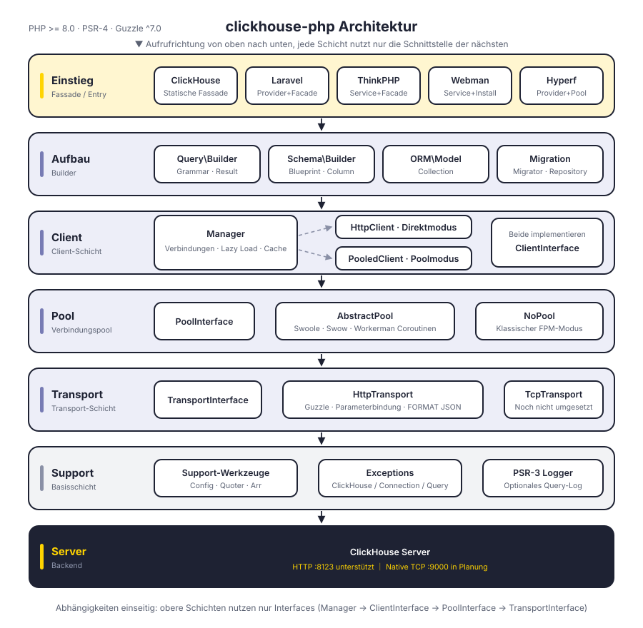
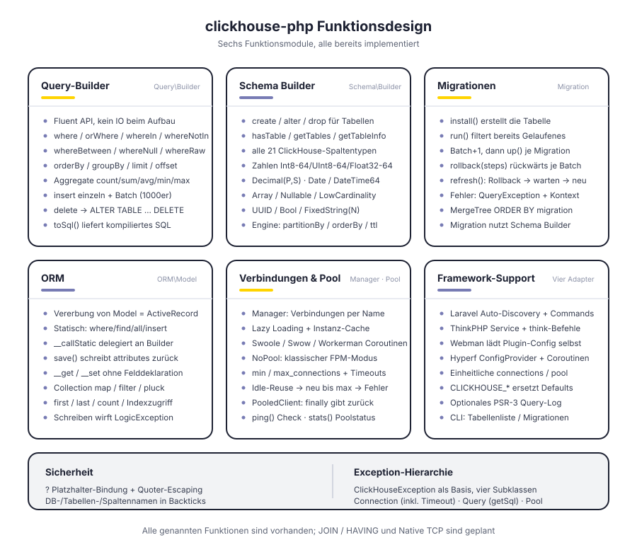
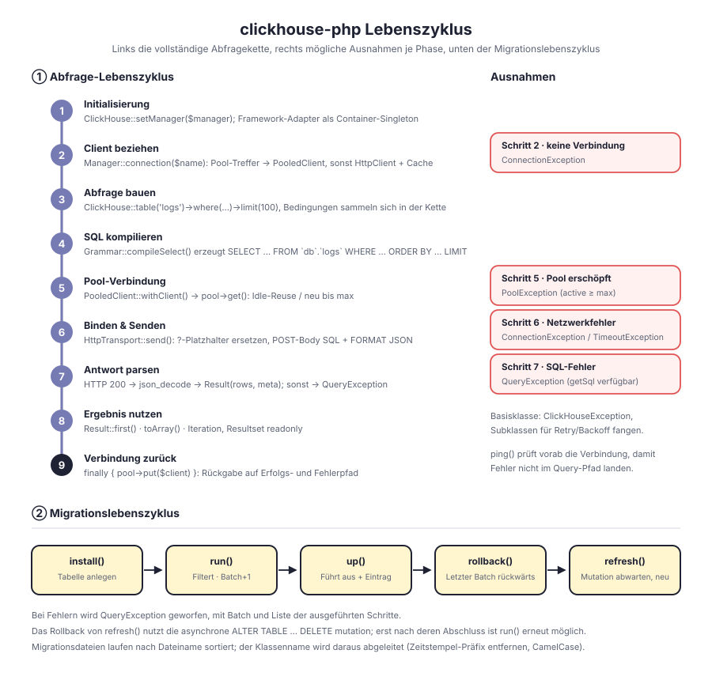

# clickhouse-php

PHP-ClickHouse-Client. Kommuniziert standardmäßig über die ClickHouse-HTTP-Schnittstelle (Port 8123), mit integriertem Query Builder, Schema Builder, Migrationssystem und ORM sowie Anpassung an Laravel, ThinkPHP, Webman und Hyperf.

Schichtenweise entkoppelt: `Manager → ClientInterface → PoolInterface → TransportInterface`. Client-Form, Verbindungspool und Transportprotokoll richten sich jeweils an einer eigenen Schnittstelle aus und sind austauschbar. Das Native-TCP-Protokoll hat in der Transportschicht bereits seinen Platz, ist aber noch nicht implementiert.

[简体中文](../../../README.md) | [English](../../../README_EN.md) | [한국어](../ko/README.md) | [Русский](../ru/README.md) | **Deutsch** | [Français](../fr/README.md) | [Español](../es/README.md) | [Português](../pt/README.md) | [हिन्दी](../hi/README.md) | [العربية](../ar/README.md) | [বাংলা](../bn/README.md) | [Bahasa Indonesia](../id/README.md) | [日本語](../ja/README.md)

<p align="center">
  
</p>

## Projektstruktur

```
clickhouse-php/
├── src/
│   ├── ClickHouse.php                  # Statischer Fassadeneinstieg
│   ├── Client/                         # Client-Schicht: mehrere Verbindungen, direkt / gepoolt
│   │   ├── ClientInterface.php         # query / select / insert / ping
│   │   ├── Manager.php                 # Verwaltung mehrerer Verbindungen, Lazy Loading + Instanz-Cache
│   │   ├── HttpClient.php              # Direktclient, zuständig für SQL-Aufbau und Antwortauswertung
│   │   └── PooledClient.php            # Gepoolter Client, holt und gibt Verbindungen automatisch zurück
│   ├── Query/                          # Query Builder
│   │   ├── Builder.php                 # Fluent API und Aggregationseinstieg
│   │   ├── Grammar.php                 # Kompilierung der SELECT- / DELETE-Syntax
│   │   ├── Expression.php              # Rohe Ausdrücke
│   │   └── Result.php                  # Schreibgeschütztes Resultset
│   ├── Schema/                         # Schema Builder
│   │   ├── Builder.php                 # create / alter / drop / Metadatenabfragen
│   │   ├── Blueprint.php               # Sammlung von Spalten und Engine-Parametern
│   │   ├── Column.php                  # Spaltendefinition
│   │   └── Grammar.php                 # Kompilierung der DDL-Syntax
│   ├── Migration/                      # Migrationssystem
│   │   ├── Migration.php               # Basisklasse der Migrationen
│   │   ├── Migrator.php                # run / rollback / refresh
│   │   └── Repository.php              # Lesen und Schreiben der Migrationstabelle und Warten auf mutation
│   ├── ORM/                            # ORM
│   │   ├── Model.php                   # ActiveRecord-Basisklasse
│   │   └── Collection.php              # Schreibgeschützte Modelsammlung
│   ├── Pool/                           # Verbindungspool
│   │   ├── PoolInterface.php           # get / put / stats / close
│   │   ├── AbstractPool.php            # Gemeinsame Pool-Logik (Zähler, Timeout, Nachfüllen)
│   │   ├── SwoolePool.php              # Swoole-Coroutine-Kanal
│   │   ├── SwowPool.php                # Swow-Coroutine-Kanal
│   │   ├── WorkermanPool.php           # Workerman-Coroutine-Kanal
│   │   └── NoPool.php                  # Klassischer FPM-Modus
│   ├── Transport/                      # Transportschicht
│   │   ├── TransportInterface.php      # send / close
│   │   ├── HttpTransport.php           # Guzzle HTTP, Parameterbindung und FORMAT JSON
│   │   └── TcpTransport.php            # Native TCP (in Planung)
│   ├── Support/                        # Config / Quoter / Arr
│   ├── Exceptions/                     # Ausnahmeklassen (1 Basisklasse + 4 Unterklassen)
│   ├── Laravel/                        # ServiceProvider · Facade · Artisan-Befehle
│   ├── ThinkPHP/                       # Service · Facade · Befehle
│   ├── Webman/                         # Service · Installationsskript
│   └── Hyperf/                         # ConfigProvider · Coroutine-Pool · Befehle
├── tests/                              # PHPUnit-Tests, Verzeichnisse analog zu src
├── docs/                               # Designdiagramme und Dokumentation
└── composer.json
```

## Architektur

<p align="center">
  
</p>

Von oben nach unten in sechs Schichten gegliedert; jede Schicht hängt nur von der abstrakten Schnittstelle der nächsten ab:

| Schicht | Aufgabe | Zentrale Typen |
|---------|---------|----------------|
| Einstiegsschicht | Fassade und Framework-Anpassung | `ClickHouse`, vier Framework-Adapter |
| Aufbauschicht | Zusammenbau von Queries und DDL, ohne IO | `Query\Builder`, `Schema\Builder`, `ORM\Model`, `Migration\Migrator` |
| Client-Schicht | Verwaltung mehrerer Verbindungen und Ausführungseinstieg | `Manager`, `HttpClient`, `PooledClient` |
| Pool-Schicht | Verbindungswiederverwendung und Nebenläufigkeitsgrenze | `PoolInterface`, `AbstractPool`, `NoPool` |
| Transportschicht | Protokollierung und Fehlerabbildung | `HttpTransport`, `TcpTransport` (in Planung) |
| Basisschicht | Konfiguration, Escaping, Ausnahmen, Logging | `Support\*`, `Exceptions\*`, PSR-3 `LoggerInterface` |

## Funktionsdesign

<p align="center">
  
</p>

## Lebenszyklus

<p align="center">
  
</p>

## Installation

```bash
composer require erikwang2013/clickhouse-php
```

## Schnellstart

### Standalone-Nutzung (reines PHP)

Ohne Framework. Initialisierung über die `CLICKHOUSE_*`-Umgebungsvariablen, eine Zeile genügt:

```php
use Erikwang2013\ClickHouse\ClickHouse;

ClickHouse::bootstrap();   // entspricht ClickHouse::setManager(Manager::fromEnv())

$rows = ClickHouse::table('logs')
    ->where('date', '>=', '2024-01-01')
    ->whereIn('level', ['error', 'warn'])
    ->orderBy('timestamp', 'desc')
    ->limit(100)
    ->get();

foreach ($rows as $row) {
    echo $row['message'];
}
```

Konfiguration, die die Umgebungsvariablen nicht abdecken (mehrere Verbindungen, Pool-Feinabstimmung), wird explizit an `Manager` übergeben:

```php
use Erikwang2013\ClickHouse\ClickHouse;
use Erikwang2013\ClickHouse\Client\Manager;

// Konfiguration
$config = [
    'default' => 'clickhouse',
    'connections' => [
        'clickhouse' => [
            'driver'   => 'http',        // http (empfohlen) oder native (in Entwicklung)
            'host'     => 'localhost',
            'port'     => 8123,          // HTTP-Port, für Native 9000
            'database' => 'default',
            'username' => 'default',
            'password' => '',
            'timeout'  => 30,
            'https'    => false,         // true verwendet HTTPS
        ],
    ],
    'pool' => [
        'min_connections'    => 2,
        'max_connections'    => 16,
        'connection_timeout' => 5.0,
    ],
];

// Initialisierung
$manager = new Manager($config);
ClickHouse::setManager($manager);

// Abfrage
$rows = ClickHouse::table('logs')
    ->where('date', '>=', '2024-01-01')
    ->whereIn('level', ['error', 'warn'])
    ->orderBy('timestamp', 'desc')
    ->limit(100)
    ->get();

foreach ($rows as $row) {
    echo $row['message'];
}

// Rohes SQL
$result = ClickHouse::query('SELECT count(*) AS cnt FROM logs WHERE date = ?', ['2024-01-01']);
echo $result->first()['cnt'];

// Aggregation
$count = ClickHouse::table('logs')->where('level', 'error')->count();
$avgDuration = ClickHouse::table('logs')->avg('duration');
```

### Daten einfügen

```php
// Einzelne Zeile
ClickHouse::table('logs')->insert([
    'date'      => '2024-01-01',
    'level'     => 'info',
    'message'   => 'hello',
    'duration'  => 12.5,
]);

// Batch
ClickHouse::table('logs')->insert([
    ['date' => '2024-01-01', 'level' => 'info',  'message' => 'a', 'duration' => 1.2],
    ['date' => '2024-01-02', 'level' => 'error', 'message' => 'b', 'duration' => 3.4],
]);
```

### Tabelle anlegen (Schema Builder)

```php
ClickHouse::schema()->create('logs', function ($table) {
    $table->date('date');
    $table->dateTime('timestamp');
    $table->string('level');
    $table->string('message');
    $table->float64('duration');
    $table->engine('MergeTree')
          ->partitionBy('toYYYYMM(date)')
          ->orderBy(['date', 'timestamp', 'level']);
});

// Tabelle löschen
ClickHouse::schema()->drop('logs');

// Tabelle ändern
ClickHouse::schema()->alter('logs', function ($table) {
    $table->nullable('source', 'String');
});
```

### Datenmigration

Migrationsdatei anlegen (z. B. `2026_05_27_000000_create_logs_table.php`):

```php
use Erikwang2013\ClickHouse\Migration\Migration;

class CreateLogsTable extends Migration
{
    public function up(): void
    {
        $this->schema->create('logs', function ($table) {
            $table->date('date');
            $table->string('level');
            $table->engine('MergeTree')
                  ->partitionBy('toYYYYMM(date)')
                  ->orderBy(['date', 'level']);
        });
    }

    public function down(): void
    {
        $this->schema->drop('logs');
    }
}
```

Migration ausführen:

```php
use Erikwang2013\ClickHouse\Migration\Migrator;
use Erikwang2013\ClickHouse\Migration\Repository;

$client = ClickHouse::getManager()->connection();
$repository = new Repository($client);
$migrator = new Migrator($client, $repository, '/path/to/migrations');

$migrator->install();   // Migrationstabelle anlegen
$migrator->run();       // Ausstehende Migrationen ausführen
$migrator->rollback();  // Letzten Batch zurückrollen
$migrator->refresh();   // Zurückrollen und erneut ausführen
```

### ORM

```php
use Erikwang2013\ClickHouse\ORM\Model;

class Log extends Model
{
    protected string $table = 'logs';
    protected string $connection = 'default';
}

// Abfrage
$logs = Log::where('level', 'error')
    ->orderBy('timestamp', 'desc')
    ->limit(50)
    ->get();

// Einzelnen Datensatz finden
$log = Log::find(123);

// Aggregation
$total = Log::where('date', '>=', '2024-01-01')->count();

// Batch-Einfügung
Log::insert([
    ['date' => '2024-01-01', 'level' => 'info'],
    ['date' => '2024-01-02', 'level' => 'error'],
]);
```

### Mehrere Verbindungen

```php
$config = [
    'default' => 'default',
    'connections' => [
        'default' => ['driver' => 'http', 'host' => 'ch1.example.com', 'port' => 8123],
        'analytics' => ['driver' => 'http', 'host' => 'ch2.example.com', 'port' => 8123],
    ],
];

$manager = new Manager($config);

// Bestimmte Verbindung verwenden
ClickHouse::connection('analytics')->table('events')->get();
ClickHouse::table('events', 'analytics')->get();
```

## Framework-Integration

### Laravel

Die Konfigurationsdatei wird automatisch veröffentlicht, Composer findet den ServiceProvider automatisch.

```bash
php artisan vendor:publish --tag=clickhouse-config
```

```php
use Erikwang2013\ClickHouse\Laravel\Facades\ClickHouse;

ClickHouse::table('logs')->where('level', 'error')->get();
ClickHouse::connection('native')->select('SELECT * FROM logs LIMIT 10');
```

Artisan-Befehle:

```bash
php artisan clickhouse:table-list
php artisan clickhouse:migration:install
php artisan clickhouse:migration:run
```

### ThinkPHP

Service in `app/service.php` registrieren:

```php
return [
    \Erikwang2013\ClickHouse\ThinkPHP\ClickHouseService::class,
];
```

```php
use think\facade\ClickHouse;

ClickHouse::table('logs')->get();
```

```bash
php think clickhouse:table-list
```

### Webman

Webman lädt die Plugin-Konfiguration automatisch, eine manuelle Konfiguration ist nicht nötig.

```php
use Erikwang2013\ClickHouse\Webman\ClickHouse;

ClickHouse::table('logs')->where('level', 'error')->get();
```

### Hyperf

Wird über den `ConfigProvider` automatisch erkannt, unterstützt Dependency Injection und Coroutine-Verbindungspool.

```bash
php bin/hyperf.php vendor:publish erikwang2013/clickhouse-php
```

```php
use Erikwang2013\ClickHouse\Hyperf\ClickHouseConnection;

class LogController
{
    public function __construct(
        private ClickHouseConnection $clickhouse
    ) {}

    public function index()
    {
        return $this->clickhouse->table('logs')->get();
    }
}
```

## Referenz: Query Builder

| Methode | Beschreibung |
|---------|--------------|
| `table($name)` / `from($name)` | Tabellennamen angeben |
| `select([...])` / `selectRaw($expr)` | SELECT-Spalten. Spaltennamen in `select()` werden in Backticks gesetzt (Schlüsselwörter wie `` `order` `` sind damit nutzbar), bei einem Alias `id as uid` wird jede Seite einzeln gequotet; für Funktionen oder Unterabfragen `selectRaw()` oder `Expression` verwenden |
| `where($col, $op, $val)` | Bedingung (bei 2 Argumenten ist `$op` standardmäßig `=`). Bei einem Wert `null` wird automatisch `IS NULL` / `IS NOT NULL` daraus |
| `orWhere($col, $op, $val)` | OR-Bedingung |
| `whereIn($col, $arr)` / `whereNotIn($col, $arr)` | IN / NOT IN |
| `whereBetween($col, [$min, $max])` | BETWEEN |
| `whereNull($col)` / `whereNotNull($col)` | IS NULL / IS NOT NULL |
| `whereRaw($sql)` | Rohes WHERE (keine Benutzereingaben übergeben) |
| `prewhere($col, $op, $val)` | PREWHERE, steht vor WHERE (die wirksamste Scan-Eingrenzung in ClickHouse) |
| `orderBy($col, $dir)` | Sortierung (standardmäßig ASC) |
| `groupBy(...$cols)` | Gruppierung |
| `having($col, $op, $val)` / `havingRaw($sql)` | HAVING, steht nach GROUP BY. `having()` quotet Spaltennamen als Bezeichner; für Aggregatbedingungen (z. B. `count() > 100`) `havingRaw()` oder `new Expression('count()')` verwenden |
| `limit($n)` / `offset($n)` | Paginierung |
| `final()` | Deduplizierende Zusammenführung beim Lesen (ReplacingMergeTree usw.) |
| `sample($ratio)` | SAMPLE-Stichprobe, z. B. `sample(0.1)` |
| `settings([...])` | SETTINGS auf Abfrageebene, z. B. `settings(['max_execution_time' => 30])` |
| `count()` / `sum($col)` / `avg($col)` / `min($col)` / `max($col)` | Aggregation |
| `insert($data)` | Einfügen (einzelne Zeile oder Batch). Innerhalb eines Batches müssen alle Zeilen dieselben Spalten haben; fehlende oder zusätzliche Spalten lösen direkt einen Fehler aus (sonst könnten Werte positional verrutschen) |
| `delete()` | Löschen (kompiliert zu `ALTER TABLE ... DELETE`; **WHERE ist Pflicht**, sonst wird eine Ausnahme geworfen) |
| `get()` | Abfrage ausführen, liefert Result |
| `first()` | Ersten Datensatz liefern |
| `toSql()` | Erzeugtes SQL abrufen |

### Große Resultsets und Streaming

`get()` parst das gesamte Resultset in ein PHP-Array; der Speicherbedarf liegt bei rund dem 7-Fachen der Antwortgröße (gemessen an einer schmalen Tabelle mit 5 Spalten: 93 B/Zeile im Payload → 677 B/Zeile nach dem Dekodieren, bei 100 000 Zeilen etwa 73 MB). Bei großen Datenmengen mit `stream()` Zeile für Zeile konsumieren — der Speicherbedarf ist dann unabhängig von der Resultset-Größe:

```php
use Erikwang2013\ClickHouse\Client\StreamingClientInterface;

$client = ClickHouse::client();           // für den Low-Level-Client verwenden (connection() liefert den Builder)
if ($client instanceof StreamingClientInterface) {
    foreach ($client->stream('SELECT * FROM logs') as $row) {   // FORMAT JSONEachRow
        echo $row['message'], PHP_EOL;
    }
}

// Abfragen mit eigenem FORMAT (CSV/TSV usw.) über raw(), Antwortkörper unverändert
$csv = $client->raw('SELECT * FROM logs FORMAT CSV');
```

Im Pool-Modus ist `stream()` ebenso nutzbar: Die Verbindung wird zurückgegeben, sobald der Generator vollständig konsumiert (oder bei vorzeitigem `break` verworfen) ist.

### Nativer SQL-Einstieg

Die folgenden Einstiegspunkte sind **unverändert zusammengesetzte** native SQL-Kanäle — wer hier Benutzereingaben durchreicht, gibt die Datenbank aus der Hand: `selectRaw()`, `whereRaw()`, `havingRaw()`, `new Expression($sql)`, die Werte von `Blueprint::settings()` sowie Spaltentyp-Strings wie `$table->string('col')` (`array($name, $type)`). Bezeichner und Werte werden für sich escapt (Spaltennamen in Backticks, Werte je nach Typ), native SQL-Fragmente jedoch in keiner Weise behandelt.

`Expression` lässt sich in `select()` (im Array), `where()`, `prewhere()`, `having()`, `orderBy()` und `groupBy()` übergeben — für Ausdrücke wie `rand()` oder `toStartOfHour(ts)`.

## Schema-Spaltentypen

| Methode | ClickHouse-Typ |
|---------|----------------|
| `string($name)` | String |
| `fixedString($name, $len)` | FixedString(N) |
| `int8/16/32/64($name)` | Int8/16/32/64 |
| `uint8/16/32/64($name)` | UInt8/16/32/64 |
| `float32($name)` / `float64($name)` | Float32 / Float64 |
| `decimal($name, $p, $s)` | Decimal(P, S) |
| `date($name)` | Date |
| `dateTime($name)` | DateTime |
| `dateTime64($name, $p)` | DateTime64(P) |
| `uuid($name)` | UUID |
| `bool($name)` | Bool |
| `array($name, $type)` | Array(T) |
| `nullable($name, $type)` | Nullable(T) |
| `lowCardinality($name, $type)` | LowCardinality(T) |

## Konfigurationsreferenz

```php
[
    'default' => 'clickhouse',
    'connections' => [
        'clickhouse' => [
            'driver'   => 'http',     // http (empfohlen) | native (in Entwicklung)
            'host'     => 'localhost',
            'port'     => 8123,       // HTTP 8123, Native 9000
            'database' => 'default',
            'username' => 'default',
            'password' => '',
            'timeout'  => 30,
            'https'    => false,
        ],
    ],
    'pool' => [
        'min_connections'    => 2,
        'max_connections'    => 16,
        'connection_timeout' => 5.0,
    ],
    'query_log' => false,
];
```

Zum Verbindungspool: Die `pool`-Konfiguration greift nur, **wenn ein nutzbarer Coroutine-Kanal vorhanden ist** (Swoole / Swow / Workerman); in synchronen Umgebungen wie FPM wird sie ignoriert und direkt verbunden — eine Nebenläufigkeitsgrenze entsteht dadurch nicht. Außerdem nutzt der HTTP-Treiber synchrones Guzzle; der tatsächliche Nutzen des Poolings ist „Begrenzung der gleichzeitigen Verbindungen + Wiederverwendung der Verbindungsobjekte“ und **macht den Aufruf nicht automatisch nicht blockierend** — dafür muss der curl-Hook von Swoole selbst aktiviert werden (`Swoole\Runtime::enableCoroutine(SWOOLE_HOOK_NATIVE_CURL)`, er ist nicht in `SWOOLE_HOOK_ALL` enthalten) oder der CoroutineHandler von hyperf/guzzle eingebunden werden. Mit `pool.driver` lässt sich `swoole|swow|workerman|none` explizit festlegen.

## Umgebungsvariablen

| Variable | Standardwert | Beschreibung |
|----------|--------------|--------------|
| `CLICKHOUSE_CONNECTION` | default | Standard-Verbindungsname |
| `CLICKHOUSE_HOST` | localhost | Hostname |
| `CLICKHOUSE_PORT` | 8123 | HTTP-Port |
| `CLICKHOUSE_DB` | default | Datenbankname |
| `CLICKHOUSE_USER` | default | Benutzername |
| `CLICKHOUSE_PASS` | — | Passwort |
| `CLICKHOUSE_TIMEOUT` | 30 | Verbindungs-Timeout (Sekunden) |
| `CLICKHOUSE_HTTPS` | false | Ob HTTPS verwendet wird |
| `CLICKHOUSE_DRIVER` | http | Treibertyp |
| `CLICKHOUSE_POOL_MIN` | 2 | Minimale Verbindungsanzahl |
| `CLICKHOUSE_POOL_MAX` | 16 | Maximale Verbindungsanzahl |
| `CLICKHOUSE_POOL_TIMEOUT` | 5.0 | Timeout beim Holen einer Verbindung (Sekunden) |

Alle diese Variablen werden in reinem PHP von `ClickHouse::bootstrap()` / `Manager::fromEnv()` gelesen; die Konfigurationsdateien der vier Frameworks lesen dieselben Variablennamen (inklusive `CLICKHOUSE_HTTPS`).

## Fehlerbehandlung

```php
use Erikwang2013\ClickHouse\Exceptions\{
    ClickHouseException,
    ConnectionException,
    QueryException,
    TimeoutException,
    PoolException,
};

try {
    ClickHouse::table('logs')->get();
} catch (ConnectionException | TimeoutException $e) {
    // Verbindungs- oder Timeout-Problem
} catch (QueryException $e) {
    echo $e->getMessage();
    echo $e->getSql();      // Rohes SQL
} catch (ClickHouseException $e) {
    // Sonstige Ausnahme
}
```

## Unterstützung

| WeChat | Alipay |
|--------|--------|
|  |  |

Vielen Dank für Ihre Unterstützung!

## Lizenz

MIT License.  Copyright (c) 2026 erik <erik@erik.xyz> — https://erik.xyz
