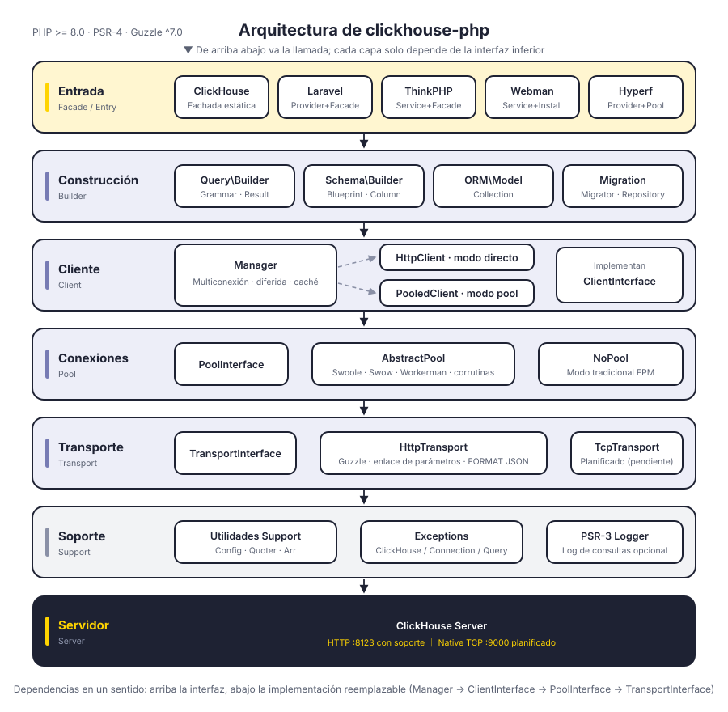
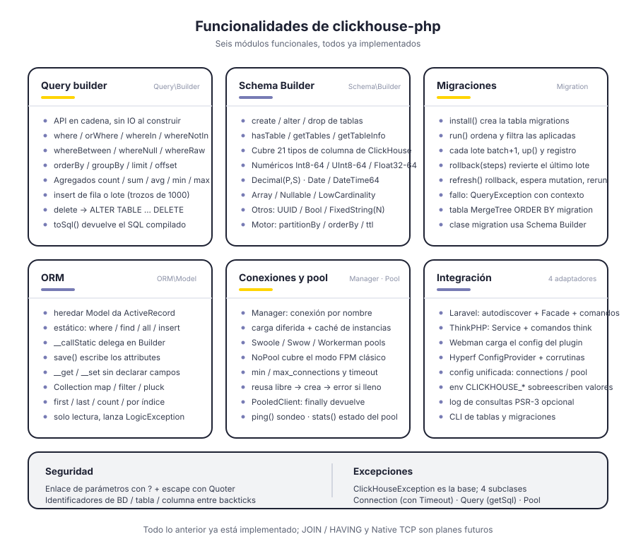
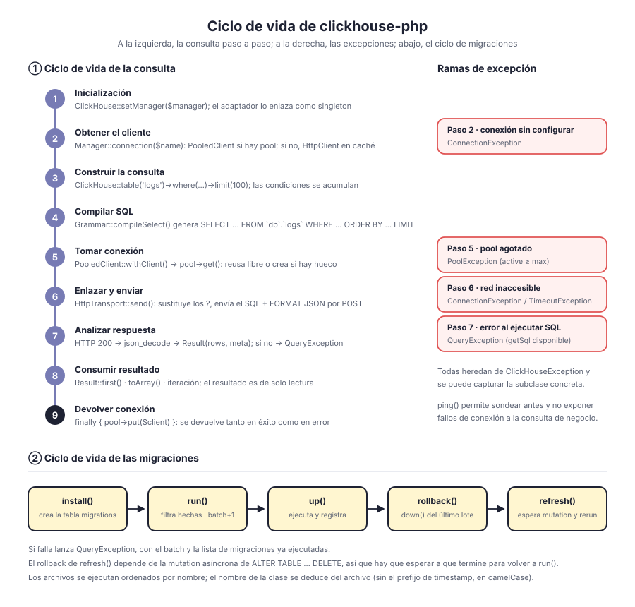

# clickhouse-php

Cliente ClickHouse para PHP. Por defecto se comunica a través de la interfaz HTTP de ClickHouse (puerto 8123); incluye query builder, Schema Builder, sistema de migraciones y ORM, con adaptadores para Laravel, ThinkPHP, Webman y Hyperf.

Desacoplamiento por capas: `Manager → ClientInterface → PoolInterface → TransportInterface`; la forma del cliente, el connection pool y el protocolo de transporte se programan contra interfaces y todos son reemplazables. El protocolo Native TCP ya tiene su lugar reservado en la capa de transporte, pero aún no está implementado.

[简体中文](../../../README.md) | [English](../../../README_EN.md) | [한국어](../ko/README.md) | [Русский](../ru/README.md) | [Deutsch](../de/README.md) | [Français](../fr/README.md) | **Español** | [Português](../pt/README.md) | [हिन्दी](../hi/README.md) | [العربية](../ar/README.md) | [বাংলা](../bn/README.md) | [Bahasa Indonesia](../id/README.md) | [日本語](../ja/README.md)

<p align="center">
  
</p>

## Estructura del proyecto

```
clickhouse-php/
├── src/
│   ├── ClickHouse.php                  # Punto de entrada de la fachada estática
│   ├── Client/                         # Capa de cliente: multiconexión, modo directo / agrupado
│   │   ├── ClientInterface.php         # query / select / insert / ping
│   │   ├── Manager.php                 # Gestión multiconexión, carga diferida + caché de instancias
│   │   ├── HttpClient.php              # Cliente directo: ensambla el SQL y analiza la respuesta
│   │   └── PooledClient.php            # Cliente agrupado: toma y devuelve la conexión solo
│   ├── Query/                          # Query builder
│   │   ├── Builder.php                 # API en cadena y punto de entrada de agregados
│   │   ├── Grammar.php                 # Compilación de la sintaxis SELECT / DELETE
│   │   ├── Expression.php              # Expresiones nativas
│   │   └── Result.php                  # Conjunto de resultados de solo lectura
│   ├── Schema/                         # Schema Builder
│   │   ├── Builder.php                 # create / alter / drop / consulta de metadatos
│   │   ├── Blueprint.php               # Recolección de columnas y parámetros del motor
│   │   ├── Column.php                  # Definición de columnas
│   │   └── Grammar.php                 # Compilación de la sintaxis DDL
│   ├── Migration/                      # Sistema de migraciones
│   │   ├── Migration.php               # Clase base de migración
│   │   ├── Migrator.php                # run / rollback / refresh
│   │   └── Repository.php              # Lectura/escritura de la tabla de registros y espera de mutation
│   ├── ORM/                            # ORM
│   │   ├── Model.php                   # Clase base ActiveRecord
│   │   └── Collection.php              # Colección de modelos de solo lectura
│   ├── Pool/                           # Connection pool
│   │   ├── PoolInterface.php           # get / put / stats / close
│   │   ├── AbstractPool.php            # Lógica común del pool (conteo, timeout, rellenado)
│   │   ├── SwoolePool.php              # Canal de corrutinas de Swoole
│   │   ├── SwowPool.php                # Canal de corrutinas de Swow
│   │   ├── WorkermanPool.php           # Canal de corrutinas de Workerman
│   │   └── NoPool.php                  # Modo tradicional FPM
│   ├── Transport/                      # Capa de transporte
│   │   ├── TransportInterface.php      # send / close
│   │   ├── HttpTransport.php           # Guzzle HTTP, enlace de parámetros y FORMAT JSON
│   │   └── TcpTransport.php            # Native TCP (planificado)
│   ├── Support/                        # Config / Quoter / Arr
│   ├── Exceptions/                     # Jerarquía de excepciones (1 clase base + 4 subclases)
│   ├── Laravel/                        # ServiceProvider · Facade · comandos Artisan
│   ├── ThinkPHP/                       # Service · Facade · comandos
│   ├── Webman/                         # Service · script de instalación
│   └── Hyperf/                         # ConfigProvider · pool de corrutinas · comandos
├── tests/                              # Pruebas PHPUnit, directorios isomorfos a src
├── docs/                               # Diagramas y documentación
└── composer.json
```

## Diseño de arquitectura

<p align="center">
  
</p>

Se divide de arriba abajo en seis capas, y cada capa solo depende de la interfaz abstracta de la capa inferior:

| Capa | Responsabilidad | Tipos clave |
|----|------|----------|
| Capa de entrada | Fachada y adaptadores de framework | `ClickHouse`, cuatro adaptadores de framework |
| Capa de construcción | Ensambla consultas y DDL, sin generar IO | `Query\Builder`, `Schema\Builder`, `ORM\Model`, `Migration\Migrator` |
| Capa de cliente | Gestión multiconexión y punto de entrada de ejecución | `Manager`, `HttpClient`, `PooledClient` |
| Capa de pool de conexiones | Reutilización de conexiones y límite de concurrencia | `PoolInterface`, `AbstractPool`, `NoPool` |
| Capa de transporte | Códec del protocolo y mapeo de errores | `HttpTransport`, `TcpTransport` (planificado) |
| Capa de soporte | Configuración, escape, excepciones, logs | `Support\*`, `Exceptions\*`, PSR-3 `LoggerInterface` |

## Diseño de funcionalidades

<p align="center">
  
</p>

## Ciclo de vida

<p align="center">
  
</p>

## Instalación

```bash
composer require erikwang2013/clickhouse-php
```

## Inicio rápido

### Uso independiente (PHP nativo)

Sin depender de ningún framework. Se inicializa con las variables de entorno `CLICKHOUSE_*`, en una sola línea:

```php
use Erikwang2013\ClickHouse\ClickHouse;

ClickHouse::bootstrap();   // Equivale a ClickHouse::setManager(Manager::fromEnv())

$rows = ClickHouse::table('logs')
    ->where('date', '>=', '2024-01-01')
    ->whereIn('level', ['error', 'warn'])
    ->orderBy('timestamp', 'desc')
    ->limit(100)
    ->get();

foreach ($rows as $row) {
    echo $row['message'];
}
```

La configuración que las variables de entorno no cubren (multiconexión, ajuste del connection pool) se pasa explícitamente con `Manager`:

```php
use Erikwang2013\ClickHouse\ClickHouse;
use Erikwang2013\ClickHouse\Client\Manager;

// Configuración
$config = [
    'default' => 'clickhouse',
    'connections' => [
        'clickhouse' => [
            'driver'   => 'http',        // http (recomendado) o native (en desarrollo)
            'host'     => 'localhost',
            'port'     => 8123,          // Puerto HTTP, Native usa 9000
            'database' => 'default',
            'username' => 'default',
            'password' => '',
            'timeout'  => 30,
            'https'    => false,         // true usa HTTPS
        ],
    ],
    'pool' => [
        'min_connections'    => 2,
        'max_connections'    => 16,
        'connection_timeout' => 5.0,
    ],
];

// Inicialización
$manager = new Manager($config);
ClickHouse::setManager($manager);

// Consulta
$rows = ClickHouse::table('logs')
    ->where('date', '>=', '2024-01-01')
    ->whereIn('level', ['error', 'warn'])
    ->orderBy('timestamp', 'desc')
    ->limit(100)
    ->get();

foreach ($rows as $row) {
    echo $row['message'];
}

// SQL nativo
$result = ClickHouse::query('SELECT count(*) AS cnt FROM logs WHERE date = ?', ['2024-01-01']);
echo $result->first()['cnt'];

// Agregados
$count = ClickHouse::table('logs')->where('level', 'error')->count();
$avgDuration = ClickHouse::table('logs')->avg('duration');
```

### Insertar datos

```php
// Una fila
ClickHouse::table('logs')->insert([
    'date'      => '2024-01-01',
    'level'     => 'info',
    'message'   => 'hello',
    'duration'  => 12.5,
]);

// Por lotes
ClickHouse::table('logs')->insert([
    ['date' => '2024-01-01', 'level' => 'info',  'message' => 'a', 'duration' => 1.2],
    ['date' => '2024-01-02', 'level' => 'error', 'message' => 'b', 'duration' => 3.4],
]);
```

### Crear tablas (Schema Builder)

```php
ClickHouse::schema()->create('logs', function ($table) {
    $table->date('date');
    $table->dateTime('timestamp');
    $table->string('level');
    $table->string('message');
    $table->float64('duration');
    $table->engine('MergeTree')
          ->partitionBy('toYYYYMM(date)')
          ->orderBy(['date', 'timestamp', 'level']);
});

// Eliminar tabla
ClickHouse::schema()->drop('logs');

// Modificar tabla
ClickHouse::schema()->alter('logs', function ($table) {
    $table->nullable('source', 'String');
});
```

### Migraciones de datos

Crea un archivo de migración (por ejemplo `2026_05_27_000000_create_logs_table.php`):

```php
use Erikwang2013\ClickHouse\Migration\Migration;

class CreateLogsTable extends Migration
{
    public function up(): void
    {
        $this->schema->create('logs', function ($table) {
            $table->date('date');
            $table->string('level');
            $table->engine('MergeTree')
                  ->partitionBy('toYYYYMM(date)')
                  ->orderBy(['date', 'level']);
        });
    }

    public function down(): void
    {
        $this->schema->drop('logs');
    }
}
```

Ejecutar las migraciones:

```php
use Erikwang2013\ClickHouse\Migration\Migrator;
use Erikwang2013\ClickHouse\Migration\Repository;

$client = ClickHouse::getManager()->connection();
$repository = new Repository($client);
$migrator = new Migrator($client, $repository, '/path/to/migrations');

$migrator->install();   // Crea la tabla de registros de migraciones
$migrator->run();       // Ejecuta las migraciones pendientes
$migrator->rollback();  // Revierte el último lote
$migrator->refresh();   // Revierte y vuelve a ejecutar
```

### ORM

```php
use Erikwang2013\ClickHouse\ORM\Model;

class Log extends Model
{
    protected string $table = 'logs';
    protected string $connection = 'default';
}

// Consulta
$logs = Log::where('level', 'error')
    ->orderBy('timestamp', 'desc')
    ->limit(50)
    ->get();

// Buscar un registro
$log = Log::find(123);

// Agregados
$total = Log::where('date', '>=', '2024-01-01')->count();

// Inserción por lotes
Log::insert([
    ['date' => '2024-01-01', 'level' => 'info'],
    ['date' => '2024-01-02', 'level' => 'error'],
]);
```

### Multiconexión

```php
$config = [
    'default' => 'default',
    'connections' => [
        'default' => ['driver' => 'http', 'host' => 'ch1.example.com', 'port' => 8123],
        'analytics' => ['driver' => 'http', 'host' => 'ch2.example.com', 'port' => 8123],
    ],
];

$manager = new Manager($config);

// Usar una conexión concreta
ClickHouse::connection('analytics')->table('events')->get();
ClickHouse::table('events', 'analytics')->get();
```

## Integración con frameworks

### Laravel

El archivo de configuración se publica automáticamente y Composer descubre el ServiceProvider por su cuenta.

```bash
php artisan vendor:publish --tag=clickhouse-config
```

```php
use Erikwang2013\ClickHouse\Laravel\Facades\ClickHouse;

ClickHouse::table('logs')->where('level', 'error')->get();
ClickHouse::connection('native')->select('SELECT * FROM logs LIMIT 10');
```

Comandos Artisan:

```bash
php artisan clickhouse:table-list
php artisan clickhouse:migration:install
php artisan clickhouse:migration:run
```

### ThinkPHP

Registra el servicio en `app/service.php`:

```php
return [
    \Erikwang2013\ClickHouse\ThinkPHP\ClickHouseService::class,
];
```

```php
use think\facade\ClickHouse;

ClickHouse::table('logs')->get();
```

```bash
php think clickhouse:table-list
```

### Webman

Webman carga automáticamente la configuración del plugin, sin necesidad de configurar nada a mano.

```php
use Erikwang2013\ClickHouse\Webman\ClickHouse;

ClickHouse::table('logs')->where('level', 'error')->get();
```

### Hyperf

Se descubre automáticamente mediante `ConfigProvider`; admite inyección de dependencias y pool de conexiones de corrutinas.

```bash
php bin/hyperf.php vendor:publish erikwang2013/clickhouse-php
```

```php
use Erikwang2013\ClickHouse\Hyperf\ClickHouseConnection;

class LogController
{
    public function __construct(
        private ClickHouseConnection $clickhouse
    ) {}

    public function index()
    {
        return $this->clickhouse->table('logs')->get();
    }
}
```

## Referencia del query builder

| Método | Descripción |
|------|------|
| `table($name)` / `from($name)` | Especifica el nombre de la tabla |
| `select([...])` / `selectRaw($expr)` | Columnas del SELECT |
| `where($col, $op, $val)` | Condición (con 2 argumentos, `$op` es `=` por defecto) |
| `orWhere($col, $op, $val)` | Condición OR |
| `whereIn($col, $arr)` / `whereNotIn($col, $arr)` | IN / NOT IN |
| `whereBetween($col, [$min, $max])` | BETWEEN |
| `whereNull($col)` / `whereNotNull($col)` | IS NULL / IS NOT NULL |
| `whereRaw($sql)` | WHERE nativo |
| `orderBy($col, $dir)` | Ordenación (ASC por defecto) |
| `groupBy(...$cols)` | Agrupación |
| `limit($n)` / `offset($n)` | Paginación |
| `count()` / `sum($col)` / `avg($col)` / `min($col)` / `max($col)` | Agregados |
| `insert($data)` | Inserción (una fila o por lotes) |
| `delete()` | Eliminación |
| `get()` | Ejecuta la consulta y devuelve un Result |
| `first()` | Devuelve el primer registro |
| `toSql()` | Obtiene el SQL generado |

## Tipos de columna de Schema

| Método | Tipo de ClickHouse |
|------|----------------|
| `string($name)` | String |
| `fixedString($name, $len)` | FixedString(N) |
| `int8/16/32/64($name)` | Int8/16/32/64 |
| `uint8/16/32/64($name)` | UInt8/16/32/64 |
| `float32($name)` / `float64($name)` | Float32 / Float64 |
| `decimal($name, $p, $s)` | Decimal(P, S) |
| `date($name)` | Date |
| `dateTime($name)` | DateTime |
| `dateTime64($name, $p)` | DateTime64(P) |
| `uuid($name)` | UUID |
| `bool($name)` | Bool |
| `array($name, $type)` | Array(T) |
| `nullable($name, $type)` | Nullable(T) |
| `lowCardinality($name, $type)` | LowCardinality(T) |

## Referencia de configuración

```php
[
    'default' => 'clickhouse',
    'connections' => [
        'clickhouse' => [
            'driver'   => 'http',     // http (recomendado) | native (en desarrollo)
            'host'     => 'localhost',
            'port'     => 8123,       // HTTP 8123, Native 9000
            'database' => 'default',
            'username' => 'default',
            'password' => '',
            'timeout'  => 30,
            'https'    => false,
        ],
    ],
    'pool' => [
        'min_connections'    => 2,
        'max_connections'    => 16,
        'connection_timeout' => 5.0,
    ],
    'query_log' => false,
];
```

## Variables de entorno

| Variable | Valor predeterminado | Descripción |
|------|--------|------|
| `CLICKHOUSE_CONNECTION` | default | Nombre de la conexión por defecto |
| `CLICKHOUSE_HOST` | localhost | Dirección del host |
| `CLICKHOUSE_PORT` | 8123 | Puerto HTTP |
| `CLICKHOUSE_DB` | default | Nombre de la base de datos |
| `CLICKHOUSE_USER` | default | Nombre de usuario |
| `CLICKHOUSE_PASS` | — | Contraseña |
| `CLICKHOUSE_TIMEOUT` | 30 | Timeout de conexión (segundos) |
| `CLICKHOUSE_HTTPS` | false | Si se usa HTTPS |
| `CLICKHOUSE_DRIVER` | http | Tipo de driver |
| `CLICKHOUSE_POOL_MIN` | 2 | Número mínimo de conexiones |
| `CLICKHOUSE_POOL_MAX` | 16 | Número máximo de conexiones |
| `CLICKHOUSE_POOL_TIMEOUT` | 5.0 | Timeout al tomar una conexión (segundos) |

Con PHP nativo, las variables anteriores las leen `ClickHouse::bootstrap()` / `Manager::fromEnv()`. Los archivos de configuración de los cuatro frameworks usan los mismos nombres de variable, pero la cobertura no es la misma (Laravel todas; a Hyperf le faltan `CLICKHOUSE_CONNECTION`/`CLICKHOUSE_DRIVER`/`CLICKHOUSE_HTTPS`; Webman solo las cinco de conexión; ThinkPHP por ahora no lee variables de entorno), así que manda el archivo de configuración de cada framework.

## Manejo de excepciones

```php
use Erikwang2013\ClickHouse\Exceptions\{
    ClickHouseException,
    ConnectionException,
    QueryException,
    TimeoutException,
    PoolException,
};

try {
    ClickHouse::table('logs')->get();
} catch (ConnectionException | TimeoutException $e) {
    // Problemas de conexión o de timeout
} catch (QueryException $e) {
    echo $e->getMessage();
    echo $e->getSql();      // SQL original
} catch (ClickHouseException $e) {
    // Otras excepciones
}
```

## Apoya el proyecto

| WeChat | Alipay |
|------|--------|
|  |  |

¡Gracias por tu apoyo!

## Licencia

MIT License.  Copyright (c) 2026 erik <erik@erik.xyz> — https://erik.xyz
