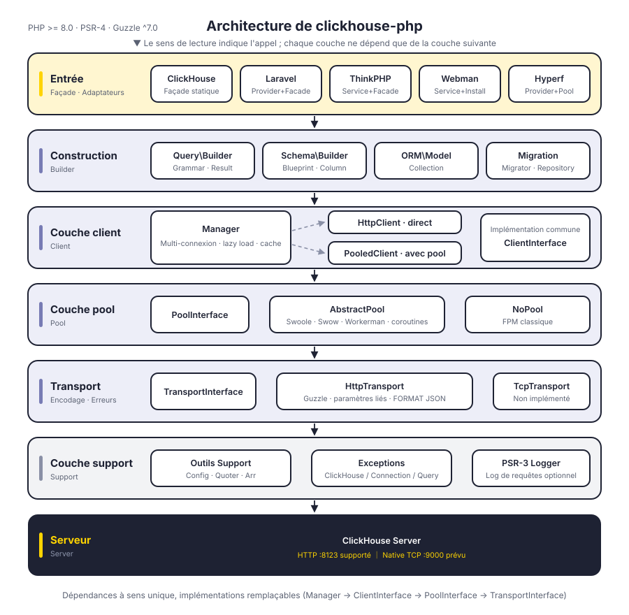
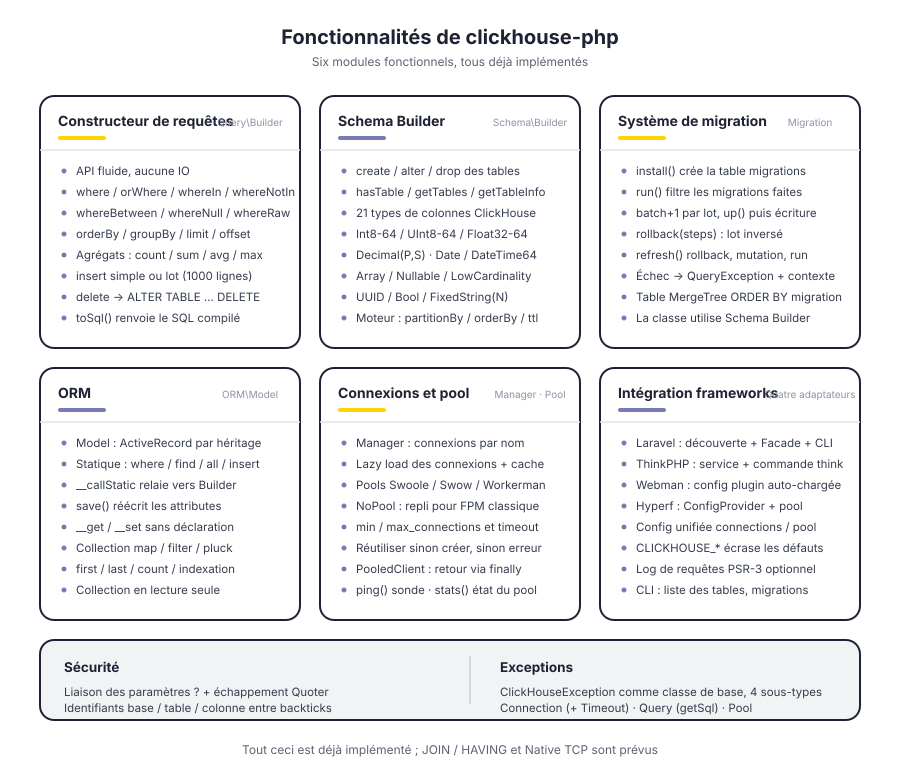
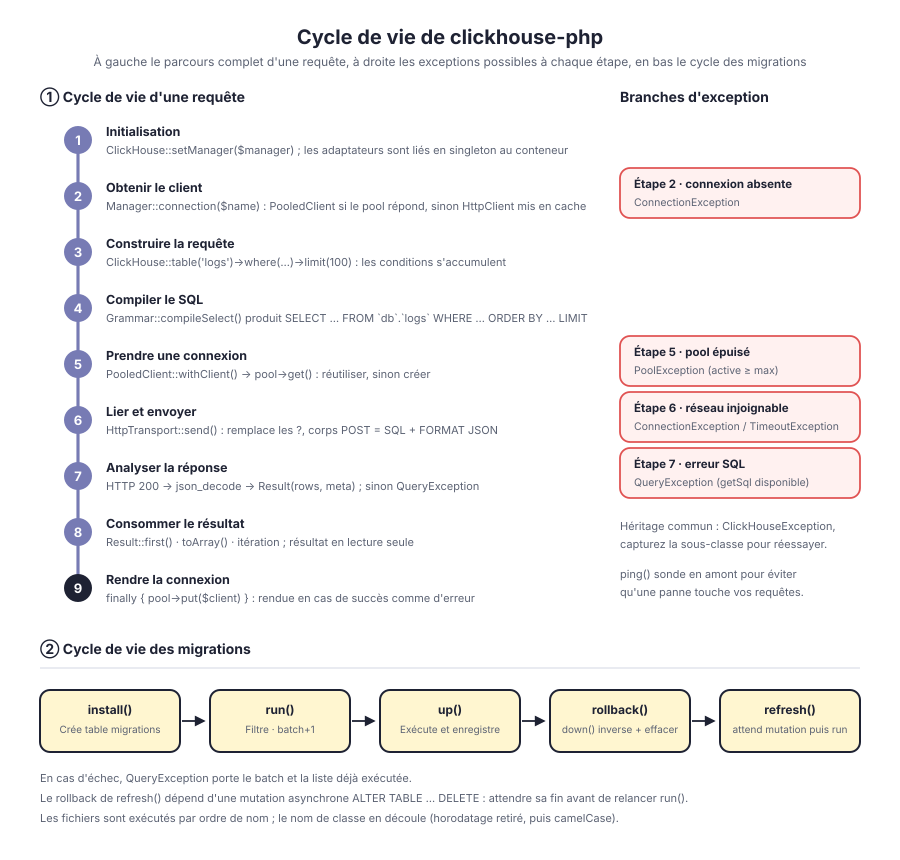

# clickhouse-php

Client ClickHouse pour PHP. Communication par défaut via l'interface HTTP de ClickHouse (port 8123), avec constructeur de requêtes, Schema Builder, système de migrations et ORM intégrés, et adaptation à Laravel, ThinkPHP, Webman et Hyperf.

Découplage par couches : `Manager → ClientInterface → PoolInterface → TransportInterface` ; forme du client, pool de connexions et protocole de transport sont chacun définis par une interface et remplaçables. Le protocole Native TCP dispose d'un emplacement réservé dans la couche transport, mais n'est pas encore implémenté.

[简体中文](../../../README.md) | [English](../../../README_EN.md) | [한국어](../ko/README.md) | [Русский](../ru/README.md) | [Deutsch](../de/README.md) | **Français** | [Español](../es/README.md) | [Português](../pt/README.md) | [हिन्दी](../hi/README.md) | [العربية](../ar/README.md) | [বাংলা](../bn/README.md) | [Bahasa Indonesia](../id/README.md) | [日本語](../ja/README.md)

<p align="center">
  
</p>

## Structure du projet

```
clickhouse-php/
├── src/
│   ├── ClickHouse.php                  # entrée de la façade statique
│   ├── Client/                         # couche client : multi-connexion, direct / pool
│   │   ├── ClientInterface.php         # query / select / insert / ping
│   │   ├── Manager.php                 # gestion multi-connexion, lazy load + cache d'instances
│   │   ├── HttpClient.php              # client direct : assemblage SQL et parsing des réponses
│   │   └── PooledClient.php            # client poolé : prend et rend la connexion automatiquement
│   ├── Query/                          # constructeur de requêtes
│   │   ├── Builder.php                 # API fluide et point d'entrée des agrégats
│   │   ├── Grammar.php                 # compilation de la syntaxe SELECT / DELETE
│   │   ├── Expression.php              # expression brute
│   │   └── Result.php                  # jeu de résultats en lecture seule
│   ├── Schema/                         # Schema Builder
│   │   ├── Builder.php                 # create / alter / drop / requêtes de métadonnées
│   │   ├── Blueprint.php               # collecte des colonnes et des paramètres de moteur
│   │   ├── Column.php                  # définition de colonne
│   │   └── Grammar.php                 # compilation de la syntaxe DDL
│   ├── Migration/                      # système de migrations
│   │   ├── Migration.php               # classe de base des migrations
│   │   ├── Migrator.php                # run / rollback / refresh
│   │   └── Repository.php              # lecture/écriture de la table de suivi et attente des mutations
│   ├── ORM/                            # ORM
│   │   ├── Model.php                   # classe de base ActiveRecord
│   │   └── Collection.php              # collection de modèles en lecture seule
│   ├── Pool/                           # pool de connexions
│   │   ├── PoolInterface.php           # get / put / stats / close
│   │   ├── AbstractPool.php            # logique de pool commune (comptage, timeout, réalimentation)
│   │   ├── SwoolePool.php              # canal de coroutines Swoole
│   │   ├── SwowPool.php                # canal de coroutines Swow
│   │   ├── WorkermanPool.php           # canal de coroutines Workerman
│   │   └── NoPool.php                  # mode classique FPM
│   ├── Transport/                      # couche transport
│   │   ├── TransportInterface.php      # send / close
│   │   ├── HttpTransport.php           # Guzzle HTTP, liaison des paramètres et FORMAT JSON
│   │   └── TcpTransport.php            # Native TCP (prévu)
│   ├── Support/                        # Config / Quoter / Arr
│   ├── Exceptions/                     # hiérarchie d'exceptions (1 classe de base + 4 sous-classes)
│   ├── Laravel/                        # ServiceProvider · Facade · commandes Artisan
│   ├── ThinkPHP/                       # Service · Facade · commandes
│   ├── Webman/                         # Service · script d'installation
│   └── Hyperf/                         # ConfigProvider · pool de coroutines · commandes
├── tests/                              # tests PHPUnit, arborescence calquée sur src
├── docs/                               # schémas et documentation
└── composer.json
```

## Architecture

<p align="center">
  
</p>

Six couches de haut en bas, chacune ne dépendant que de l'interface abstraite de la couche inférieure :

| Couche | Responsabilité | Types clés |
|----|------|----------|
| Entrée | Façade et adaptation des frameworks | `ClickHouse`, les quatre adaptateurs de framework |
| Construction | Assemble requêtes et DDL, sans produire d'IO | `Query\Builder`, `Schema\Builder`, `ORM\Model`, `Migration\Migrator` |
| Client | Gestion multi-connexion et point d'exécution | `Manager`, `HttpClient`, `PooledClient` |
| Pool de connexions | Réutilisation des connexions et plafond de concurrence | `PoolInterface`, `AbstractPool`, `NoPool` |
| Transport | Encodage/décodage du protocole et mapping des erreurs | `HttpTransport`, `TcpTransport` (prévu) |
| Support | Configuration, échappement, exceptions, logs | `Support\*`, `Exceptions\*`, PSR-3 `LoggerInterface` |

## Conception fonctionnelle

<p align="center">
  
</p>

## Cycle de vie

<p align="center">
  
</p>

## Installation

```bash
composer require erikwang2013/clickhouse-php
```

## Démarrage rapide

### Utilisation autonome

```php
use Erikwang2013\ClickHouse\ClickHouse;
use Erikwang2013\ClickHouse\Client\Manager;

// Configuration
$config = [
    'default' => 'clickhouse',
    'connections' => [
        'clickhouse' => [
            'driver'   => 'http',        // http (recommandé) ou native (en développement)
            'host'     => 'localhost',
            'port'     => 8123,          // port HTTP, 9000 pour Native
            'database' => 'default',
            'username' => 'default',
            'password' => '',
            'timeout'  => 30,
        ],
    ],
];

// Initialisation
$manager = new Manager($config);
ClickHouse::setManager($manager);

// Requête
$rows = ClickHouse::table('logs')
    ->where('date', '>=', '2024-01-01')
    ->whereIn('level', ['error', 'warn'])
    ->orderBy('timestamp', 'desc')
    ->limit(100)
    ->get();

foreach ($rows as $row) {
    echo $row['message'];
}

// SQL brut
$result = ClickHouse::query('SELECT count(*) AS cnt FROM logs WHERE date = ?', ['2024-01-01']);
echo $result->first()['cnt'];

// Agrégats
$count = ClickHouse::table('logs')->where('level', 'error')->count();
$avgDuration = ClickHouse::table('logs')->avg('duration');
```

### Insérer des données

```php
// Ligne unique
ClickHouse::table('logs')->insert([
    'date'      => '2024-01-01',
    'level'     => 'info',
    'message'   => 'hello',
    'duration'  => 12.5,
]);

// Lot
ClickHouse::table('logs')->insert([
    ['date' => '2024-01-01', 'level' => 'info',  'message' => 'a', 'duration' => 1.2],
    ['date' => '2024-01-02', 'level' => 'error', 'message' => 'b', 'duration' => 3.4],
]);
```

### Créer une table (Schema Builder)

```php
ClickHouse::schema()->create('logs', function ($table) {
    $table->date('date');
    $table->dateTime('timestamp');
    $table->string('level');
    $table->string('message');
    $table->float64('duration');
    $table->engine('MergeTree')
          ->partitionBy('toYYYYMM(date)')
          ->orderBy(['date', 'timestamp', 'level']);
});

// Supprimer la table
ClickHouse::schema()->drop('logs');

// Modifier la table
ClickHouse::schema()->alter('logs', function ($table) {
    $table->nullable('source', 'String');
});
```

### Migrations

Créer un fichier de migration (par exemple `2026_05_27_000000_create_logs_table.php`) :

```php
use Erikwang2013\ClickHouse\Migration\Migration;

class CreateLogsTable extends Migration
{
    public function up(): void
    {
        $this->schema->create('logs', function ($table) {
            $table->date('date');
            $table->string('level');
            $table->engine('MergeTree')
                  ->partitionBy('toYYYYMM(date)')
                  ->orderBy(['date', 'level']);
        });
    }

    public function down(): void
    {
        $this->schema->drop('logs');
    }
}
```

Exécuter les migrations :

```php
use Erikwang2013\ClickHouse\Migration\Migrator;
use Erikwang2013\ClickHouse\Migration\Repository;

$client = ClickHouse::getManager()->connection();
$repository = new Repository($client);
$migrator = new Migrator($client, $repository, '/path/to/migrations');

$migrator->install();   // crée la table de suivi des migrations
$migrator->run();       // exécute les migrations en attente
$migrator->rollback();  // annule le dernier lot
$migrator->refresh();   // annule puis réexécute
```

### ORM

```php
use Erikwang2013\ClickHouse\ORM\Model;

class Log extends Model
{
    protected string $table = 'logs';
    protected string $connection = 'default';
}

// Requête
$logs = Log::where('level', 'error')
    ->orderBy('timestamp', 'desc')
    ->limit(50)
    ->get();

// Trouver une ligne
$log = Log::find(123);

// Agrégats
$total = Log::where('date', '>=', '2024-01-01')->count();

// Insertion par lots
Log::insert([
    ['date' => '2024-01-01', 'level' => 'info'],
    ['date' => '2024-01-02', 'level' => 'error'],
]);
```

### Connexions multiples

```php
$config = [
    'default' => 'default',
    'connections' => [
        'default' => ['driver' => 'http', 'host' => 'ch1.example.com', 'port' => 8123],
        'analytics' => ['driver' => 'http', 'host' => 'ch2.example.com', 'port' => 8123],
    ],
];

$manager = new Manager($config);

// Utiliser une connexion donnée
ClickHouse::connection('analytics')->table('events')->get();
ClickHouse::table('events', 'analytics')->get();
```

## Intégration des frameworks

### Laravel

Le fichier de configuration est publié automatiquement, Composer découvre le ServiceProvider tout seul.

```bash
php artisan vendor:publish --tag=clickhouse-config
```

```php
use Erikwang2013\ClickHouse\Laravel\Facades\ClickHouse;

ClickHouse::table('logs')->where('level', 'error')->get();
ClickHouse::connection('native')->select('SELECT * FROM logs LIMIT 10');
```

Commandes Artisan :

```bash
php artisan clickhouse:table-list
php artisan clickhouse:migration:install
php artisan clickhouse:migration:run
```

### ThinkPHP

Enregistrer le service dans `app/service.php` :

```php
return [
    \Erikwang2013\ClickHouse\ThinkPHP\ClickHouseService::class,
];
```

```php
use think\facade\ClickHouse;

ClickHouse::table('logs')->get();
```

```bash
php think clickhouse:table-list
```

### Webman

Webman charge automatiquement la configuration du plugin, aucune configuration manuelle n'est nécessaire.

```php
use Erikwang2013\ClickHouse\Webman\ClickHouse;

ClickHouse::table('logs')->where('level', 'error')->get();
```

### Hyperf

Découverte automatique via `ConfigProvider`, avec injection de dépendances et pool de connexions à coroutines.

```bash
php bin/hyperf.php vendor:publish erikwang2013/clickhouse-php
```

```php
use Erikwang2013\ClickHouse\Hyperf\ClickHouseConnection;

class LogController
{
    public function __construct(
        private ClickHouseConnection $clickhouse
    ) {}

    public function index()
    {
        return $this->clickhouse->table('logs')->get();
    }
}
```

## Référence du constructeur de requêtes

| Méthode | Description |
|------|------|
| `table($name)` / `from($name)` | Nomme la table |
| `select([...])` / `selectRaw($expr)` | Colonnes du SELECT |
| `where($col, $op, $val)` | Condition (`$op` vaut `=` avec 2 arguments) |
| `orWhere($col, $op, $val)` | Condition OR |
| `whereIn($col, $arr)` / `whereNotIn($col, $arr)` | IN / NOT IN |
| `whereBetween($col, [$min, $max])` | BETWEEN |
| `whereNull($col)` / `whereNotNull($col)` | IS NULL / IS NOT NULL |
| `whereRaw($sql)` | WHERE brut |
| `orderBy($col, $dir)` | Tri (ASC par défaut) |
| `groupBy(...$cols)` | Groupement |
| `limit($n)` / `offset($n)` | Pagination |
| `count()` / `sum($col)` / `avg($col)` / `min($col)` / `max($col)` | Agrégats |
| `insert($data)` | Insertion (ligne unique ou lot) |
| `delete()` | Suppression |
| `get()` | Exécute la requête et renvoie un Result |
| `first()` | Renvoie la première ligne |
| `toSql()` | Récupère le SQL généré |

## Types de colonnes Schema

| Méthode | Type ClickHouse |
|------|----------------|
| `string($name)` | String |
| `fixedString($name, $len)` | FixedString(N) |
| `int8/16/32/64($name)` | Int8/16/32/64 |
| `uint8/16/32/64($name)` | UInt8/16/32/64 |
| `float32($name)` / `float64($name)` | Float32 / Float64 |
| `decimal($name, $p, $s)` | Decimal(P, S) |
| `date($name)` | Date |
| `dateTime($name)` | DateTime |
| `dateTime64($name, $p)` | DateTime64(P) |
| `uuid($name)` | UUID |
| `bool($name)` | Bool |
| `array($name, $type)` | Array(T) |
| `nullable($name, $type)` | Nullable(T) |
| `lowCardinality($name, $type)` | LowCardinality(T) |

## Référence de configuration

```php
[
    'default' => 'clickhouse',
    'connections' => [
        'clickhouse' => [
            'driver'   => 'http',     // http (recommandé) | native (en développement)
            'host'     => 'localhost',
            'port'     => 8123,       // HTTP 8123, Native 9000
            'database' => 'default',
            'username' => 'default',
            'password' => '',
            'timeout'  => 30,
        ],
    ],
    'pool' => [
        'min_connections'    => 2,
        'max_connections'    => 16,
        'connection_timeout' => 5.0,
    ],
    'query_log' => false,
];
```

## Variables d'environnement

| Variable | Valeur par défaut | Description |
|------|--------|------|
| `CLICKHOUSE_HOST` | localhost | Adresse de l'hôte |
| `CLICKHOUSE_PORT` | 8123 | Port HTTP |
| `CLICKHOUSE_DB` | default | Nom de la base |
| `CLICKHOUSE_USER` | default | Nom d'utilisateur |
| `CLICKHOUSE_PASS` | — | Mot de passe |
| `CLICKHOUSE_TIMEOUT` | 30 | Délai de connexion (secondes) |
| `CLICKHOUSE_DRIVER` | http | Type de driver |
| `CLICKHOUSE_POOL_MIN` | 2 | Nombre minimal de connexions |
| `CLICKHOUSE_POOL_MAX` | 16 | Nombre maximal de connexions |

## Gestion des exceptions

```php
use Erikwang2013\ClickHouse\Exceptions\{
    ClickHouseException,
    ConnectionException,
    QueryException,
    TimeoutException,
    PoolException,
};

try {
    ClickHouse::table('logs')->get();
} catch (ConnectionException | TimeoutException $e) {
    // problème de connexion ou de timeout
} catch (QueryException $e) {
    echo $e->getMessage();
    echo $e->getSql();      // SQL brut
} catch (ClickHouseException $e) {
    // autres exceptions
}
```

## Soutien

| WeChat | Alipay |
|------|--------|
|  |  |

Merci pour votre soutien !

## Licence

MIT License.  Copyright (c) 2026 erik <erik@erik.xyz> — https://erik.xyz
