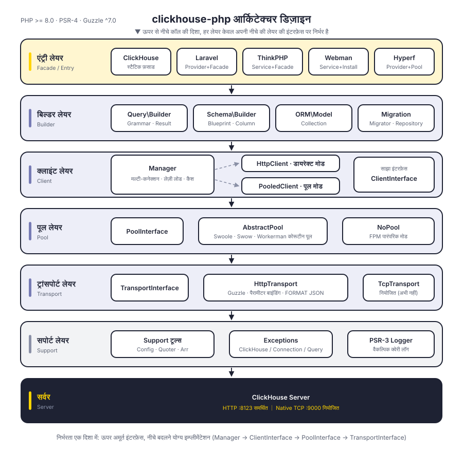
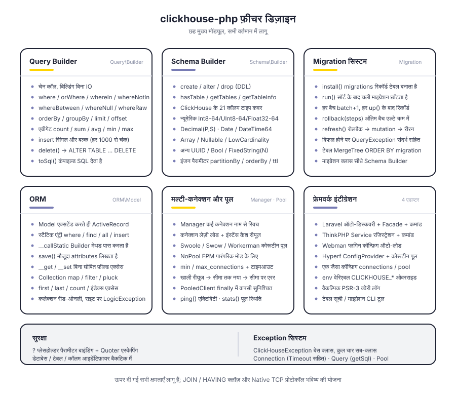
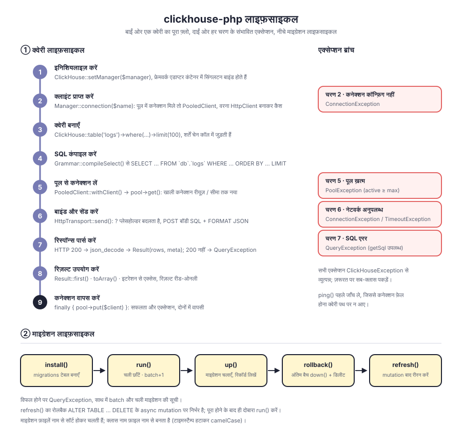

# clickhouse-php

PHP के लिए ClickHouse क्लाइंट। डिफ़ॉल्ट रूप से ClickHouse HTTP इंटरफ़ेस (पोर्ट 8123) से संवाद करता है; इसमें Query Builder, Schema Builder, माइग्रेशन सिस्टम और ORM अंतर्निहित हैं, और यह Laravel, ThinkPHP, Webman, Hyperf के लिए अनुकूलित है।

लेयर अलगाव: `Manager → ClientInterface → PoolInterface → TransportInterface` — क्लाइंट का स्वरूप, कनेक्शन पूल और ट्रांसपोर्ट प्रोटोकॉल, तीनों इंटरफ़ेस-उन्मुख हैं और बदले जा सकते हैं। Native TCP प्रोटोकॉल के लिए ट्रांसपोर्ट लेयर में जगह सुरक्षित है, अभी लागू नहीं है।

[简体中文](../../../README.md) | [English](../../../README_EN.md) | [한국어](../ko/README.md) | [Русский](../ru/README.md) | [Deutsch](../de/README.md) | [Français](../fr/README.md) | [Español](../es/README.md) | [Português](../pt/README.md) | **हिन्दी** | [العربية](../ar/README.md) | [বাংলা](../bn/README.md) | [Bahasa Indonesia](../id/README.md) | [日本語](../ja/README.md)

<p align="center">
  
</p>

## प्रोजेक्ट संरचना

```
clickhouse-php/
├── src/
│   ├── ClickHouse.php                  # स्टैटिक फ़साड एंट्री
│   ├── Client/                         # क्लाइंट लेयर: मल्टी-कनेक्शन, डायरेक्ट / पूल्ड दो रूप
│   │   ├── ClientInterface.php         # query / select / insert / ping
│   │   ├── Manager.php                 # मल्टी-कनेक्शन प्रबंधन, लेज़ी लोड + इंस्टेंस कैश
│   │   ├── HttpClient.php              # डायरेक्ट क्लाइंट, SQL निर्माण और रिस्पॉन्स पार्सिंग
│   │   └── PooledClient.php            # पूल्ड क्लाइंट, कनेक्शन अपने-आप लेता और लौटाता है
│   ├── Query/                          # क्वेरी बिल्डर
│   │   ├── Builder.php                 # चेन API और एग्रीगेशन एंट्री
│   │   ├── Grammar.php                 # SELECT / DELETE सिंटैक्स कंपाइल
│   │   ├── Expression.php              # रॉ एक्सप्रेशन
│   │   └── Result.php                  # रीड-ओनली रिज़ल्ट सेट
│   ├── Schema/                         # Schema Builder
│   │   ├── Builder.php                 # create / alter / drop / मेटाडेटा क्वेरी
│   │   ├── Blueprint.php               # कॉलम और इंजन पैरामीटर संग्रह
│   │   ├── Column.php                  # कॉलम परिभाषा
│   │   └── Grammar.php                 # DDL सिंटैक्स कंपाइल
│   ├── Migration/                      # माइग्रेशन सिस्टम
│   │   ├── Migration.php               # माइग्रेशन बेस क्लास
│   │   ├── Migrator.php                # run / rollback / refresh
│   │   └── Repository.php              # migrations टेबल रीड/राइट और mutation प्रतीक्षा
│   ├── ORM/                            # ORM
│   │   ├── Model.php                   # ActiveRecord बेस क्लास
│   │   └── Collection.php              # रीड-ओनली मॉडल कलेक्शन
│   ├── Pool/                           # कनेक्शन पूल
│   │   ├── PoolInterface.php           # get / put / stats / close
│   │   ├── AbstractPool.php            # साझा पूल लॉजिक (गिनती, टाइमआउट, रीफ़िल)
│   │   ├── SwoolePool.php              # Swoole कोरूटीन चैनल
│   │   ├── SwowPool.php                # Swow कोरूटीन चैनल
│   │   ├── WorkermanPool.php           # Workerman कोरूटीन चैनल
│   │   └── NoPool.php                  # FPM पारंपरिक मोड
│   ├── Transport/                      # ट्रांसपोर्ट लेयर
│   │   ├── TransportInterface.php      # send / close
│   │   ├── HttpTransport.php           # Guzzle HTTP, पैरामीटर बाइंडिंग और FORMAT JSON
│   │   └── TcpTransport.php            # Native TCP (नियोजित)
│   ├── Support/                        # Config / Quoter / Arr
│   ├── Exceptions/                     # Exception सिस्टम (1 बेस क्लास + 4 सब-क्लास)
│   ├── Laravel/                        # ServiceProvider · Facade · Artisan कमांड
│   ├── ThinkPHP/                       # Service · Facade · कमांड
│   ├── Webman/                         # Service · इंस्टॉल स्क्रिप्ट
│   └── Hyperf/                         # ConfigProvider · कोरूटीन पूल · कमांड
├── tests/                              # PHPUnit टेस्ट, डायरेक्टरी संरचना src जैसी
├── docs/                               # डिज़ाइन डायग्राम और दस्तावेज़
└── composer.json
```

## आर्किटेक्चर डिज़ाइन

<p align="center">
  
</p>

ऊपर से नीचे छह लेयर हैं, हर लेयर केवल अपनी नीचे की लेयर की अमूर्त इंटरफ़ेस पर निर्भर है:

| लेयर | ज़िम्मेदारी | मुख्य टाइप |
|----|------|----------|
| एंट्री लेयर | फ़साड और फ्रेमवर्क अडैप्टेशन | `ClickHouse`, चारों फ्रेमवर्क एडाप्टर |
| बिल्डर लेयर | क्वेरी और DDL बनाता है, कोई IO नहीं | `Query\Builder`, `Schema\Builder`, `ORM\Model`, `Migration\Migrator` |
| क्लाइंट लेयर | मल्टी-कनेक्शन प्रबंधन और निष्पादन एंट्री | `Manager`, `HttpClient`, `PooledClient` |
| कनेक्शन पूल लेयर | कनेक्शन रीयूज़ और समवर्ती सीमा | `PoolInterface`, `AbstractPool`, `NoPool` |
| ट्रांसपोर्ट लेयर | प्रोटोकॉल एनकोड/डिकोड और एरर मैपिंग | `HttpTransport`, `TcpTransport` (नियोजित) |
| सपोर्ट लेयर | कॉन्फ़िग, एस्केपिंग, Exception, लॉग | `Support\*`, `Exceptions\*`, PSR-3 `LoggerInterface` |

## फ़ीचर डिज़ाइन

<p align="center">
  
</p>

## लाइफ़साइकल

<p align="center">
  
</p>

## इंस्टॉलेशन

```bash
composer require erikwang2013/clickhouse-php
```

## क्विक स्टार्ट

### स्टैंडअलोन उपयोग

```php
use Erikwang2013\ClickHouse\ClickHouse;
use Erikwang2013\ClickHouse\Client\Manager;

// कॉन्फ़िग
$config = [
    'default' => 'clickhouse',
    'connections' => [
        'clickhouse' => [
            'driver'   => 'http',        // http (अनुशंसित) या native (विकासाधीन)
            'host'     => 'localhost',
            'port'     => 8123,          // HTTP पोर्ट, Native के लिए 9000
            'database' => 'default',
            'username' => 'default',
            'password' => '',
            'timeout'  => 30,
        ],
    ],
];

// इनिशियलाइज़
$manager = new Manager($config);
ClickHouse::setManager($manager);

// क्वेरी
$rows = ClickHouse::table('logs')
    ->where('date', '>=', '2024-01-01')
    ->whereIn('level', ['error', 'warn'])
    ->orderBy('timestamp', 'desc')
    ->limit(100)
    ->get();

foreach ($rows as $row) {
    echo $row['message'];
}

// रॉ SQL
$result = ClickHouse::query('SELECT count(*) AS cnt FROM logs WHERE date = ?', ['2024-01-01']);
echo $result->first()['cnt'];

// एग्रीगेशन
$count = ClickHouse::table('logs')->where('level', 'error')->count();
$avgDuration = ClickHouse::table('logs')->avg('duration');
```

### डेटा इन्सर्ट करें

```php
// सिंगल रो
ClickHouse::table('logs')->insert([
    'date'      => '2024-01-01',
    'level'     => 'info',
    'message'   => 'hello',
    'duration'  => 12.5,
]);

// बल्क
ClickHouse::table('logs')->insert([
    ['date' => '2024-01-01', 'level' => 'info',  'message' => 'a', 'duration' => 1.2],
    ['date' => '2024-01-02', 'level' => 'error', 'message' => 'b', 'duration' => 3.4],
]);
```

### टेबल बनाना (Schema Builder)

```php
ClickHouse::schema()->create('logs', function ($table) {
    $table->date('date');
    $table->dateTime('timestamp');
    $table->string('level');
    $table->string('message');
    $table->float64('duration');
    $table->engine('MergeTree')
          ->partitionBy('toYYYYMM(date)')
          ->orderBy(['date', 'timestamp', 'level']);
});

// टेबल ड्रॉप करें
ClickHouse::schema()->drop('logs');

// टेबल अल्टर करें
ClickHouse::schema()->alter('logs', function ($table) {
    $table->nullable('source', 'String');
});
```

### डेटा माइग्रेशन

माइग्रेशन फ़ाइल बनाएँ (जैसे `2026_05_27_000000_create_logs_table.php`):

```php
use Erikwang2013\ClickHouse\Migration\Migration;

class CreateLogsTable extends Migration
{
    public function up(): void
    {
        $this->schema->create('logs', function ($table) {
            $table->date('date');
            $table->string('level');
            $table->engine('MergeTree')
                  ->partitionBy('toYYYYMM(date)')
                  ->orderBy(['date', 'level']);
        });
    }

    public function down(): void
    {
        $this->schema->drop('logs');
    }
}
```

माइग्रेशन चलाएँ:

```php
use Erikwang2013\ClickHouse\Migration\Migrator;
use Erikwang2013\ClickHouse\Migration\Repository;

$client = ClickHouse::getManager()->connection();
$repository = new Repository($client);
$migrator = new Migrator($client, $repository, '/path/to/migrations');

$migrator->install();   // migrations टेबल बनाएँ
$migrator->run();       // बाक़ी माइग्रेशन चलाएँ
$migrator->rollback();  // पिछला बैच रोलबैक करें
$migrator->refresh();   // रोलबैक के बाद दोबारा चलाएँ
```

### ORM

```php
use Erikwang2013\ClickHouse\ORM\Model;

class Log extends Model
{
    protected string $table = 'logs';
    protected string $connection = 'default';
}

// क्वेरी
$logs = Log::where('level', 'error')
    ->orderBy('timestamp', 'desc')
    ->limit(50)
    ->get();

// एक रिकॉर्ड खोजें
$log = Log::find(123);

// एग्रीगेशन
$total = Log::where('date', '>=', '2024-01-01')->count();

// बल्क इन्सर्ट
Log::insert([
    ['date' => '2024-01-01', 'level' => 'info'],
    ['date' => '2024-01-02', 'level' => 'error'],
]);
```

### मल्टी-कनेक्शन

```php
$config = [
    'default' => 'default',
    'connections' => [
        'default' => ['driver' => 'http', 'host' => 'ch1.example.com', 'port' => 8123],
        'analytics' => ['driver' => 'http', 'host' => 'ch2.example.com', 'port' => 8123],
    ],
];

$manager = new Manager($config);

// निर्दिष्ट कनेक्शन उपयोग करें
ClickHouse::connection('analytics')->table('events')->get();
ClickHouse::table('events', 'analytics')->get();
```

## फ्रेमवर्क इंटीग्रेशन

### Laravel

कॉन्फ़िग फ़ाइल अपने-आप पब्लिश होती है, Composer ServiceProvider को ऑटो-डिस्कवर करता है।

```bash
php artisan vendor:publish --tag=clickhouse-config
```

```php
use Erikwang2013\ClickHouse\Laravel\Facades\ClickHouse;

ClickHouse::table('logs')->where('level', 'error')->get();
ClickHouse::connection('native')->select('SELECT * FROM logs LIMIT 10');
```

Artisan कमांड:

```bash
php artisan clickhouse:table-list
php artisan clickhouse:migration:install
php artisan clickhouse:migration:run
```

### ThinkPHP

`app/service.php` में सर्विस रजिस्टर करें:

```php
return [
    \Erikwang2013\ClickHouse\ThinkPHP\ClickHouseService::class,
];
```

```php
use think\facade\ClickHouse;

ClickHouse::table('logs')->get();
```

```bash
php think clickhouse:table-list
```

### Webman

Webman प्लगिन कॉन्फ़िग अपने-आप लोड करता है, हाथ से कॉन्फ़िग करने की ज़रूरत नहीं।

```php
use Erikwang2013\ClickHouse\Webman\ClickHouse;

ClickHouse::table('logs')->where('level', 'error')->get();
```

### Hyperf

`ConfigProvider` से ऑटो-डिस्कवरी, डिपेंडेंसी इंजेक्शन और कोरूटीन कनेक्शन पूल समर्थित।

```bash
php bin/hyperf.php vendor:publish erikwang2013/clickhouse-php
```

```php
use Erikwang2013\ClickHouse\Hyperf\ClickHouseConnection;

class LogController
{
    public function __construct(
        private ClickHouseConnection $clickhouse
    ) {}

    public function index()
    {
        return $this->clickhouse->table('logs')->get();
    }
}
```

## Query Builder संदर्भ

| मेथड | विवरण |
|------|------|
| `table($name)` / `from($name)` | टेबल नाम निर्दिष्ट करें |
| `select([...])` / `selectRaw($expr)` | SELECT कॉलम |
| `where($col, $op, $val)` | शर्त (2 पैरामीटर होने पर `$op` डिफ़ॉल्ट `=`) |
| `orWhere($col, $op, $val)` | OR शर्त |
| `whereIn($col, $arr)` / `whereNotIn($col, $arr)` | IN / NOT IN |
| `whereBetween($col, [$min, $max])` | BETWEEN |
| `whereNull($col)` / `whereNotNull($col)` | IS NULL / IS NOT NULL |
| `whereRaw($sql)` | रॉ WHERE |
| `orderBy($col, $dir)` | सॉर्ट (डिफ़ॉल्ट ASC) |
| `groupBy(...$cols)` | ग्रुपिंग |
| `limit($n)` / `offset($n)` | पेजिंग |
| `count()` / `sum($col)` / `avg($col)` / `min($col)` / `max($col)` | एग्रीगेशन |
| `insert($data)` | इन्सर्ट (सिंगल रो या बल्क) |
| `delete()` | डिलीट |
| `get()` | क्वेरी चलाएँ, Result लौटाएँ |
| `first()` | पहला रिकॉर्ड लौटाएँ |
| `toSql()` | जनरेट किया गया SQL पाएँ |

## Schema कॉलम टाइप

| मेथड | ClickHouse टाइप |
|------|----------------|
| `string($name)` | String |
| `fixedString($name, $len)` | FixedString(N) |
| `int8/16/32/64($name)` | Int8/16/32/64 |
| `uint8/16/32/64($name)` | UInt8/16/32/64 |
| `float32($name)` / `float64($name)` | Float32 / Float64 |
| `decimal($name, $p, $s)` | Decimal(P, S) |
| `date($name)` | Date |
| `dateTime($name)` | DateTime |
| `dateTime64($name, $p)` | DateTime64(P) |
| `uuid($name)` | UUID |
| `bool($name)` | Bool |
| `array($name, $type)` | Array(T) |
| `nullable($name, $type)` | Nullable(T) |
| `lowCardinality($name, $type)` | LowCardinality(T) |

## कॉन्फ़िग संदर्भ

```php
[
    'default' => 'clickhouse',
    'connections' => [
        'clickhouse' => [
            'driver'   => 'http',     // http (अनुशंसित) | native (विकासाधीन)
            'host'     => 'localhost',
            'port'     => 8123,       // HTTP 8123, Native 9000
            'database' => 'default',
            'username' => 'default',
            'password' => '',
            'timeout'  => 30,
        ],
    ],
    'pool' => [
        'min_connections'    => 2,
        'max_connections'    => 16,
        'connection_timeout' => 5.0,
    ],
    'query_log' => false,
];
```

## एनवायरनमेंट वेरिएबल

| वेरिएबल | डिफ़ॉल्ट | विवरण |
|------|--------|------|
| `CLICKHOUSE_HOST` | localhost | होस्ट पता |
| `CLICKHOUSE_PORT` | 8123 | HTTP पोर्ट |
| `CLICKHOUSE_DB` | default | डेटाबेस नाम |
| `CLICKHOUSE_USER` | default | यूज़रनेम |
| `CLICKHOUSE_PASS` | — | पासवर्ड |
| `CLICKHOUSE_TIMEOUT` | 30 | कनेक्शन टाइमआउट (सेकंड) |
| `CLICKHOUSE_DRIVER` | http | ड्राइवर टाइप |
| `CLICKHOUSE_POOL_MIN` | 2 | न्यूनतम कनेक्शन |
| `CLICKHOUSE_POOL_MAX` | 16 | अधिकतम कनेक्शन |

## Exception हैंडलिंग

```php
use Erikwang2013\ClickHouse\Exceptions\{
    ClickHouseException,
    ConnectionException,
    QueryException,
    TimeoutException,
    PoolException,
};

try {
    ClickHouse::table('logs')->get();
} catch (ConnectionException | TimeoutException $e) {
    // कनेक्शन या टाइमआउट की समस्या
} catch (QueryException $e) {
    echo $e->getMessage();
    echo $e->getSql();      // रॉ SQL
} catch (ClickHouseException $e) {
    // अन्य Exception
}
```

## सहयोग करें

| WeChat Pay | Alipay |
|------|--------|
|  |  |

आपके सहयोग के लिए धन्यवाद!

## लाइसेंस

MIT License.  Copyright (c) 2026 erik <erik@erik.xyz> — https://erik.xyz
