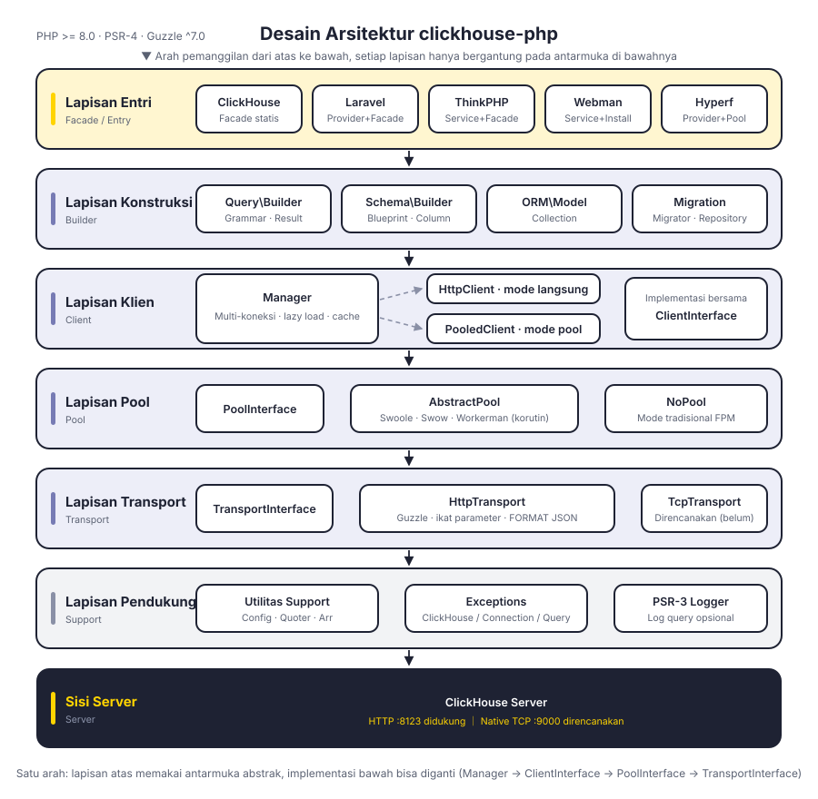
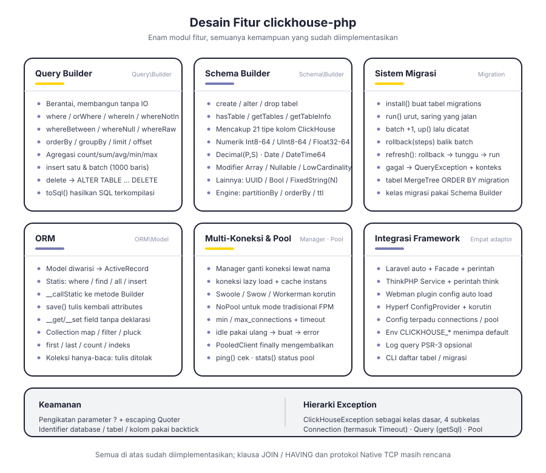
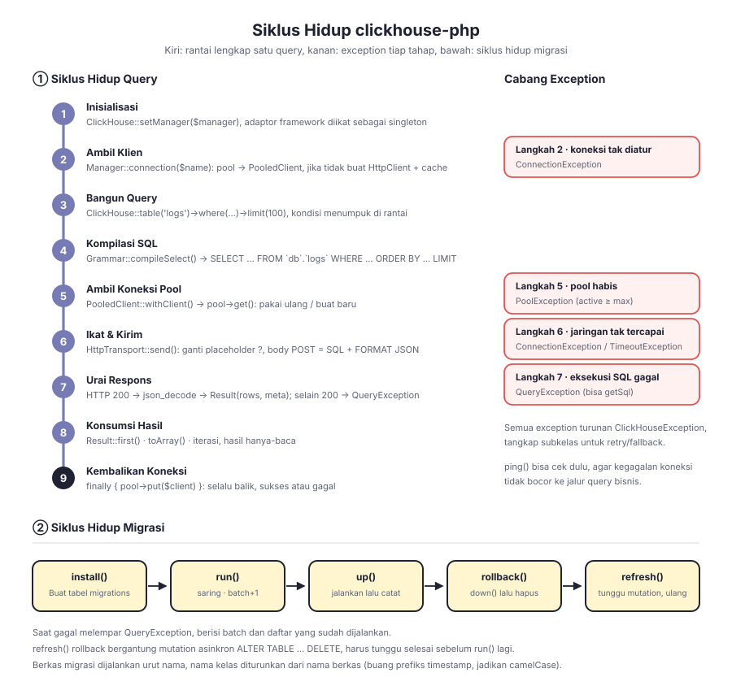

# clickhouse-php

Klien ClickHouse untuk PHP. Secara default berkomunikasi melalui antarmuka ClickHouse HTTP (port 8123), dilengkapi query builder, Schema Builder, sistem migrasi, dan ORM bawaan, serta mendukung Laravel, ThinkPHP, Webman, dan Hyperf.

Dekopel berlapis: `Manager → ClientInterface → PoolInterface → TransportInterface`, di mana bentuk klien, connection pool, dan protokol transport masing-masing menghadap antarmuka sehingga dapat diganti. Protokol Native TCP sudah disediakan tempatnya di lapisan transport, namun belum diimplementasikan.

[简体中文](../../../README.md) | [English](../../../README_EN.md) | [한국어](../ko/README.md) | [Русский](../ru/README.md) | [Deutsch](../de/README.md) | [Français](../fr/README.md) | [Español](../es/README.md) | [Português](../pt/README.md) | [हिन्दी](../hi/README.md) | [العربية](../ar/README.md) | [বাংলা](../bn/README.md) | **Bahasa Indonesia** | [日本語](../ja/README.md)

<p align="center">
  
</p>

## Struktur Proyek

```
clickhouse-php/
├── src/
│   ├── ClickHouse.php                  # Pintu masuk facade statis
│   ├── Client/                         # Lapisan klien: multi-koneksi, mode langsung / pool
│   │   ├── ClientInterface.php         # query / select / insert / ping
│   │   ├── Manager.php                 # Manajemen multi-koneksi, lazy load + cache instans
│   │   ├── HttpClient.php              # Klien langsung, menyusun SQL dan mengurai respons
│   │   └── PooledClient.php            # Klien pool, otomatis mengambil dan mengembalikan koneksi
│   ├── Query/                          # Query builder
│   │   ├── Builder.php                 # API berantai dan pintu masuk agregasi
│   │   ├── Grammar.php                 # Kompilasi sintaks SELECT / DELETE
│   │   ├── Expression.php              # Ekspresi mentah
│   │   └── Result.php                  # Himpunan hasil hanya-baca
│   ├── Schema/                         # Schema Builder
│   │   ├── Builder.php                 # create / alter / drop / kueri metadata
│   │   ├── Blueprint.php               # Pengumpulan kolom dan parameter engine
│   │   ├── Column.php                  # Definisi kolom
│   │   └── Grammar.php                 # Kompilasi sintaks DDL
│   ├── Migration/                      # Sistem migrasi
│   │   ├── Migration.php               # Kelas dasar migrasi
│   │   ├── Migrator.php                # run / rollback / refresh
│   │   └── Repository.php              # Baca-tulis tabel catatan migrasi dan menunggu mutation
│   ├── ORM/                            # ORM
│   │   ├── Model.php                   # Kelas dasar ActiveRecord
│   │   └── Collection.php              # Koleksi model hanya-baca
│   ├── Pool/                           # Connection pool
│   │   ├── PoolInterface.php           # get / put / stats / close
│   │   ├── AbstractPool.php            # Logika pool bersama (penghitungan, timeout, isi ulang)
│   │   ├── SwoolePool.php              # Kanal korutin Swoole
│   │   ├── SwowPool.php                # Kanal korutin Swow
│   │   ├── WorkermanPool.php           # Kanal korutin Workerman
│   │   └── NoPool.php                  # Mode tradisional FPM
│   ├── Transport/                      # Lapisan transport
│   │   ├── TransportInterface.php      # send / close
│   │   ├── HttpTransport.php           # Guzzle HTTP, pengikatan parameter dan FORMAT JSON
│   │   └── TcpTransport.php            # Native TCP (direncanakan)
│   ├── Support/                        # Config / Quoter / Arr
│   ├── Exceptions/                     # Hierarki exception (1 kelas dasar + 4 subkelas)
│   ├── Laravel/                        # ServiceProvider · Facade · perintah Artisan
│   ├── ThinkPHP/                       # Service · Facade · perintah
│   ├── Webman/                         # Service · skrip instalasi
│   └── Hyperf/                         # ConfigProvider · connection pool korutin · perintah
├── tests/                              # Tes PHPUnit, struktur direktori sama dengan src
├── docs/                               # Diagram desain dan dokumentasi
└── composer.json
```

## Desain Arsitektur

<p align="center">
  
</p>

Terbagi menjadi enam lapisan dari atas ke bawah, setiap lapisan hanya bergantung pada antarmuka abstrak lapisan di bawahnya:

| Lapisan | Tanggung jawab | Tipe kunci |
|----|------|----------|
| Lapisan entri | Facade dan adaptasi framework | `ClickHouse`, empat adaptor framework |
| Lapisan konstruksi | Menyusun query dan DDL, tanpa IO | `Query\Builder`, `Schema\Builder`, `ORM\Model`, `Migration\Migrator` |
| Lapisan klien | Manajemen multi-koneksi dan pintu masuk eksekusi | `Manager`, `HttpClient`, `PooledClient` |
| Lapisan pool | Pemakaian ulang koneksi dan batas konkurensi | `PoolInterface`, `AbstractPool`, `NoPool` |
| Lapisan transport | Enkode-dekode protokol dan pemetaan error | `HttpTransport`, `TcpTransport` (direncanakan) |
| Lapisan pendukung | Konfigurasi, escaping, exception, log | `Support\*`, `Exceptions\*`, PSR-3 `LoggerInterface` |

## Desain Fitur

<p align="center">
  
</p>

## Siklus Hidup

<p align="center">
  
</p>

## Instalasi

```bash
composer require erikwang2013/clickhouse-php
```

## Mulai Cepat

### Penggunaan Mandiri (PHP native)

Tanpa bergantung pada framework apa pun. Inisialisasi lewat variabel lingkungan `CLICKHOUSE_*`, cukup satu baris:

```php
use Erikwang2013\ClickHouse\ClickHouse;

ClickHouse::bootstrap();   // setara dengan ClickHouse::setManager(Manager::fromEnv())

$rows = ClickHouse::table('logs')
    ->where('date', '>=', '2024-01-01')
    ->whereIn('level', ['error', 'warn'])
    ->orderBy('timestamp', 'desc')
    ->limit(100)
    ->get();

foreach ($rows as $row) {
    echo $row['message'];
}
```

Konfigurasi yang tidak tercakup variabel lingkungan (multi-koneksi, penyetelan connection pool) diteruskan secara eksplisit lewat `Manager`:

```php
use Erikwang2013\ClickHouse\ClickHouse;
use Erikwang2013\ClickHouse\Client\Manager;

// Konfigurasi
$config = [
    'default' => 'clickhouse',
    'connections' => [
        'clickhouse' => [
            'driver'   => 'http',        // http (disarankan) atau native (dalam pengembangan)
            'host'     => 'localhost',
            'port'     => 8123,          // Port HTTP, Native memakai 9000
            'database' => 'default',
            'username' => 'default',
            'password' => '',
            'timeout'  => 30,
            'https'    => false,         // true memakai HTTPS
        ],
    ],
    'pool' => [
        'min_connections'    => 2,
        'max_connections'    => 16,
        'connection_timeout' => 5.0,
    ],
];

// Inisialisasi
$manager = new Manager($config);
ClickHouse::setManager($manager);

// Query
$rows = ClickHouse::table('logs')
    ->where('date', '>=', '2024-01-01')
    ->whereIn('level', ['error', 'warn'])
    ->orderBy('timestamp', 'desc')
    ->limit(100)
    ->get();

foreach ($rows as $row) {
    echo $row['message'];
}

// SQL mentah
$result = ClickHouse::query('SELECT count(*) AS cnt FROM logs WHERE date = ?', ['2024-01-01']);
echo $result->first()['cnt'];

// Agregasi
$count = ClickHouse::table('logs')->where('level', 'error')->count();
$avgDuration = ClickHouse::table('logs')->avg('duration');
```

### Menyisipkan Data

```php
// Satu baris
ClickHouse::table('logs')->insert([
    'date'      => '2024-01-01',
    'level'     => 'info',
    'message'   => 'hello',
    'duration'  => 12.5,
]);

// Batch
ClickHouse::table('logs')->insert([
    ['date' => '2024-01-01', 'level' => 'info',  'message' => 'a', 'duration' => 1.2],
    ['date' => '2024-01-02', 'level' => 'error', 'message' => 'b', 'duration' => 3.4],
]);
```

### Membuat Tabel (Schema Builder)

```php
ClickHouse::schema()->create('logs', function ($table) {
    $table->date('date');
    $table->dateTime('timestamp');
    $table->string('level');
    $table->string('message');
    $table->float64('duration');
    $table->engine('MergeTree')
          ->partitionBy('toYYYYMM(date)')
          ->orderBy(['date', 'timestamp', 'level']);
});

// Hapus tabel
ClickHouse::schema()->drop('logs');

// Ubah tabel
ClickHouse::schema()->alter('logs', function ($table) {
    $table->nullable('source', 'String');
});
```

### Migrasi Data

Buat berkas migrasi (misalnya `2026_05_27_000000_create_logs_table.php`):

```php
use Erikwang2013\ClickHouse\Migration\Migration;

class CreateLogsTable extends Migration
{
    public function up(): void
    {
        $this->schema->create('logs', function ($table) {
            $table->date('date');
            $table->string('level');
            $table->engine('MergeTree')
                  ->partitionBy('toYYYYMM(date)')
                  ->orderBy(['date', 'level']);
        });
    }

    public function down(): void
    {
        $this->schema->drop('logs');
    }
}
```

Menjalankan migrasi:

```php
use Erikwang2013\ClickHouse\Migration\Migrator;
use Erikwang2013\ClickHouse\Migration\Repository;

$client = ClickHouse::getManager()->connection();
$repository = new Repository($client);
$migrator = new Migrator($client, $repository, '/path/to/migrations');

$migrator->install();   // Membuat tabel catatan migrasi
$migrator->run();       // Menjalankan migrasi yang tertunda
$migrator->rollback();  // Mengembalikan batch terakhir
$migrator->refresh();   // Mengembalikan lalu menjalankan ulang
```

### ORM

```php
use Erikwang2013\ClickHouse\ORM\Model;

class Log extends Model
{
    protected string $table = 'logs';
    protected string $connection = 'default';
}

// Query
$logs = Log::where('level', 'error')
    ->orderBy('timestamp', 'desc')
    ->limit(50)
    ->get();

// Cari satu baris
$log = Log::find(123);

// Agregasi
$total = Log::where('date', '>=', '2024-01-01')->count();

// Sisip batch
Log::insert([
    ['date' => '2024-01-01', 'level' => 'info'],
    ['date' => '2024-01-02', 'level' => 'error'],
]);
```

### Multi-Koneksi

```php
$config = [
    'default' => 'default',
    'connections' => [
        'default' => ['driver' => 'http', 'host' => 'ch1.example.com', 'port' => 8123],
        'analytics' => ['driver' => 'http', 'host' => 'ch2.example.com', 'port' => 8123],
    ],
];

$manager = new Manager($config);

// Memakai koneksi tertentu
ClickHouse::connection('analytics')->table('events')->get();
ClickHouse::table('events', 'analytics')->get();
```

## Integrasi Framework

### Laravel

Berkas konfigurasi dipublikasikan otomatis, Composer menemukan ServiceProvider secara otomatis.

```bash
php artisan vendor:publish --tag=clickhouse-config
```

```php
use Erikwang2013\ClickHouse\Laravel\Facades\ClickHouse;

ClickHouse::table('logs')->where('level', 'error')->get();
ClickHouse::connection('native')->select('SELECT * FROM logs LIMIT 10');
```

Perintah Artisan:

```bash
php artisan clickhouse:table-list
php artisan clickhouse:migration:install
php artisan clickhouse:migration:run
```

### ThinkPHP

Daftarkan service di `app/service.php`:

```php
return [
    \Erikwang2013\ClickHouse\ThinkPHP\ClickHouseService::class,
];
```

```php
use think\facade\ClickHouse;

ClickHouse::table('logs')->get();
```

```bash
php think clickhouse:table-list
```

### Webman

Webman memuat konfigurasi plugin secara otomatis, tanpa konfigurasi manual.

```php
use Erikwang2013\ClickHouse\Webman\ClickHouse;

ClickHouse::table('logs')->where('level', 'error')->get();
```

### Hyperf

Ditemukan otomatis melalui `ConfigProvider`, mendukung dependency injection dan connection pool korutin.

```bash
php bin/hyperf.php vendor:publish erikwang2013/clickhouse-php
```

```php
use Erikwang2013\ClickHouse\Hyperf\ClickHouseConnection;

class LogController
{
    public function __construct(
        private ClickHouseConnection $clickhouse
    ) {}

    public function index()
    {
        return $this->clickhouse->table('logs')->get();
    }
}
```

## Referensi Query Builder

| Metode | Keterangan |
|------|------|
| `table($name)` / `from($name)` | Menentukan nama tabel |
| `select([...])` / `selectRaw($expr)` | Kolom SELECT |
| `where($col, $op, $val)` | Kondisi (dengan 2 argumen `$op` default `=`) |
| `orWhere($col, $op, $val)` | Kondisi OR |
| `whereIn($col, $arr)` / `whereNotIn($col, $arr)` | IN / NOT IN |
| `whereBetween($col, [$min, $max])` | BETWEEN |
| `whereNull($col)` / `whereNotNull($col)` | IS NULL / IS NOT NULL |
| `whereRaw($sql)` | WHERE mentah |
| `orderBy($col, $dir)` | Pengurutan (default ASC) |
| `groupBy(...$cols)` | Pengelompokan |
| `limit($n)` / `offset($n)` | Paginasi |
| `count()` / `sum($col)` / `avg($col)` / `min($col)` / `max($col)` | Agregasi |
| `insert($data)` | Sisip (satu baris atau batch) |
| `delete()` | Hapus |
| `get()` | Menjalankan query, mengembalikan Result |
| `first()` | Mengembalikan baris pertama |
| `toSql()` | Mengambil SQL yang dihasilkan |

## Tipe Kolom Schema

| Metode | Tipe ClickHouse |
|------|----------------|
| `string($name)` | String |
| `fixedString($name, $len)` | FixedString(N) |
| `int8/16/32/64($name)` | Int8/16/32/64 |
| `uint8/16/32/64($name)` | UInt8/16/32/64 |
| `float32($name)` / `float64($name)` | Float32 / Float64 |
| `decimal($name, $p, $s)` | Decimal(P, S) |
| `date($name)` | Date |
| `dateTime($name)` | DateTime |
| `dateTime64($name, $p)` | DateTime64(P) |
| `uuid($name)` | UUID |
| `bool($name)` | Bool |
| `array($name, $type)` | Array(T) |
| `nullable($name, $type)` | Nullable(T) |
| `lowCardinality($name, $type)` | LowCardinality(T) |

## Referensi Konfigurasi

```php
[
    'default' => 'clickhouse',
    'connections' => [
        'clickhouse' => [
            'driver'   => 'http',     // http (disarankan) | native (dalam pengembangan)
            'host'     => 'localhost',
            'port'     => 8123,       // HTTP 8123, Native 9000
            'database' => 'default',
            'username' => 'default',
            'password' => '',
            'timeout'  => 30,
            'https'    => false,
        ],
    ],
    'pool' => [
        'min_connections'    => 2,
        'max_connections'    => 16,
        'connection_timeout' => 5.0,
    ],
    'query_log' => false,
];
```

## Variabel Lingkungan

| Variabel | Nilai default | Keterangan |
|------|--------|------|
| `CLICKHOUSE_CONNECTION` | default | Nama koneksi default |
| `CLICKHOUSE_HOST` | localhost | Alamat host |
| `CLICKHOUSE_PORT` | 8123 | Port HTTP |
| `CLICKHOUSE_DB` | default | Nama database |
| `CLICKHOUSE_USER` | default | Nama pengguna |
| `CLICKHOUSE_PASS` | — | Kata sandi |
| `CLICKHOUSE_TIMEOUT` | 30 | Timeout koneksi (detik) |
| `CLICKHOUSE_HTTPS` | false | Apakah memakai HTTPS |
| `CLICKHOUSE_DRIVER` | http | Jenis driver |
| `CLICKHOUSE_POOL_MIN` | 2 | Jumlah koneksi minimum |
| `CLICKHOUSE_POOL_MAX` | 16 | Jumlah koneksi maksimum |
| `CLICKHOUSE_POOL_TIMEOUT` | 5.0 | Timeout pengambilan koneksi (detik) |

Di PHP native variabel-variabel di atas dibaca oleh `ClickHouse::bootstrap()` / `Manager::fromEnv()`. Berkas konfigurasi keempat framework membaca kumpulan nama variabel yang sama, tetapi cakupannya berbeda (Laravel lengkap; Hyperf tidak memakai `CLICKHOUSE_CONNECTION`/`CLICKHOUSE_DRIVER`/`CLICKHOUSE_HTTPS`; Webman hanya lima variabel koneksi; ThinkPHP untuk saat ini tidak membaca variabel lingkungan), jadi acuannya adalah berkas konfigurasi masing-masing.

## Penanganan Exception

```php
use Erikwang2013\ClickHouse\Exceptions\{
    ClickHouseException,
    ConnectionException,
    QueryException,
    TimeoutException,
    PoolException,
};

try {
    ClickHouse::table('logs')->get();
} catch (ConnectionException | TimeoutException $e) {
    // Masalah koneksi atau timeout
} catch (QueryException $e) {
    echo $e->getMessage();
    echo $e->getSql();      // SQL asli
} catch (ClickHouseException $e) {
    // Exception lainnya
}
```

## Dukungan

| WeChat | Alipay |
|------|--------|
|  |  |

Terima kasih atas dukungan Anda!

## Lisensi

MIT License.  Copyright (c) 2026 erik <erik@erik.xyz> — https://erik.xyz
