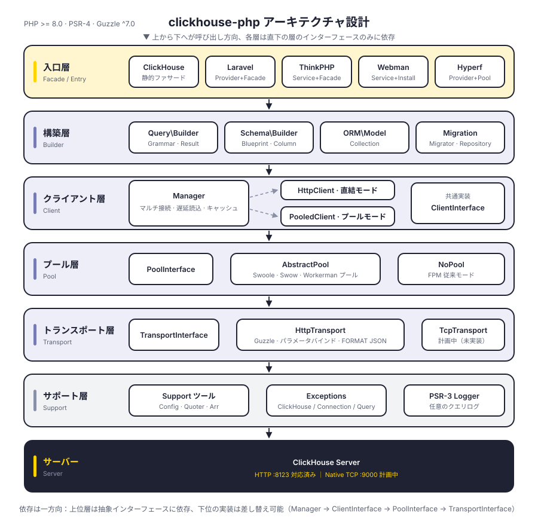
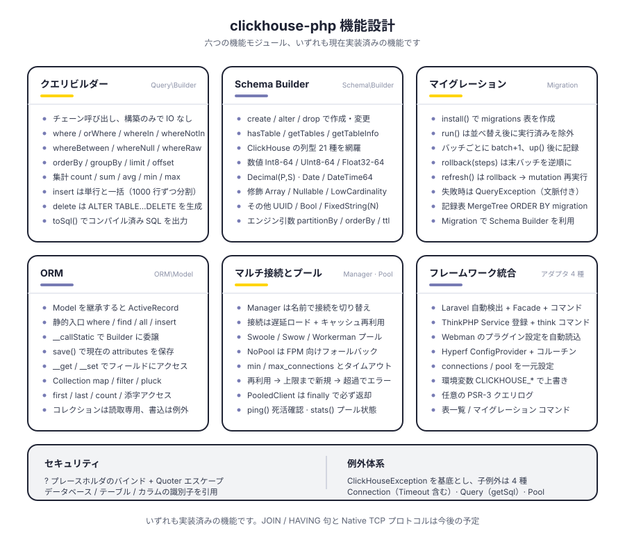
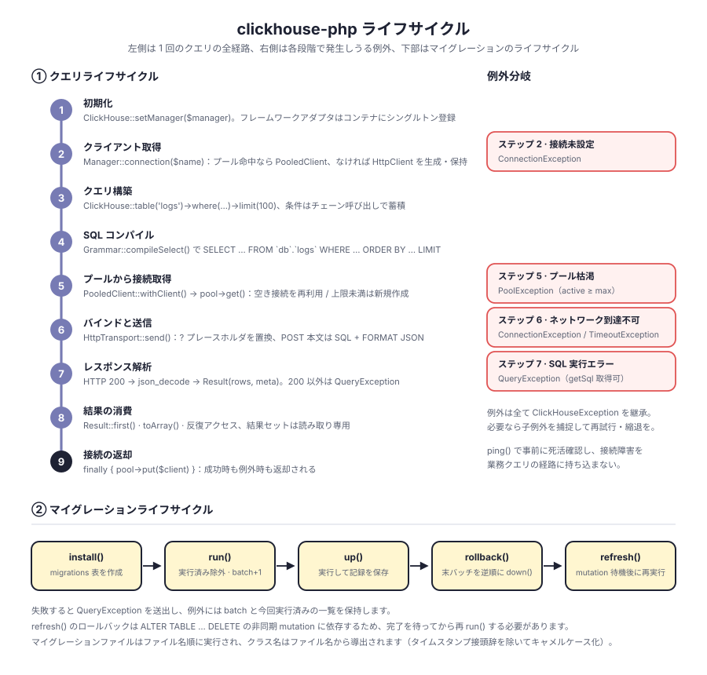

# clickhouse-php

PHP 製 ClickHouse クライアント。デフォルトでは ClickHouse HTTP インターフェース（ポート 8123）を介して通信し、クエリビルダー、Schema Builder、マイグレーションシステム、ORM を内蔵し、Laravel、ThinkPHP、Webman、Hyperf に対応しています。

階層は疎結合：`Manager → ClientInterface → PoolInterface → TransportInterface`。クライアント形態、コネクションプール、トランスポートプロトコルはそれぞれインターフェース指向で、いずれも差し替え可能です。Native TCP プロトコルはトランスポート層に場所を確保済みですが、未実装です。

[简体中文](../../../README.md) | [English](../../../README_EN.md) | [한국어](../ko/README.md) | [Русский](../ru/README.md) | [Deutsch](../de/README.md) | [Français](../fr/README.md) | [Español](../es/README.md) | [Português](../pt/README.md) | [हिन्दी](../hi/README.md) | [العربية](../ar/README.md) | [বাংলা](../bn/README.md) | [Bahasa Indonesia](../id/README.md) | **日本語**

<p align="center">
  
</p>

## プロジェクト構成

```
clickhouse-php/
├── src/
│   ├── ClickHouse.php                  # 静的ファサードの入口
│   ├── Client/                         # クライアント層：マルチ接続、直結 / プールの 2 形態
│   │   ├── ClientInterface.php         # query / select / insert / ping
│   │   ├── Manager.php                 # マルチ接続管理、遅延ロード + インスタンスキャッシュ
│   │   ├── HttpClient.php              # 直結クライアント、SQL の組み立てと応答解析を担当
│   │   └── PooledClient.php            # プールクライアント、接続の取得と返却を自動化
│   ├── Query/                          # クエリビルダー
│   │   ├── Builder.php                 # チェーン API と集計の入口
│   │   ├── Grammar.php                 # SELECT / DELETE 構文のコンパイル
│   │   ├── Expression.php              # 生の式
│   │   └── Result.php                  # 読み取り専用の結果セット
│   ├── Schema/                         # Schema Builder
│   │   ├── Builder.php                 # create / alter / drop / メタ情報クエリ
│   │   ├── Blueprint.php               # カラムとエンジンパラメータの収集
│   │   ├── Column.php                  # カラム定義
│   │   └── Grammar.php                 # DDL 構文のコンパイル
│   ├── Migration/                      # マイグレーションシステム
│   │   ├── Migration.php               # マイグレーション基底クラス
│   │   ├── Migrator.php                # run / rollback / refresh
│   │   └── Repository.php              # 記録テーブルの読み書きと mutation 待機
│   ├── ORM/                            # ORM
│   │   ├── Model.php                   # ActiveRecord 基底クラス
│   │   └── Collection.php              # 読み取り専用のモデルコレクション
│   ├── Pool/                           # コネクションプール
│   │   ├── PoolInterface.php           # get / put / stats / close
│   │   ├── AbstractPool.php            # 共通プールロジック（カウント、タイムアウト、補充）
│   │   ├── SwoolePool.php              # Swoole コルーチンチャネル
│   │   ├── SwowPool.php                # Swow コルーチンチャネル
│   │   ├── WorkermanPool.php           # Workerman コルーチンチャネル
│   │   └── NoPool.php                  # FPM 従来モード
│   ├── Transport/                      # トランスポート層
│   │   ├── TransportInterface.php      # send / close
│   │   ├── HttpTransport.php           # Guzzle HTTP、パラメータバインドと FORMAT JSON
│   │   └── TcpTransport.php            # Native TCP（計画中）
│   ├── Support/                        # Config / Quoter / Arr
│   ├── Exceptions/                     # 例外体系（基底 1 つ + サブ 4 つ）
│   ├── Laravel/                        # ServiceProvider · Facade · Artisan コマンド
│   ├── ThinkPHP/                       # Service · Facade · コマンド
│   ├── Webman/                         # Service · インストールスクリプト
│   └── Hyperf/                         # ConfigProvider · コルーチンコネクションプール · コマンド
├── tests/                              # PHPUnit テスト、ディレクトリは src と同構造
├── docs/                               # 設計図とドキュメント
└── composer.json
```

## アーキテクチャ設計

<p align="center">
  
</p>

上から下へ六つの層に分かれ、各層はその直下の層の抽象インターフェースのみに依存します：

| 層 | 役割 | 主要な型 |
|----|------|----------|
| 入口層 | ファサードとフレームワーク適応 | `ClickHouse`、4 つのフレームワークアダプタ |
| 構築層 | クエリと DDL の組み立て、IO は発生しない | `Query\Builder`、`Schema\Builder`、`ORM\Model`、`Migration\Migrator` |
| クライアント層 | マルチ接続管理と実行の入口 | `Manager`、`HttpClient`、`PooledClient` |
| プール層 | 接続の再利用と同時実行の上限 | `PoolInterface`、`AbstractPool`、`NoPool` |
| トランスポート層 | プロトコルの符号化とエラー変換 | `HttpTransport`、`TcpTransport`（計画中） |
| サポート層 | 設定、エスケープ、例外、ログ | `Support\*`、`Exceptions\*`、PSR-3 `LoggerInterface` |

## 機能設計

<p align="center">
  
</p>

## ライフサイクル

<p align="center">
  
</p>

## インストール

```bash
composer require erikwang2013/clickhouse-php
```

## クイックスタート

### 単体での利用

```php
use Erikwang2013\ClickHouse\ClickHouse;
use Erikwang2013\ClickHouse\Client\Manager;

// 設定
$config = [
    'default' => 'clickhouse',
    'connections' => [
        'clickhouse' => [
            'driver'   => 'http',        // http（推奨）または native（開発中）
            'host'     => 'localhost',
            'port'     => 8123,          // HTTP ポート, Native は 9000
            'database' => 'default',
            'username' => 'default',
            'password' => '',
            'timeout'  => 30,
        ],
    ],
];

// 初期化
$manager = new Manager($config);
ClickHouse::setManager($manager);

// クエリ
$rows = ClickHouse::table('logs')
    ->where('date', '>=', '2024-01-01')
    ->whereIn('level', ['error', 'warn'])
    ->orderBy('timestamp', 'desc')
    ->limit(100)
    ->get();

foreach ($rows as $row) {
    echo $row['message'];
}

// 生の SQL
$result = ClickHouse::query('SELECT count(*) AS cnt FROM logs WHERE date = ?', ['2024-01-01']);
echo $result->first()['cnt'];

// 集計
$count = ClickHouse::table('logs')->where('level', 'error')->count();
$avgDuration = ClickHouse::table('logs')->avg('duration');
```

### データの挿入

```php
// 単行
ClickHouse::table('logs')->insert([
    'date'      => '2024-01-01',
    'level'     => 'info',
    'message'   => 'hello',
    'duration'  => 12.5,
]);

// 一括
ClickHouse::table('logs')->insert([
    ['date' => '2024-01-01', 'level' => 'info',  'message' => 'a', 'duration' => 1.2],
    ['date' => '2024-01-02', 'level' => 'error', 'message' => 'b', 'duration' => 3.4],
]);
```

### テーブル作成 (Schema Builder)

```php
ClickHouse::schema()->create('logs', function ($table) {
    $table->date('date');
    $table->dateTime('timestamp');
    $table->string('level');
    $table->string('message');
    $table->float64('duration');
    $table->engine('MergeTree')
          ->partitionBy('toYYYYMM(date)')
          ->orderBy(['date', 'timestamp', 'level']);
});

// テーブル削除
ClickHouse::schema()->drop('logs');

// テーブル変更
ClickHouse::schema()->alter('logs', function ($table) {
    $table->nullable('source', 'String');
});
```

### データマイグレーション

マイグレーションファイルを作成します（例：`2026_05_27_000000_create_logs_table.php`）：

```php
use Erikwang2013\ClickHouse\Migration\Migration;

class CreateLogsTable extends Migration
{
    public function up(): void
    {
        $this->schema->create('logs', function ($table) {
            $table->date('date');
            $table->string('level');
            $table->engine('MergeTree')
                  ->partitionBy('toYYYYMM(date)')
                  ->orderBy(['date', 'level']);
        });
    }

    public function down(): void
    {
        $this->schema->drop('logs');
    }
}
```

マイグレーションの実行：

```php
use Erikwang2013\ClickHouse\Migration\Migrator;
use Erikwang2013\ClickHouse\Migration\Repository;

$client = ClickHouse::getManager()->connection();
$repository = new Repository($client);
$migrator = new Migrator($client, $repository, '/path/to/migrations');

$migrator->install();   // マイグレーション記録表を作成
$migrator->run();       // 未実行のマイグレーションを実行
$migrator->rollback();  // 直前のバッチをロールバック
$migrator->refresh();   // ロールバック後に再実行
```

### ORM

```php
use Erikwang2013\ClickHouse\ORM\Model;

class Log extends Model
{
    protected string $table = 'logs';
    protected string $connection = 'default';
}

// クエリ
$logs = Log::where('level', 'error')
    ->orderBy('timestamp', 'desc')
    ->limit(50)
    ->get();

// 1 件取得
$log = Log::find(123);

// 集計
$total = Log::where('date', '>=', '2024-01-01')->count();

// 一括挿入
Log::insert([
    ['date' => '2024-01-01', 'level' => 'info'],
    ['date' => '2024-01-02', 'level' => 'error'],
]);
```

### マルチ接続

```php
$config = [
    'default' => 'default',
    'connections' => [
        'default' => ['driver' => 'http', 'host' => 'ch1.example.com', 'port' => 8123],
        'analytics' => ['driver' => 'http', 'host' => 'ch2.example.com', 'port' => 8123],
    ],
];

$manager = new Manager($config);

// 指定した接続を使用
ClickHouse::connection('analytics')->table('events')->get();
ClickHouse::table('events', 'analytics')->get();
```

## フレームワーク統合

### Laravel

設定ファイルは自動公開され、Composer が ServiceProvider を自動検出します。

```bash
php artisan vendor:publish --tag=clickhouse-config
```

```php
use Erikwang2013\ClickHouse\Laravel\Facades\ClickHouse;

ClickHouse::table('logs')->where('level', 'error')->get();
ClickHouse::connection('native')->select('SELECT * FROM logs LIMIT 10');
```

Artisan コマンド：

```bash
php artisan clickhouse:table-list
php artisan clickhouse:migration:install
php artisan clickhouse:migration:run
```

### ThinkPHP

`app/service.php` にサービスを登録します：

```php
return [
    \Erikwang2013\ClickHouse\ThinkPHP\ClickHouseService::class,
];
```

```php
use think\facade\ClickHouse;

ClickHouse::table('logs')->get();
```

```bash
php think clickhouse:table-list
```

### Webman

Webman はプラグイン設定を自動ロードするため、手動設定は不要です。

```php
use Erikwang2013\ClickHouse\Webman\ClickHouse;

ClickHouse::table('logs')->where('level', 'error')->get();
```

### Hyperf

`ConfigProvider` による自動検出に対応し、依存性注入とコルーチンコネクションプールを利用できます。

```bash
php bin/hyperf.php vendor:publish erikwang2013/clickhouse-php
```

```php
use Erikwang2013\ClickHouse\Hyperf\ClickHouseConnection;

class LogController
{
    public function __construct(
        private ClickHouseConnection $clickhouse
    ) {}

    public function index()
    {
        return $this->clickhouse->table('logs')->get();
    }
}
```

## クエリビルダーリファレンス

| メソッド | 説明 |
|------|------|
| `table($name)` / `from($name)` | テーブル名を指定 |
| `select([...])` / `selectRaw($expr)` | SELECT のカラム |
| `where($col, $op, $val)` | 条件（2 引数のとき `$op` は既定で `=`） |
| `orWhere($col, $op, $val)` | OR 条件 |
| `whereIn($col, $arr)` / `whereNotIn($col, $arr)` | IN / NOT IN |
| `whereBetween($col, [$min, $max])` | BETWEEN |
| `whereNull($col)` / `whereNotNull($col)` | IS NULL / IS NOT NULL |
| `whereRaw($sql)` | 生の WHERE |
| `orderBy($col, $dir)` | 並べ替え（既定は ASC） |
| `groupBy(...$cols)` | グループ化 |
| `limit($n)` / `offset($n)` | ページング |
| `count()` / `sum($col)` / `avg($col)` / `min($col)` / `max($col)` | 集計 |
| `insert($data)` | 挿入（単行または一括） |
| `delete()` | 削除 |
| `get()` | クエリを実行し Result を返す |
| `first()` | 先頭の 1 件を返す |
| `toSql()` | 生成された SQL を取得 |

## Schema のカラム型

| メソッド | ClickHouse の型 |
|------|----------------|
| `string($name)` | String |
| `fixedString($name, $len)` | FixedString(N) |
| `int8/16/32/64($name)` | Int8/16/32/64 |
| `uint8/16/32/64($name)` | UInt8/16/32/64 |
| `float32($name)` / `float64($name)` | Float32 / Float64 |
| `decimal($name, $p, $s)` | Decimal(P, S) |
| `date($name)` | Date |
| `dateTime($name)` | DateTime |
| `dateTime64($name, $p)` | DateTime64(P) |
| `uuid($name)` | UUID |
| `bool($name)` | Bool |
| `array($name, $type)` | Array(T) |
| `nullable($name, $type)` | Nullable(T) |
| `lowCardinality($name, $type)` | LowCardinality(T) |

## 設定リファレンス

```php
[
    'default' => 'clickhouse',
    'connections' => [
        'clickhouse' => [
            'driver'   => 'http',     // http（推奨）| native（開発中）
            'host'     => 'localhost',
            'port'     => 8123,       // HTTP 8123, Native 9000
            'database' => 'default',
            'username' => 'default',
            'password' => '',
            'timeout'  => 30,
        ],
    ],
    'pool' => [
        'min_connections'    => 2,
        'max_connections'    => 16,
        'connection_timeout' => 5.0,
    ],
    'query_log' => false,
];
```

## 環境変数

| 変数 | 既定値 | 説明 |
|------|--------|------|
| `CLICKHOUSE_HOST` | localhost | ホストアドレス |
| `CLICKHOUSE_PORT` | 8123 | HTTP ポート |
| `CLICKHOUSE_DB` | default | データベース名 |
| `CLICKHOUSE_USER` | default | ユーザー名 |
| `CLICKHOUSE_PASS` | — | パスワード |
| `CLICKHOUSE_TIMEOUT` | 30 | 接続タイムアウト（秒） |
| `CLICKHOUSE_DRIVER` | http | ドライバ種別 |
| `CLICKHOUSE_POOL_MIN` | 2 | 最小接続数 |
| `CLICKHOUSE_POOL_MAX` | 16 | 最大接続数 |

## 例外処理

```php
use Erikwang2013\ClickHouse\Exceptions\{
    ClickHouseException,
    ConnectionException,
    QueryException,
    TimeoutException,
    PoolException,
};

try {
    ClickHouse::table('logs')->get();
} catch (ConnectionException | TimeoutException $e) {
    // 接続またはタイムアウトの問題
} catch (QueryException $e) {
    echo $e->getMessage();
    echo $e->getSql();      // 生の SQL
} catch (ClickHouseException $e) {
    // その他の例外
}
```

## ご支援のお願い

| WeChat | Alipay |
|------|--------|
|  |  |

ご支援ありがとうございます！

## ライセンス

MIT License.  Copyright (c) 2026 erik <erik@erik.xyz> — https://erik.xyz
