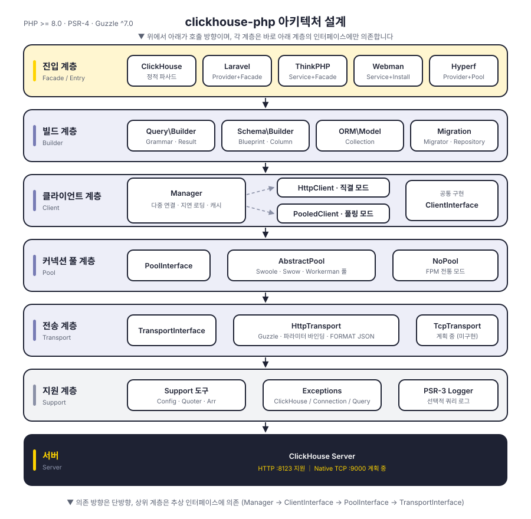
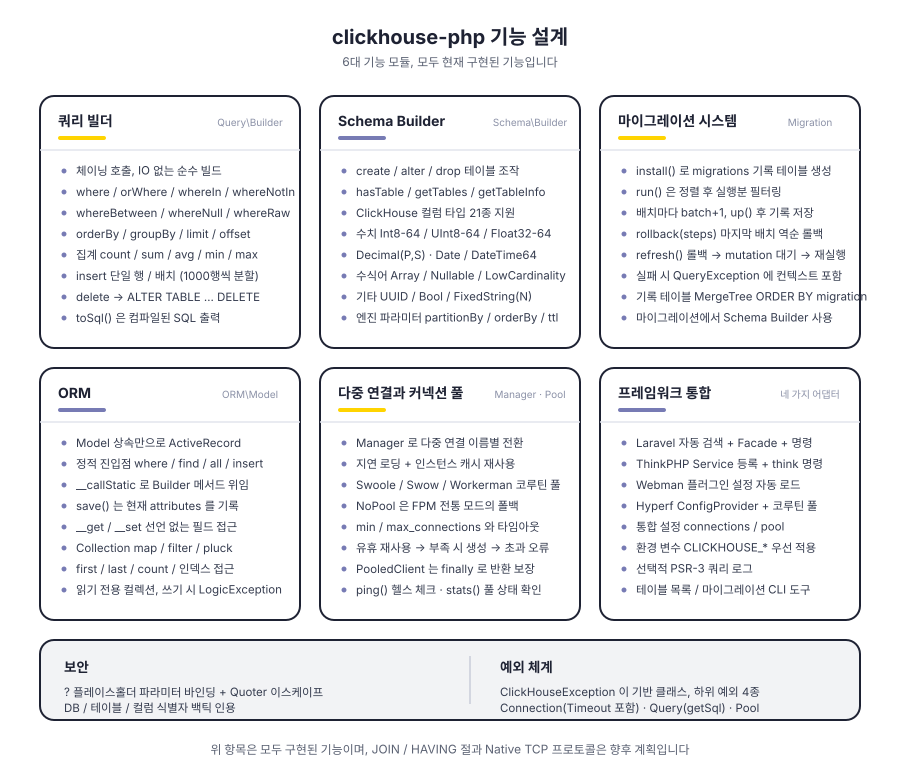
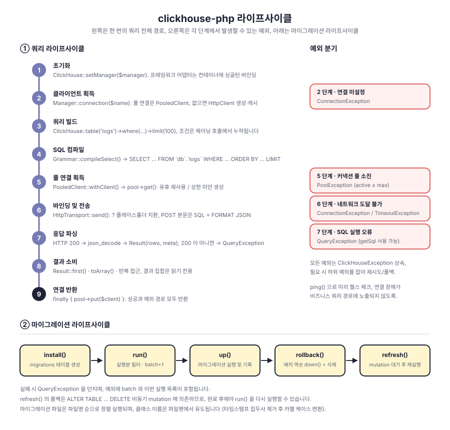

# clickhouse-php

PHP ClickHouse 클라이언트. 기본적으로 ClickHouse HTTP 인터페이스(8123 포트)를 통해 통신하며, 쿼리 빌더, Schema Builder, 마이그레이션 시스템, ORM을 내장하고 Laravel, ThinkPHP, Webman, Hyperf를 지원합니다.

계층형 분리 구조: `Manager → ClientInterface → PoolInterface → TransportInterface`. 클라이언트 형태, 커넥션 풀, 전송 프로토콜이 각각 인터페이스를 향해 있어 모두 교체할 수 있습니다. Native TCP 프로토콜은 전송 계층에 자리를 마련해 두었으나 아직 구현되지 않았습니다.

**简体中文** | [English](../../../README_EN.md) | **한국어** | [Русский](../ru/README.md) | [Deutsch](../de/README.md) | [Français](../fr/README.md) | [Español](../es/README.md) | [Português](../pt/README.md) | [हिन्दी](../hi/README.md) | [العربية](../ar/README.md) | [বাংলা](../bn/README.md) | [Bahasa Indonesia](../id/README.md) | [日本語](../ja/README.md)

<p align="center">
  
</p>

## 프로젝트 구조

```
clickhouse-php/
├── src/
│   ├── ClickHouse.php                  # 정적 파사드 진입점
│   ├── Client/                         # 클라이언트 계층: 다중 연결, 직결 / 풀링 두 가지 형태
│   │   ├── ClientInterface.php         # query / select / insert / ping
│   │   ├── Manager.php                 # 다중 연결 관리, 지연 로딩 + 인스턴스 캐시
│   │   ├── HttpClient.php              # 직결 클라이언트, SQL 조립과 응답 파싱 담당
│   │   └── PooledClient.php            # 풀링 클라이언트, 연결 자동 대여/반납
│   ├── Query/                          # 쿼리 빌더
│   │   ├── Builder.php                 # 체이닝 API와 집계 진입점
│   │   ├── Grammar.php                 # SELECT / DELETE 문법 컴파일
│   │   ├── Expression.php              # 원시 표현식
│   │   └── Result.php                  # 읽기 전용 결과 집합
│   ├── Schema/                         # Schema Builder
│   │   ├── Builder.php                 # create / alter / drop / 메타 정보 조회
│   │   ├── Blueprint.php               # 컬럼과 엔진 파라미터 수집
│   │   ├── Column.php                  # 컬럼 정의
│   │   └── Grammar.php                 # DDL 문법 컴파일
│   ├── Migration/                      # 마이그레이션 시스템
│   │   ├── Migration.php               # 마이그레이션 기반 클래스
│   │   ├── Migrator.php                # run / rollback / refresh
│   │   └── Repository.php              # 마이그레이션 기록 테이블 읽기/쓰기와 mutation 대기
│   ├── ORM/                            # ORM
│   │   ├── Model.php                   # ActiveRecord 기반 클래스
│   │   └── Collection.php              # 읽기 전용 모델 컬렉션
│   ├── Pool/                           # 커넥션 풀
│   │   ├── PoolInterface.php           # get / put / stats / close
│   │   ├── AbstractPool.php            # 공통 풀링 로직 (카운트, 타임아웃, 보충)
│   │   ├── SwoolePool.php              # Swoole 코루틴 채널
│   │   ├── SwowPool.php                # Swow 코루틴 채널
│   │   ├── WorkermanPool.php           # Workerman 코루틴 채널
│   │   └── NoPool.php                  # FPM 전통 모드
│   ├── Transport/                      # 전송 계층
│   │   ├── TransportInterface.php      # send / close
│   │   ├── HttpTransport.php           # Guzzle HTTP, 파라미터 바인딩과 FORMAT JSON
│   │   └── TcpTransport.php            # Native TCP (계획 중)
│   ├── Support/                        # Config / Quoter / Arr
│   ├── Exceptions/                     # 예외 체계 (기반 클래스 1개 + 하위 클래스 4개)
│   ├── Laravel/                        # ServiceProvider · Facade · Artisan 명령
│   ├── ThinkPHP/                       # Service · Facade · 명령
│   ├── Webman/                         # Service · 설치 스크립트
│   └── Hyperf/                         # ConfigProvider · 코루틴 커넥션 풀 · 명령
├── tests/                              # PHPUnit 테스트, 디렉터리는 src와 동형
├── docs/                               # 설계도와 문서
└── composer.json
```

## 아키텍처 설계

<p align="center">
  
</p>

위에서 아래로 여섯 계층이며, 각 계층은 바로 아래 계층의 추상 인터페이스에만 의존합니다:

| 계층 | 역할 | 주요 타입 |
|----|------|----------|
| 진입 계층 | 파사드와 프레임워크 어댑터 | `ClickHouse`, 네 가지 프레임워크 어댑터 |
| 빌드 계층 | 쿼리와 DDL 조립, IO 를 발생시키지 않음 | `Query\Builder`, `Schema\Builder`, `ORM\Model`, `Migration\Migrator` |
| 클라이언트 계층 | 다중 연결 관리와 실행 진입점 | `Manager`, `HttpClient`, `PooledClient` |
| 커넥션 풀 계층 | 연결 재사용과 동시성 상한 | `PoolInterface`, `AbstractPool`, `NoPool` |
| 전송 계층 | 프로토콜 인코딩/디코딩과 오류 매핑 | `HttpTransport`, `TcpTransport`(계획 중) |
| 지원 계층 | 설정, 이스케이프, 예외, 로그 | `Support\*`, `Exceptions\*`, PSR-3 `LoggerInterface` |

## 기능 설계

<p align="center">
  
</p>

## 라이프사이클

<p align="center">
  
</p>

## 설치

```bash
composer require erikwang2013/clickhouse-php
```

## 빠른 시작

### 단독 사용(네이티브 PHP)

프레임워크에 의존하지 않습니다. `CLICKHOUSE_*` 환경 변수로 초기화하며, 한 줄이면 됩니다:

```php
use Erikwang2013\ClickHouse\ClickHouse;

ClickHouse::bootstrap();   // ClickHouse::setManager(Manager::fromEnv()) 와 동일

$rows = ClickHouse::table('logs')
    ->where('date', '>=', '2024-01-01')
    ->whereIn('level', ['error', 'warn'])
    ->orderBy('timestamp', 'desc')
    ->limit(100)
    ->get();

foreach ($rows as $row) {
    echo $row['message'];
}
```

환경 변수로 덮을 수 없는 설정(다중 연결, 커넥션 풀 튜닝)은 `Manager` 로 명시적으로 전달합니다:

```php
use Erikwang2013\ClickHouse\ClickHouse;
use Erikwang2013\ClickHouse\Client\Manager;

// 설정
$config = [
    'default' => 'clickhouse',
    'connections' => [
        'clickhouse' => [
            'driver'   => 'http',        // http(권장) 또는 native(개발 중)
            'host'     => 'localhost',
            'port'     => 8123,          // HTTP 포트, Native 는 9000
            'database' => 'default',
            'username' => 'default',
            'password' => '',
            'timeout'  => 30,
            'https'    => false,         // true 이면 HTTPS
        ],
    ],
    'pool' => [
        'min_connections'    => 2,
        'max_connections'    => 16,
        'connection_timeout' => 5.0,
    ],
];

// 초기화
$manager = new Manager($config);
ClickHouse::setManager($manager);

// 조회
$rows = ClickHouse::table('logs')
    ->where('date', '>=', '2024-01-01')
    ->whereIn('level', ['error', 'warn'])
    ->orderBy('timestamp', 'desc')
    ->limit(100)
    ->get();

foreach ($rows as $row) {
    echo $row['message'];
}

// 원시 SQL
$result = ClickHouse::query('SELECT count(*) AS cnt FROM logs WHERE date = ?', ['2024-01-01']);
echo $result->first()['cnt'];

// 집계
$count = ClickHouse::table('logs')->where('level', 'error')->count();
$avgDuration = ClickHouse::table('logs')->avg('duration');
```

### 데이터 삽입

```php
// 단일 행
ClickHouse::table('logs')->insert([
    'date'      => '2024-01-01',
    'level'     => 'info',
    'message'   => 'hello',
    'duration'  => 12.5,
]);

// 배치
ClickHouse::table('logs')->insert([
    ['date' => '2024-01-01', 'level' => 'info',  'message' => 'a', 'duration' => 1.2],
    ['date' => '2024-01-02', 'level' => 'error', 'message' => 'b', 'duration' => 3.4],
]);
```

### 테이블 생성 (Schema Builder)

```php
ClickHouse::schema()->create('logs', function ($table) {
    $table->date('date');
    $table->dateTime('timestamp');
    $table->string('level');
    $table->string('message');
    $table->float64('duration');
    $table->engine('MergeTree')
          ->partitionBy('toYYYYMM(date)')
          ->orderBy(['date', 'timestamp', 'level']);
});

// 테이블 삭제
ClickHouse::schema()->drop('logs');

// 테이블 수정
ClickHouse::schema()->alter('logs', function ($table) {
    $table->nullable('source', 'String');
});
```

### 데이터 마이그레이션

마이그레이션 파일 생성 (예: `2026_05_27_000000_create_logs_table.php`):

```php
use Erikwang2013\ClickHouse\Migration\Migration;

class CreateLogsTable extends Migration
{
    public function up(): void
    {
        $this->schema->create('logs', function ($table) {
            $table->date('date');
            $table->string('level');
            $table->engine('MergeTree')
                  ->partitionBy('toYYYYMM(date)')
                  ->orderBy(['date', 'level']);
        });
    }

    public function down(): void
    {
        $this->schema->drop('logs');
    }
}
```

마이그레이션 실행:

```php
use Erikwang2013\ClickHouse\Migration\Migrator;
use Erikwang2013\ClickHouse\Migration\Repository;

$client = ClickHouse::getManager()->connection();
$repository = new Repository($client);
$migrator = new Migrator($client, $repository, '/path/to/migrations');

$migrator->install();   // 마이그레이션 기록 테이블 생성
$migrator->run();       // 대기 중인 마이그레이션 실행
$migrator->rollback();  // 직전 배치 롤백
$migrator->refresh();   // 롤백 후 재실행
```

### ORM

```php
use Erikwang2013\ClickHouse\ORM\Model;

class Log extends Model
{
    protected string $table = 'logs';
    protected string $connection = 'default';
}

// 조회
$logs = Log::where('level', 'error')
    ->orderBy('timestamp', 'desc')
    ->limit(50)
    ->get();

// 단일 건 조회
$log = Log::find(123);

// 집계
$total = Log::where('date', '>=', '2024-01-01')->count();

// 배치 삽입
Log::insert([
    ['date' => '2024-01-01', 'level' => 'info'],
    ['date' => '2024-01-02', 'level' => 'error'],
]);
```

### 다중 연결

```php
$config = [
    'default' => 'default',
    'connections' => [
        'default' => ['driver' => 'http', 'host' => 'ch1.example.com', 'port' => 8123],
        'analytics' => ['driver' => 'http', 'host' => 'ch2.example.com', 'port' => 8123],
    ],
];

$manager = new Manager($config);

// 지정한 연결 사용
ClickHouse::connection('analytics')->table('events')->get();
ClickHouse::table('events', 'analytics')->get();
```

## 프레임워크 통합

### Laravel

설정 파일 자동 배포, Composer 가 ServiceProvider 를 자동 검색합니다.

```bash
php artisan vendor:publish --tag=clickhouse-config
```

```php
use Erikwang2013\ClickHouse\Laravel\Facades\ClickHouse;

ClickHouse::table('logs')->where('level', 'error')->get();
ClickHouse::connection('native')->select('SELECT * FROM logs LIMIT 10');
```

Artisan 명령:

```bash
php artisan clickhouse:table-list
php artisan clickhouse:migration:install
php artisan clickhouse:migration:run
```

### ThinkPHP

`app/service.php` 에서 서비스를 등록합니다:

```php
return [
    \Erikwang2013\ClickHouse\ThinkPHP\ClickHouseService::class,
];
```

```php
use think\facade\ClickHouse;

ClickHouse::table('logs')->get();
```

```bash
php think clickhouse:table-list
```

### Webman

Webman 이 플러그인 설정을 자동 로드하므로 수동 설정이 필요 없습니다.

```php
use Erikwang2013\ClickHouse\Webman\ClickHouse;

ClickHouse::table('logs')->where('level', 'error')->get();
```

### Hyperf

`ConfigProvider` 를 통해 자동 검색되며, 의존성 주입과 코루틴 커넥션 풀을 지원합니다.

```bash
php bin/hyperf.php vendor:publish erikwang2013/clickhouse-php
```

```php
use Erikwang2013\ClickHouse\Hyperf\ClickHouseConnection;

class LogController
{
    public function __construct(
        private ClickHouseConnection $clickhouse
    ) {}

    public function index()
    {
        return $this->clickhouse->table('logs')->get();
    }
}
```

## 쿼리 빌더 레퍼런스

| 메서드 | 설명 |
|------|------|
| `table($name)` / `from($name)` | 테이블 이름 지정 |
| `select([...])` / `selectRaw($expr)` | SELECT 컬럼 |
| `where($col, $op, $val)` | 조건 (인자가 2개면 `$op` 기본값은 `=`) |
| `orWhere($col, $op, $val)` | OR 조건 |
| `whereIn($col, $arr)` / `whereNotIn($col, $arr)` | IN / NOT IN |
| `whereBetween($col, [$min, $max])` | BETWEEN |
| `whereNull($col)` / `whereNotNull($col)` | IS NULL / IS NOT NULL |
| `whereRaw($sql)` | 원시 WHERE |
| `orderBy($col, $dir)` | 정렬 (기본 ASC) |
| `groupBy(...$cols)` | 그룹화 |
| `limit($n)` / `offset($n)` | 페이징 |
| `count()` / `sum($col)` / `avg($col)` / `min($col)` / `max($col)` | 집계 |
| `insert($data)` | 삽입 (단일 행 또는 배치) |
| `delete()` | 삭제 |
| `get()` | 쿼리를 실행하고 Result 반환 |
| `first()` | 첫 번째 행 반환 |
| `toSql()` | 생성된 SQL 조회 |

## Schema 컬럼 타입

| 메서드 | ClickHouse 타입 |
|------|----------------|
| `string($name)` | String |
| `fixedString($name, $len)` | FixedString(N) |
| `int8/16/32/64($name)` | Int8/16/32/64 |
| `uint8/16/32/64($name)` | UInt8/16/32/64 |
| `float32($name)` / `float64($name)` | Float32 / Float64 |
| `decimal($name, $p, $s)` | Decimal(P, S) |
| `date($name)` | Date |
| `dateTime($name)` | DateTime |
| `dateTime64($name, $p)` | DateTime64(P) |
| `uuid($name)` | UUID |
| `bool($name)` | Bool |
| `array($name, $type)` | Array(T) |
| `nullable($name, $type)` | Nullable(T) |
| `lowCardinality($name, $type)` | LowCardinality(T) |

## 설정 레퍼런스

```php
[
    'default' => 'clickhouse',
    'connections' => [
        'clickhouse' => [
            'driver'   => 'http',     // http(권장) | native(개발 중)
            'host'     => 'localhost',
            'port'     => 8123,       // HTTP 8123, Native 9000
            'database' => 'default',
            'username' => 'default',
            'password' => '',
            'timeout'  => 30,
            'https'    => false,
        ],
    ],
    'pool' => [
        'min_connections'    => 2,
        'max_connections'    => 16,
        'connection_timeout' => 5.0,
    ],
    'query_log' => false,
];
```

## 환경 변수

| 변수 | 기본값 | 설명 |
|------|--------|------|
| `CLICKHOUSE_CONNECTION` | default | 기본 연결 이름 |
| `CLICKHOUSE_HOST` | localhost | 호스트 주소 |
| `CLICKHOUSE_PORT` | 8123 | HTTP 포트 |
| `CLICKHOUSE_DB` | default | 데이터베이스 이름 |
| `CLICKHOUSE_USER` | default | 사용자 이름 |
| `CLICKHOUSE_PASS` | — | 비밀번호 |
| `CLICKHOUSE_TIMEOUT` | 30 | 연결 타임아웃(초) |
| `CLICKHOUSE_HTTPS` | false | HTTPS 사용 여부 |
| `CLICKHOUSE_DRIVER` | http | 드라이버 유형 |
| `CLICKHOUSE_POOL_MIN` | 2 | 최소 연결 수 |
| `CLICKHOUSE_POOL_MAX` | 16 | 최대 연결 수 |
| `CLICKHOUSE_POOL_TIMEOUT` | 5.0 | 연결 대여 타임아웃(초) |

네이티브 PHP 에서는 위 변수들을 `ClickHouse::bootstrap()` / `Manager::fromEnv()` 가 읽습니다. 네 프레임워크의 설정 파일도 같은 변수 이름을 읽지만 적용 범위는 다릅니다(Laravel 은 전체, Hyperf 는 `CLICKHOUSE_CONNECTION`/`CLICKHOUSE_DRIVER`/`CLICKHOUSE_HTTPS` 누락, Webman 은 연결 5개 항목만, ThinkPHP 는 현재 환경 변수를 읽지 않음). 각 설정 파일을 기준으로 하십시오.

## 예외 처리

```php
use Erikwang2013\ClickHouse\Exceptions\{
    ClickHouseException,
    ConnectionException,
    QueryException,
    TimeoutException,
    PoolException,
};

try {
    ClickHouse::table('logs')->get();
} catch (ConnectionException | TimeoutException $e) {
    // 연결 또는 타임아웃 문제
} catch (QueryException $e) {
    echo $e->getMessage();
    echo $e->getSql();      // 원본 SQL
} catch (ClickHouseException $e) {
    // 기타 예외
}
```

## 후원

| 위챗 | 알리페이 |
|------|--------|
|  |  |

후원해 주셔서 감사합니다!

## 라이선스

MIT License.  Copyright (c) 2026 erik <erik@erik.xyz> — https://erik.xyz
