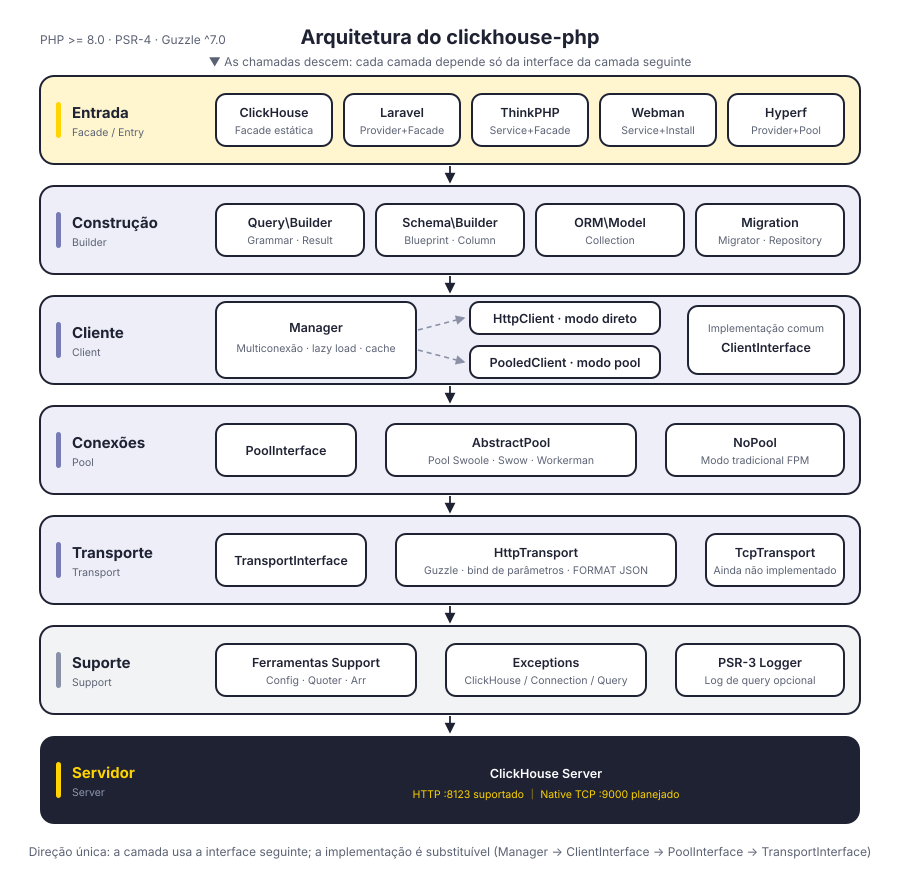
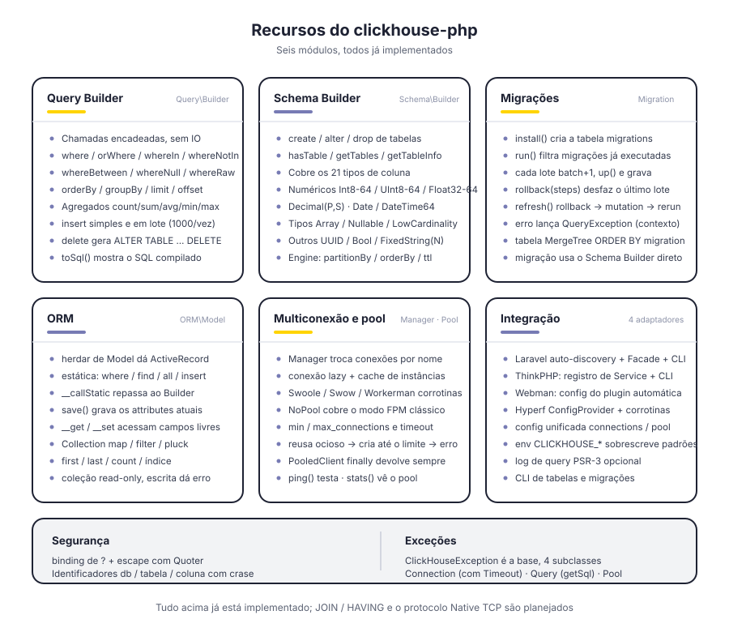
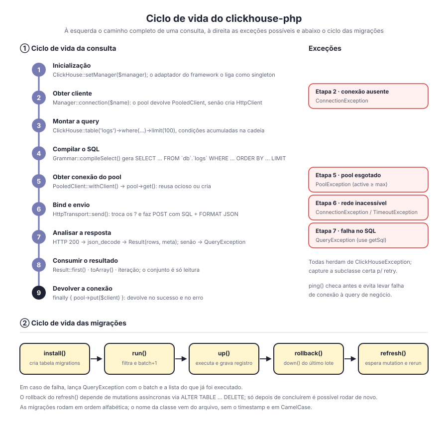

# clickhouse-php

Cliente ClickHouse para PHP. Por padrão se comunica pela interface HTTP do ClickHouse (porta 8123), com query builder, Schema Builder, sistema de migrações e ORM integrados, além de adaptadores para Laravel, ThinkPHP, Webman e Hyperf.

Camadas desacopladas: `Manager → ClientInterface → PoolInterface → TransportInterface` — o formato do cliente, o pool de conexões e o protocolo de transporte são todos orientados a interfaces e substituíveis. O protocolo Native TCP já tem lugar reservado na camada de transporte, mas ainda não foi implementado.

[简体中文](../../../README.md) | [English](../../../README_EN.md) | [한국어](../ko/README.md) | [Русский](../ru/README.md) | [Deutsch](../de/README.md) | [Français](../fr/README.md) | [Español](../es/README.md) | **Português** | [हिन्दी](../hi/README.md) | [العربية](../ar/README.md) | [বাংলা](../bn/README.md) | [Bahasa Indonesia](../id/README.md) | [日本語](../ja/README.md)

<p align="center">
  
</p>

## Estrutura do projeto

```
clickhouse-php/
├── src/
│   ├── ClickHouse.php                  # entrada da facade estática
│   ├── Client/                         # camada cliente: multiconexão, modos direto / pool
│   │   ├── ClientInterface.php         # query / select / insert / ping
│   │   ├── Manager.php                 # gestão de conexões, lazy load + cache de instâncias
│   │   ├── HttpClient.php              # cliente direto: monta o SQL e analisa a resposta
│   │   └── PooledClient.php            # cliente com pool: pega e devolve conexões
│   ├── Query/                          # query builder
│   │   ├── Builder.php                 # API encadeada e agregados
│   │   ├── Grammar.php                 # compilação da sintaxe SELECT / DELETE
│   │   ├── Expression.php              # expressão nativa
│   │   └── Result.php                  # conjunto de resultados somente leitura
│   ├── Schema/                         # Schema Builder
│   │   ├── Builder.php                 # create / alter / drop / metadados
│   │   ├── Blueprint.php               # coleta de colunas e parâmetros de engine
│   │   ├── Column.php                  # definição de coluna
│   │   └── Grammar.php                 # compilação da sintaxe DDL
│   ├── Migration/                      # sistema de migrações
│   │   ├── Migration.php               # classe base de migração
│   │   ├── Migrator.php                # run / rollback / refresh
│   │   └── Repository.php              # leitura/escrita da tabela de migrações e espera de mutation
│   ├── ORM/                            # ORM
│   │   ├── Model.php                   # classe base ActiveRecord
│   │   └── Collection.php              # coleção de modelos somente leitura
│   ├── Pool/                           # pool de conexões
│   │   ├── PoolInterface.php           # get / put / stats / close
│   │   ├── AbstractPool.php            # lógica comum do pool (contagem, timeout, reposição)
│   │   ├── SwoolePool.php              # canal de corrotina Swoole
│   │   ├── SwowPool.php                # canal de corrotina Swow
│   │   ├── WorkermanPool.php           # canal de corrotina Workerman
│   │   └── NoPool.php                  # modo tradicional FPM
│   ├── Transport/                      # camada de transporte
│   │   ├── TransportInterface.php      # send / close
│   │   ├── HttpTransport.php           # Guzzle HTTP, bind de parâmetros e FORMAT JSON
│   │   └── TcpTransport.php            # Native TCP (planejado)
│   ├── Support/                        # Config / Quoter / Arr
│   ├── Exceptions/                     # hierarquia de exceções (1 base + 4 subclasses)
│   ├── Laravel/                        # ServiceProvider · Facade · comandos Artisan
│   ├── ThinkPHP/                       # Service · Facade · comandos
│   ├── Webman/                         # Service · script de instalação
│   └── Hyperf/                         # ConfigProvider · pool de corrotinas · comandos
├── tests/                              # testes PHPUnit, diretórios espelhando src
├── docs/                               # diagramas e documentação
└── composer.json
```

## Arquitetura

<p align="center">
  
</p>

Dividida em seis camadas, cada uma dependendo apenas da interface abstrata da camada seguinte:

| Camada | Responsabilidade | Tipos principais |
|----|------|----------|
| Entrada | Facade e adaptação de frameworks | `ClickHouse`, quatro adaptadores de framework |
| Construção | Monta queries e DDL, sem produzir IO | `Query\Builder`, `Schema\Builder`, `ORM\Model`, `Migration\Migrator` |
| Cliente | Gestão de conexões e ponto de execução | `Manager`, `HttpClient`, `PooledClient` |
| Conexões | Reuso de conexões e limite de concorrência | `PoolInterface`, `AbstractPool`, `NoPool` |
| Transporte | Codec do protocolo e mapeamento de erros | `HttpTransport`, `TcpTransport` (planejado) |
| Suporte | Configuração, escape, exceções e logs | `Support\*`, `Exceptions\*`, PSR-3 `LoggerInterface` |

## Recursos

<p align="center">
  
</p>

## Ciclo de vida

<p align="center">
  
</p>

## Instalação

```bash
composer require erikwang2013/clickhouse-php
```

## Início rápido

### Uso independente (PHP puro)

Não depende de nenhum framework. Inicialize com as variáveis de ambiente `CLICKHOUSE_*` — uma linha basta:

```php
use Erikwang2013\ClickHouse\ClickHouse;

ClickHouse::bootstrap();   // equivale a ClickHouse::setManager(Manager::fromEnv())

$rows = ClickHouse::table('logs')
    ->where('date', '>=', '2024-01-01')
    ->whereIn('level', ['error', 'warn'])
    ->orderBy('timestamp', 'desc')
    ->limit(100)
    ->get();

foreach ($rows as $row) {
    echo $row['message'];
}
```

O que as variáveis de ambiente não cobrem (múltiplas conexões, ajuste do pool) é passado explicitamente pelo `Manager`:

```php
use Erikwang2013\ClickHouse\ClickHouse;
use Erikwang2013\ClickHouse\Client\Manager;

// Configuração
$config = [
    'default' => 'clickhouse',
    'connections' => [
        'clickhouse' => [
            'driver'   => 'http',        // http (recomendado) ou native (em desenvolvimento)
            'host'     => 'localhost',
            'port'     => 8123,          // porta HTTP; Native usa 9000
            'database' => 'default',
            'username' => 'default',
            'password' => '',
            'timeout'  => 30,
            'https'    => false,         // true usa HTTPS
        ],
    ],
    'pool' => [
        'min_connections'    => 2,
        'max_connections'    => 16,
        'connection_timeout' => 5.0,
    ],
];

// Inicialização
$manager = new Manager($config);
ClickHouse::setManager($manager);

// Consulta
$rows = ClickHouse::table('logs')
    ->where('date', '>=', '2024-01-01')
    ->whereIn('level', ['error', 'warn'])
    ->orderBy('timestamp', 'desc')
    ->limit(100)
    ->get();

foreach ($rows as $row) {
    echo $row['message'];
}

// SQL nativo
$result = ClickHouse::query('SELECT count(*) AS cnt FROM logs WHERE date = ?', ['2024-01-01']);
echo $result->first()['cnt'];

// Agregações
$count = ClickHouse::table('logs')->where('level', 'error')->count();
$avgDuration = ClickHouse::table('logs')->avg('duration');
```

### Inserir dados

```php
// Uma linha
ClickHouse::table('logs')->insert([
    'date'      => '2024-01-01',
    'level'     => 'info',
    'message'   => 'hello',
    'duration'  => 12.5,
]);

// Em lote
ClickHouse::table('logs')->insert([
    ['date' => '2024-01-01', 'level' => 'info',  'message' => 'a', 'duration' => 1.2],
    ['date' => '2024-01-02', 'level' => 'error', 'message' => 'b', 'duration' => 3.4],
]);
```

### Criar tabelas (Schema Builder)

```php
ClickHouse::schema()->create('logs', function ($table) {
    $table->date('date');
    $table->dateTime('timestamp');
    $table->string('level');
    $table->string('message');
    $table->float64('duration');
    $table->engine('MergeTree')
          ->partitionBy('toYYYYMM(date)')
          ->orderBy(['date', 'timestamp', 'level']);
});

// Remover tabela
ClickHouse::schema()->drop('logs');

// Alterar tabela
ClickHouse::schema()->alter('logs', function ($table) {
    $table->nullable('source', 'String');
});
```

### Migrações de dados

Crie o arquivo de migração (por exemplo `2026_05_27_000000_create_logs_table.php`):

```php
use Erikwang2013\ClickHouse\Migration\Migration;

class CreateLogsTable extends Migration
{
    public function up(): void
    {
        $this->schema->create('logs', function ($table) {
            $table->date('date');
            $table->string('level');
            $table->engine('MergeTree')
                  ->partitionBy('toYYYYMM(date)')
                  ->orderBy(['date', 'level']);
        });
    }

    public function down(): void
    {
        $this->schema->drop('logs');
    }
}
```

Executar as migrações:

```php
use Erikwang2013\ClickHouse\Migration\Migrator;
use Erikwang2013\ClickHouse\Migration\Repository;

$client = ClickHouse::getManager()->connection();
$repository = new Repository($client);
$migrator = new Migrator($client, $repository, '/path/to/migrations');

$migrator->install();   // cria a tabela de migrações
$migrator->run();       // executa as migrações pendentes
$migrator->rollback();  // desfaz o último lote
$migrator->refresh();   // desfaz e executa de novo
```

### ORM

```php
use Erikwang2013\ClickHouse\ORM\Model;

class Log extends Model
{
    protected string $table = 'logs';
    protected string $connection = 'default';
}

// Consulta
$logs = Log::where('level', 'error')
    ->orderBy('timestamp', 'desc')
    ->limit(50)
    ->get();

// Buscar um registro
$log = Log::find(123);

// Agregações
$total = Log::where('date', '>=', '2024-01-01')->count();

// Inserção em lote
Log::insert([
    ['date' => '2024-01-01', 'level' => 'info'],
    ['date' => '2024-01-02', 'level' => 'error'],
]);
```

### Múltiplas conexões

```php
$config = [
    'default' => 'default',
    'connections' => [
        'default' => ['driver' => 'http', 'host' => 'ch1.example.com', 'port' => 8123],
        'analytics' => ['driver' => 'http', 'host' => 'ch2.example.com', 'port' => 8123],
    ],
];

$manager = new Manager($config);

// Usar uma conexão específica
ClickHouse::connection('analytics')->table('events')->get();
ClickHouse::table('events', 'analytics')->get();
```

## Integração com frameworks

### Laravel

O arquivo de configuração é publicado automaticamente e o Composer descobre o ServiceProvider sozinho.

```bash
php artisan vendor:publish --tag=clickhouse-config
```

```php
use Erikwang2013\ClickHouse\Laravel\Facades\ClickHouse;

ClickHouse::table('logs')->where('level', 'error')->get();
ClickHouse::connection('native')->select('SELECT * FROM logs LIMIT 10');
```

Comandos Artisan:

```bash
php artisan clickhouse:table-list
php artisan clickhouse:migration:install
php artisan clickhouse:migration:run
```

### ThinkPHP

Registre o serviço em `app/service.php`:

```php
return [
    \Erikwang2013\ClickHouse\ThinkPHP\ClickHouseService::class,
];
```

```php
use think\facade\ClickHouse;

ClickHouse::table('logs')->get();
```

```bash
php think clickhouse:table-list
```

### Webman

O Webman carrega a configuração do plugin automaticamente, sem configuração manual.

```php
use Erikwang2013\ClickHouse\Webman\ClickHouse;

ClickHouse::table('logs')->where('level', 'error')->get();
```

### Hyperf

Descoberto automaticamente via `ConfigProvider`, com suporte a injeção de dependência e pool de corrotinas.

```bash
php bin/hyperf.php vendor:publish erikwang2013/clickhouse-php
```

```php
use Erikwang2013\ClickHouse\Hyperf\ClickHouseConnection;

class LogController
{
    public function __construct(
        private ClickHouseConnection $clickhouse
    ) {}

    public function index()
    {
        return $this->clickhouse->table('logs')->get();
    }
}
```

## Referência do Query Builder

| Método | Descrição |
|------|------|
| `table($name)` / `from($name)` | Define o nome da tabela |
| `select([...])` / `selectRaw($expr)` | Colunas do SELECT. Os nomes de coluna em `select()` recebem crase (palavras reservadas como `` `order` `` funcionam), e no alias `id as uid` cada lado é citado separadamente; para funções ou subqueries use `selectRaw()` ou `Expression` |
| `where($col, $op, $val)` | Condição (com 2 argumentos, `$op` assume `=`). Valor `null` vira `IS NULL` / `IS NOT NULL` automaticamente |
| `orWhere($col, $op, $val)` | Condição OR |
| `whereIn($col, $arr)` / `whereNotIn($col, $arr)` | IN / NOT IN |
| `whereBetween($col, [$min, $max])` | BETWEEN |
| `whereNull($col)` / `whereNotNull($col)` | IS NULL / IS NOT NULL |
| `whereRaw($sql)` | WHERE nativo (não passe entrada do usuário) |
| `prewhere($col, $op, $val)` | PREWHERE, posicionado antes do WHERE (o corte de varredura mais eficaz do ClickHouse) |
| `orderBy($col, $dir)` | Ordenação (padrão ASC) |
| `groupBy(...$cols)` | Agrupamento |
| `having($col, $op, $val)` / `havingRaw($sql)` | HAVING, posicionado depois do GROUP BY. O `having()` trata o nome da coluna como identificador, então condições de agregação (como `count() > 100`) devem usar `havingRaw()` ou `new Expression('count()')` |
| `limit($n)` / `offset($n)` | Paginação |
| `final()` | Desduplicação/merge na leitura (ReplacingMergeTree etc.) |
| `sample($ratio)` | Amostragem SAMPLE, ex.: `sample(0.1)` |
| `settings([...])` | SETTINGS em nível de consulta, ex.: `settings(['max_execution_time' => 30])` |
| `count()` / `sum($col)` / `avg($col)` / `min($col)` / `max($col)` | Agregação |
| `insert($data)` | Inserção (linha única ou lote). Todas as linhas do mesmo lote precisam ter as mesmas colunas; faltar ou sobrar coluna dá erro na hora (evita gravar valores deslocados por posição) |
| `delete()` | Exclusão (compila para `ALTER TABLE ... DELETE`, **exige WHERE**, senão lança exceção) |
| `get()` | Executa a consulta e retorna Result |
| `first()` | Retorna o primeiro registro |
| `toSql()` | Obtém o SQL gerado |

### Resultados grandes e leitura em streaming

O `get()` analisa o conjunto de resultados inteiro para um array PHP, ocupando cerca de 7x o tamanho da resposta em memória (medido numa tabela estreita de 5 colunas: 93 B/linha de payload → 677 B/linha já decodificado, ~73 MB para 100 mil linhas). Com volume grande, use `stream()` para consumir linha a linha — a memória não depende do tamanho do resultado:

```php
use Erikwang2013\ClickHouse\Client\StreamingClientInterface;

$client = ClickHouse::client();           // use este quando precisar do cliente de baixo nível (connection() devolve o builder)
if ($client instanceof StreamingClientInterface) {
    foreach ($client->stream('SELECT * FROM logs') as $row) {   // FORMAT JSONEachRow
        echo $row['message'], PHP_EOL;
    }
}

// Consultas com FORMAT próprio (CSV/TSV etc.) usam raw(), que devolve o corpo da resposta como está
$csv = $client->raw('SELECT * FROM logs FORMAT CSV');
```

No modo com pool o `stream()` também funciona: a conexão é devolvida quando o gerador termina de ser consumido (ou quando um `break` antecipado o destrói).

### Entradas de SQL nativo

As entradas abaixo são canais de SQL nativo **concatenados como estão**; passar entrada do usuário por elas equivale a entregar o banco: `selectRaw()`, `whereRaw()`, `havingRaw()`, `new Expression($sql)`, os valores de `Blueprint::settings()` e strings de tipo de coluna como `$table->string('col')` (`array($name, $type)`). Identificadores e valores já são escapados (crase nos nomes de coluna, valores escapados por tipo), mas fragmentos de SQL nativo não recebem tratamento nenhum.

Um `Expression` pode ser passado para `select()` (dentro do array), `where()`, `prewhere()`, `having()`, `orderBy()` e `groupBy()`, para expressões como `rand()` ou `toStartOfHour(ts)`.

## Tipos de coluna do Schema

| Método | Tipo no ClickHouse |
|------|----------------|
| `string($name)` | String |
| `fixedString($name, $len)` | FixedString(N) |
| `int8/16/32/64($name)` | Int8/16/32/64 |
| `uint8/16/32/64($name)` | UInt8/16/32/64 |
| `float32($name)` / `float64($name)` | Float32 / Float64 |
| `decimal($name, $p, $s)` | Decimal(P, S) |
| `date($name)` | Date |
| `dateTime($name)` | DateTime |
| `dateTime64($name, $p)` | DateTime64(P) |
| `uuid($name)` | UUID |
| `bool($name)` | Bool |
| `array($name, $type)` | Array(T) |
| `nullable($name, $type)` | Nullable(T) |
| `lowCardinality($name, $type)` | LowCardinality(T) |

## Referência de configuração

```php
[
    'default' => 'clickhouse',
    'connections' => [
        'clickhouse' => [
            'driver'   => 'http',     // http (recomendado) | native (em desenvolvimento)
            'host'     => 'localhost',
            'port'     => 8123,       // HTTP 8123, Native 9000
            'database' => 'default',
            'username' => 'default',
            'password' => '',
            'timeout'  => 30,
            'https'    => false,
        ],
    ],
    'pool' => [
        'min_connections'    => 2,
        'max_connections'    => 16,
        'connection_timeout' => 5.0,
    ],
    'query_log' => false,
];
```

Sobre o pool de conexões: a configuração `pool` só entra em ação quando **existe um canal de corrotina disponível** (Swoole / Swow / Workerman); em ambientes síncronos como o FPM ela é ignorada e a conexão vai direto, sem impor nenhum limite de concorrência. Além disso, o driver HTTP usa Guzzle síncrono, então o ganho real do pool é "limitar o número de conexões concorrentes + reutilizar objetos de conexão" — **ele não vira não-bloqueante sozinho**. Para ser de fato não-bloqueante é preciso habilitar o hook de curl do Swoole (`Swoole\Runtime::enableCoroutine(SWOOLE_HOOK_NATIVE_CURL)`, que não está em `SWOOLE_HOOK_ALL`) ou usar o CoroutineHandler do hyperf/guzzle. Dá para forçar com `pool.driver`: `swoole|swow|workerman|none`.

## Variáveis de ambiente

| Variável | Padrão | Descrição |
|------|--------|------|
| `CLICKHOUSE_CONNECTION` | default | Nome da conexão padrão |
| `CLICKHOUSE_HOST` | localhost | Endereço do host |
| `CLICKHOUSE_PORT` | 8123 | Porta HTTP |
| `CLICKHOUSE_DB` | default | Nome do banco |
| `CLICKHOUSE_USER` | default | Usuário |
| `CLICKHOUSE_PASS` | — | Senha |
| `CLICKHOUSE_TIMEOUT` | 30 | Timeout de conexão (segundos) |
| `CLICKHOUSE_HTTPS` | false | Usar HTTPS ou não |
| `CLICKHOUSE_DRIVER` | http | Tipo de driver |
| `CLICKHOUSE_POOL_MIN` | 2 | Conexões mínimas |
| `CLICKHOUSE_POOL_MAX` | 16 | Conexões máximas |
| `CLICKHOUSE_POOL_TIMEOUT` | 5.0 | Timeout para obter conexão (segundos) |

Em PHP puro, essas variáveis são lidas por `ClickHouse::bootstrap()` / `Manager::fromEnv()`, e os arquivos de configuração dos quatro frameworks usam os mesmos nomes de variável (incluindo `CLICKHOUSE_HTTPS`).

## Tratamento de exceções

```php
use Erikwang2013\ClickHouse\Exceptions\{
    ClickHouseException,
    ConnectionException,
    QueryException,
    TimeoutException,
    PoolException,
};

try {
    ClickHouse::table('logs')->get();
} catch (ConnectionException | TimeoutException $e) {
    // problema de conexão ou timeout
} catch (QueryException $e) {
    echo $e->getMessage();
    echo $e->getSql();      // SQL original
} catch (ClickHouseException $e) {
    // outras exceções
}
```

## Apoie o projeto

| WeChat | Alipay |
|------|--------|
|  |  |

Obrigado pelo apoio!

## Licença

MIT License.  Copyright (c) 2026 erik <erik@erik.xyz> — https://erik.xyz
