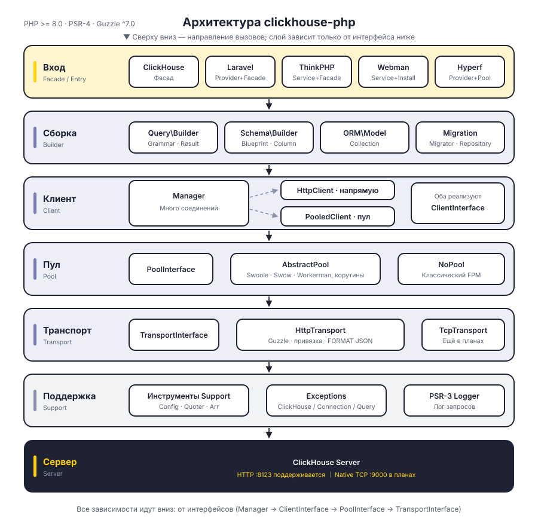
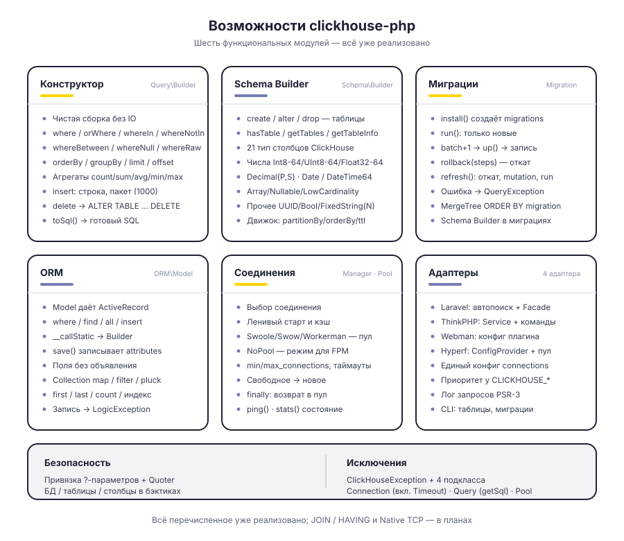
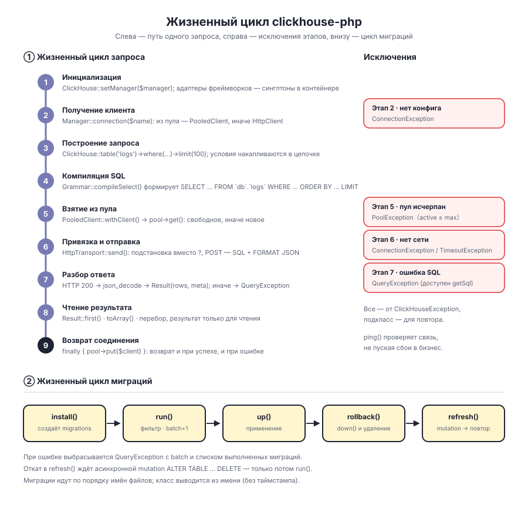

# clickhouse-php

PHP-клиент для ClickHouse. По умолчанию работает через HTTP-интерфейс ClickHouse (порт 8123); включает конструктор запросов, Schema Builder, систему миграций и ORM, а также адаптеры для Laravel, ThinkPHP, Webman и Hyperf.

Слои разделены: `Manager → ClientInterface → PoolInterface → TransportInterface` — форма клиента, пул соединений и транспортный протокол работают через интерфейсы и могут быть заменены. Для протокола Native TCP в транспортном слое зарезервировано место, но он ещё не реализован.

[简体中文](../../../README.md) | [English](../../../README_EN.md) | [한국어](../ko/README.md) | **Русский** | [Deutsch](../de/README.md) | [Français](../fr/README.md) | [Español](../es/README.md) | [Português](../pt/README.md) | [हिन्दी](../hi/README.md) | [العربية](../ar/README.md) | [বাংলা](../bn/README.md) | [Bahasa Indonesia](../id/README.md) | [日本語](../ja/README.md)

<p align="center">
  
</p>

## Структура проекта

```
clickhouse-php/
├── src/
│   ├── ClickHouse.php                  # Статическая точка входа (фасад)
│   ├── Client/                         # Слой клиента: несколько соединений, прямой доступ / пул
│   │   ├── ClientInterface.php         # query / select / insert / ping
│   │   ├── Manager.php                 # Управление соединениями, ленивая загрузка + кэш экземпляров
│   │   ├── HttpClient.php              # Прямой клиент: сборка SQL и разбор ответа
│   │   └── PooledClient.php            # Клиент с пулом: сам берёт и возвращает соединение
│   ├── Query/                          # Конструктор запросов
│   │   ├── Builder.php                 # Цепочный API и агрегаты
│   │   ├── Grammar.php                 # Компиляция синтаксиса SELECT / DELETE
│   │   ├── Expression.php              # Сырое выражение
│   │   └── Result.php                  # Результат только для чтения
│   ├── Schema/                         # Schema Builder
│   │   ├── Builder.php                 # create / alter / drop / запрос метаданных
│   │   ├── Blueprint.php               # Сбор столбцов и параметров движка
│   │   ├── Column.php                  # Определение столбца
│   │   └── Grammar.php                 # Компиляция синтаксиса DDL
│   ├── Migration/                      # Система миграций
│   │   ├── Migration.php               # Базовый класс миграции
│   │   ├── Migrator.php                # run / rollback / refresh
│   │   └── Repository.php              # Чтение и запись журнала миграций, ожидание mutation
│   ├── ORM/                            # ORM
│   │   ├── Model.php                   # Базовый класс ActiveRecord
│   │   └── Collection.php              # Коллекция моделей только для чтения
│   ├── Pool/                           # Пул соединений
│   │   ├── PoolInterface.php           # get / put / stats / close
│   │   ├── AbstractPool.php            # Общая логика пула (учёт, таймауты, пополнение)
│   │   ├── SwoolePool.php              # Канал корутин Swoole
│   │   ├── SwowPool.php                # Канал корутин Swow
│   │   ├── WorkermanPool.php           # Канал корутин Workerman
│   │   └── NoPool.php                  # Классический режим FPM
│   ├── Transport/                      # Транспортный слой
│   │   ├── TransportInterface.php      # send / close
│   │   ├── HttpTransport.php           # Guzzle HTTP, привязка параметров и FORMAT JSON
│   │   └── TcpTransport.php            # Native TCP (в планах)
│   ├── Support/                        # Config / Quoter / Arr
│   ├── Exceptions/                     # Иерархия исключений (1 базовый + 4 дочерних)
│   ├── Laravel/                        # ServiceProvider · Facade · команды Artisan
│   ├── ThinkPHP/                       # Service · Facade · команды
│   ├── Webman/                         # Service · установочный скрипт
│   └── Hyperf/                         # ConfigProvider · пул корутин · команды
├── tests/                              # Тесты PHPUnit, структура каталогов повторяет src
├── docs/                               # Схемы и документация
└── composer.json
```

## Архитектура

<p align="center">
  
</p>

Сверху вниз — шесть слоёв, каждый слой зависит только от абстрактного интерфейса слоя ниже:

| Слой | Ответственность | Ключевые типы |
|----|------|----------|
| Слой входа | Фасад и адаптеры фреймворков | `ClickHouse`, четыре адаптера фреймворков |
| Слой сборки | Сборка запросов и DDL, без ввода-вывода | `Query\Builder`, `Schema\Builder`, `ORM\Model`, `Migration\Migrator` |
| Слой клиента | Управление соединениями и точка выполнения | `Manager`, `HttpClient`, `PooledClient` |
| Слой пула | Переиспользование соединений и лимит параллелизма | `PoolInterface`, `AbstractPool`, `NoPool` |
| Транспортный слой | Кодирование протокола и отображение ошибок | `HttpTransport`, `TcpTransport` (в планах) |
| Слой поддержки | Конфигурация, экранирование, исключения, логи | `Support\*`, `Exceptions\*`, PSR-3 `LoggerInterface` |

## Возможности

<p align="center">
  
</p>

## Жизненный цикл

<p align="center">
  
</p>

## Установка

```bash
composer require erikwang2013/clickhouse-php
```

## Быстрый старт

### Автономное использование (чистый PHP)

Без каких-либо фреймворков. Инициализация через переменные окружения `CLICKHOUSE_*` — одной строкой:

```php
use Erikwang2013\ClickHouse\ClickHouse;

ClickHouse::bootstrap();   // эквивалентно ClickHouse::setManager(Manager::fromEnv())

$rows = ClickHouse::table('logs')
    ->where('date', '>=', '2024-01-01')
    ->whereIn('level', ['error', 'warn'])
    ->orderBy('timestamp', 'desc')
    ->limit(100)
    ->get();

foreach ($rows as $row) {
    echo $row['message'];
}
```

Настройки, которые не покрываются переменными окружения (несколько соединений, параметры пула), передаются явно через `Manager`:

```php
use Erikwang2013\ClickHouse\ClickHouse;
use Erikwang2013\ClickHouse\Client\Manager;

// Конфигурация
$config = [
    'default' => 'clickhouse',
    'connections' => [
        'clickhouse' => [
            'driver'   => 'http',        // http (рекомендуется) или native (в разработке)
            'host'     => 'localhost',
            'port'     => 8123,          // порт HTTP, для Native — 9000
            'database' => 'default',
            'username' => 'default',
            'password' => '',
            'timeout'  => 30,
            'https'    => false,         // true — по HTTPS
        ],
    ],
    'pool' => [
        'min_connections'    => 2,
        'max_connections'    => 16,
        'connection_timeout' => 5.0,
    ],
];

// Инициализация
$manager = new Manager($config);
ClickHouse::setManager($manager);

// Запрос
$rows = ClickHouse::table('logs')
    ->where('date', '>=', '2024-01-01')
    ->whereIn('level', ['error', 'warn'])
    ->orderBy('timestamp', 'desc')
    ->limit(100)
    ->get();

foreach ($rows as $row) {
    echo $row['message'];
}

// Сырой SQL
$result = ClickHouse::query('SELECT count(*) AS cnt FROM logs WHERE date = ?', ['2024-01-01']);
echo $result->first()['cnt'];

// Агрегация
$count = ClickHouse::table('logs')->where('level', 'error')->count();
$avgDuration = ClickHouse::table('logs')->avg('duration');
```

### Вставка данных

```php
// Одна строка
ClickHouse::table('logs')->insert([
    'date'      => '2024-01-01',
    'level'     => 'info',
    'message'   => 'hello',
    'duration'  => 12.5,
]);

// Пакетно
ClickHouse::table('logs')->insert([
    ['date' => '2024-01-01', 'level' => 'info',  'message' => 'a', 'duration' => 1.2],
    ['date' => '2024-01-02', 'level' => 'error', 'message' => 'b', 'duration' => 3.4],
]);
```

### Создание таблицы (Schema Builder)

```php
ClickHouse::schema()->create('logs', function ($table) {
    $table->date('date');
    $table->dateTime('timestamp');
    $table->string('level');
    $table->string('message');
    $table->float64('duration');
    $table->engine('MergeTree')
          ->partitionBy('toYYYYMM(date)')
          ->orderBy(['date', 'timestamp', 'level']);
});

// Удаление таблицы
ClickHouse::schema()->drop('logs');

// Изменение таблицы
ClickHouse::schema()->alter('logs', function ($table) {
    $table->nullable('source', 'String');
});
```

### Миграции

Создайте файл миграции (например, `2026_05_27_000000_create_logs_table.php`):

```php
use Erikwang2013\ClickHouse\Migration\Migration;

class CreateLogsTable extends Migration
{
    public function up(): void
    {
        $this->schema->create('logs', function ($table) {
            $table->date('date');
            $table->string('level');
            $table->engine('MergeTree')
                  ->partitionBy('toYYYYMM(date)')
                  ->orderBy(['date', 'level']);
        });
    }

    public function down(): void
    {
        $this->schema->drop('logs');
    }
}
```

Запуск миграций:

```php
use Erikwang2013\ClickHouse\Migration\Migrator;
use Erikwang2013\ClickHouse\Migration\Repository;

$client = ClickHouse::getManager()->connection();
$repository = new Repository($client);
$migrator = new Migrator($client, $repository, '/path/to/migrations');

$migrator->install();   // создать журнал миграций
$migrator->run();       // выполнить ожидающие миграции
$migrator->rollback();  // откатить последнюю партию
$migrator->refresh();   // откатить и выполнить заново
```

### ORM

```php
use Erikwang2013\ClickHouse\ORM\Model;

class Log extends Model
{
    protected string $table = 'logs';
    protected string $connection = 'default';
}

// Запрос
$logs = Log::where('level', 'error')
    ->orderBy('timestamp', 'desc')
    ->limit(50)
    ->get();

// Поиск одной записи
$log = Log::find(123);

// Агрегация
$total = Log::where('date', '>=', '2024-01-01')->count();

// Пакетная вставка
Log::insert([
    ['date' => '2024-01-01', 'level' => 'info'],
    ['date' => '2024-01-02', 'level' => 'error'],
]);
```

### Несколько соединений

```php
$config = [
    'default' => 'default',
    'connections' => [
        'default' => ['driver' => 'http', 'host' => 'ch1.example.com', 'port' => 8123],
        'analytics' => ['driver' => 'http', 'host' => 'ch2.example.com', 'port' => 8123],
    ],
];

$manager = new Manager($config);

// Использование указанного соединения
ClickHouse::connection('analytics')->table('events')->get();
ClickHouse::table('events', 'analytics')->get();
```

## Интеграция с фреймворками

### Laravel

Файл конфигурации публикуется автоматически, Composer сам находит ServiceProvider.

```bash
php artisan vendor:publish --tag=clickhouse-config
```

```php
use Erikwang2013\ClickHouse\Laravel\Facades\ClickHouse;

ClickHouse::table('logs')->where('level', 'error')->get();
ClickHouse::connection('native')->select('SELECT * FROM logs LIMIT 10');
```

Команды Artisan:

```bash
php artisan clickhouse:table-list
php artisan clickhouse:migration:install
php artisan clickhouse:migration:run
```

### ThinkPHP

Зарегистрируйте сервис в `app/service.php`:

```php
return [
    \Erikwang2013\ClickHouse\ThinkPHP\ClickHouseService::class,
];
```

```php
use think\facade\ClickHouse;

ClickHouse::table('logs')->get();
```

```bash
php think clickhouse:table-list
```

### Webman

Webman сам загружает конфигурацию плагина, ручная настройка не нужна.

```php
use Erikwang2013\ClickHouse\Webman\ClickHouse;

ClickHouse::table('logs')->where('level', 'error')->get();
```

### Hyperf

Обнаруживается автоматически через `ConfigProvider`, поддерживает внедрение зависимостей и пул корутин.

```bash
php bin/hyperf.php vendor:publish erikwang2013/clickhouse-php
```

```php
use Erikwang2013\ClickHouse\Hyperf\ClickHouseConnection;

class LogController
{
    public function __construct(
        private ClickHouseConnection $clickhouse
    ) {}

    public function index()
    {
        return $this->clickhouse->table('logs')->get();
    }
}
```

## Справочник по конструктору запросов

| Метод | Описание |
|------|------|
| `table($name)` / `from($name)` | Указать имя таблицы |
| `select([...])` / `selectRaw($expr)` | Столбцы SELECT |
| `where($col, $op, $val)` | Условие (при 2 аргументах `$op` по умолчанию `=`) |
| `orWhere($col, $op, $val)` | Условие OR |
| `whereIn($col, $arr)` / `whereNotIn($col, $arr)` | IN / NOT IN |
| `whereBetween($col, [$min, $max])` | BETWEEN |
| `whereNull($col)` / `whereNotNull($col)` | IS NULL / IS NOT NULL |
| `whereRaw($sql)` | Сырой WHERE |
| `orderBy($col, $dir)` | Сортировка (по умолчанию ASC) |
| `groupBy(...$cols)` | Группировка |
| `limit($n)` / `offset($n)` | Пагинация |
| `count()` / `sum($col)` / `avg($col)` / `min($col)` / `max($col)` | Агрегация |
| `insert($data)` | Вставка (одна строка или пакет) |
| `delete()` | Удаление |
| `get()` | Выполнить запрос, вернуть Result |
| `first()` | Вернуть первую запись |
| `toSql()` | Получить сгенерированный SQL |

## Типы столбцов Schema

| Метод | Тип ClickHouse |
|------|----------------|
| `string($name)` | String |
| `fixedString($name, $len)` | FixedString(N) |
| `int8/16/32/64($name)` | Int8/16/32/64 |
| `uint8/16/32/64($name)` | UInt8/16/32/64 |
| `float32($name)` / `float64($name)` | Float32 / Float64 |
| `decimal($name, $p, $s)` | Decimal(P, S) |
| `date($name)` | Date |
| `dateTime($name)` | DateTime |
| `dateTime64($name, $p)` | DateTime64(P) |
| `uuid($name)` | UUID |
| `bool($name)` | Bool |
| `array($name, $type)` | Array(T) |
| `nullable($name, $type)` | Nullable(T) |
| `lowCardinality($name, $type)` | LowCardinality(T) |

## Справочник по конфигурации

```php
[
    'default' => 'clickhouse',
    'connections' => [
        'clickhouse' => [
            'driver'   => 'http',     // http (рекомендуется) | native (в разработке)
            'host'     => 'localhost',
            'port'     => 8123,       // HTTP 8123, Native 9000
            'database' => 'default',
            'username' => 'default',
            'password' => '',
            'timeout'  => 30,
            'https'    => false,
        ],
    ],
    'pool' => [
        'min_connections'    => 2,
        'max_connections'    => 16,
        'connection_timeout' => 5.0,
    ],
    'query_log' => false,
];
```

## Переменные окружения

| Переменная | По умолчанию | Описание |
|------|--------|------|
| `CLICKHOUSE_CONNECTION` | default | Имя соединения по умолчанию |
| `CLICKHOUSE_HOST` | localhost | Адрес хоста |
| `CLICKHOUSE_PORT` | 8123 | Порт HTTP |
| `CLICKHOUSE_DB` | default | Имя базы данных |
| `CLICKHOUSE_USER` | default | Имя пользователя |
| `CLICKHOUSE_PASS` | — | Пароль |
| `CLICKHOUSE_TIMEOUT` | 30 | Таймаут соединения (сек) |
| `CLICKHOUSE_HTTPS` | false | Использовать HTTPS |
| `CLICKHOUSE_DRIVER` | http | Тип драйвера |
| `CLICKHOUSE_POOL_MIN` | 2 | Минимум соединений |
| `CLICKHOUSE_POOL_MAX` | 16 | Максимум соединений |
| `CLICKHOUSE_POOL_TIMEOUT` | 5.0 | Таймаут получения соединения (сек) |

В чистом PHP эти переменные читают `ClickHouse::bootstrap()` / `Manager::fromEnv()`. Конфигурационные файлы всех четырёх фреймворков используют те же имена переменных, но покрывают разные подмножества (Laravel — все, Hyperf — без `CLICKHOUSE_CONNECTION`/`CLICKHOUSE_DRIVER`/`CLICKHOUSE_HTTPS`, Webman — только пять переменных соединения, ThinkPHP сейчас переменные окружения не читает) — ориентируйтесь на соответствующий конфигурационный файл.

## Обработка исключений

```php
use Erikwang2013\ClickHouse\Exceptions\{
    ClickHouseException,
    ConnectionException,
    QueryException,
    TimeoutException,
    PoolException,
};

try {
    ClickHouse::table('logs')->get();
} catch (ConnectionException | TimeoutException $e) {
    // проблемы соединения или таймаута
} catch (QueryException $e) {
    echo $e->getMessage();
    echo $e->getSql();      // исходный SQL
} catch (ClickHouseException $e) {
    // прочие исключения
}
```

## Поддержать проект

| WeChat | Alipay |
|------|--------|
|  |  |

Спасибо за поддержку!

## Лицензия

MIT License.  Copyright (c) 2026 erik <erik@erik.xyz> — https://erik.xyz
